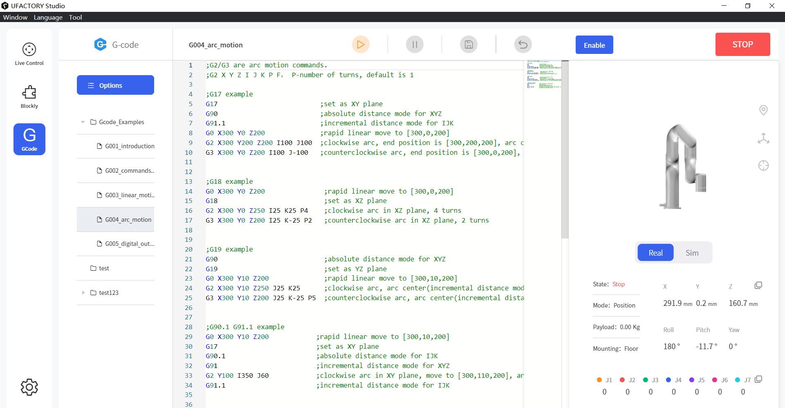

# UFACTORY Gcode

Updated: 2024-07-24

Firmware version:  v2.5.0 or later

UFACTORY Studio version:  V2.5.0 or later

TCP port: 504


### 1. G command

* **G0** X Y Z A B C   // The speed is 240mm/s by default
* **G1** X Y Z A B C F  // XYZ(mm),  ABC(RPY,degree), F(speed,mm/min)
* **G2**    //Arc move, clockwise arc (G2 X Y Z R P F ) (G2 X Y Z I J K P F),  R-radius, I- X offset, J- Y offset, K- Z offset, P-number of turns, default is 1
* **G3**     //Arc move, counterclockwise arc (G3 X Y Z R P F) (G3 X Y Z I J K P F)
* **G4** P    // Dwell, Unit: s
* **G17**    //Z-axis, XY-plane
* **G18**   //Y-axis, YZ-plane
* **G19**   //X-axis, YZ-plane
* **G20**    // use inches for length units
* **G21**    // use millimeters for length units
* **G90**  //absolute distance mode
* **G90.1**  //absolute distance mode for I, J & K offsets
* **G91**   //incremental distance mode
* **G91.1**  //incremental distance mode for I, J & K offsets


```gcode
G0 X300 Y100 Z200 A180 B0 C0        ;move to [300,100,200,180,0,0]
G4 P5                               ;sleep 5s
G1 X300 Y100 Z350 A180 B0 C0 F30000 ;move to [300,100,200,180,0,0], speed=500mm/s
G21                                 ;set the unit as mm
G0 X300                             ;move to X=300mm
G20                                 ;set the unit as inches
G0 X10                              ;move to X=10inches(254mm)
G21                                 ;set the unit as mm
G90                                 ;use absolute coordinate
G0 X300                             ;move to X=300mm
G91                                 ;use relative coordinate
G0 X10                              ;move forward 10mm
G90                                 ;use absolute coordinate
```


You can debug and check more examples via 'UFACTORY Studio-Gcode' page.

<figure><figcaption></figcaption></figure>

### 2. M command

* **M2/M30**  //end program
* **M62 P**     //turn on digital output synchronized with motion(wait=True).
* **M63 P**     //turn off digital output synchronized with motion(wait=True).
* **M64 P**     //turn on digital output immediately(wait=False).
* **M65 P**     //turn off digital output immediately(wait=False).
* **E67 E Q**  //set controller analog output synchronized with motion(wait=True).
*   **E68 E Q**  //set controller analog output immediately(wait=False).                                                                P: IONUM(0-15, 0-7: CO0-CO7, 8-15: DO0-DO7)

    E: IONUM(0-1), Q: value(0-10)
* **M100 P{} Q{}**  //enable or disable the robot.                                                                                                          P1-enable,  P0-disable,  Q-joint ID(8 by default, stands for all joints).
* **M101**    //clear error
* **M102**   //clear warning
* **M103 P{}** //set mode
* **M104 P{}**  //set state
* **M115 P{} Q{}** //set TGPIO                                                                                                                                          &#x20;

&#x20;      P:  IONUM   0/1/2/3/4

&#x20;      Q: 0/ 1/ 10/ 11&#x20;

&#x20;            Q0:turn off(low level) tool digital output synchronized with motion(wait=True).&#x20;

&#x20;            Q1:turn on(high level) tool digital output synchronized with motion(wait=True).&#x20;

&#x20;            Q10: turn off tool digital output immediately(wait=False). &#x20;

&#x20;            Q11: turn on tool digital output immediately(wait=False). &#x20;

* **M116 P{} Q{}**  //control the end effector        &#x20;

&#x20;       P1: xArm Gripper, Q-position

&#x20;       P2: xArm Vacuum Gripper

&#x20;             Q0:open(wait=True), Q1:close(wait=True),&#x20;

&#x20;             Q10:open(wait=False), Q11:close(wait=False)

&#x20;      P3: xArm BIO Gripper

&#x20;             Q0: close, Q1: open

&#x20;      P4/P5: Robotiq-2F-85 Gripper, Robotiq-2F-140 Gripper, Q:position(0\~255)

&#x20;      P11: Lite6 Gripper

&#x20;             Q0:close(wait=True), Q1:open(wait=True),&#x20;

&#x20;             Q10:close(wait=False), Q11:open(wait=False)

&#x20;      P12: Lite6 Vacuum Gripper

&#x20;             Q0:close(wait=True), Q1:open(wait=True),&#x20;

&#x20;             Q10:close(wait=False), Q11:open(wait=False)



```gcode
M62 P1            ;set CO1 to high level, wait=True
M64 P15           ;set DO7 to high level, wait=False
M67 E0 Q10        ;set AO0 to 10V, wait=True
M68 E1 Q2         ;set AO1 to 2V, wait=False


M116 P2 Q10       ;open xArm Vacuum Gripper, wait=False
M116 P2 Q11       ;close xArm Vacuum Gripper, wait=False
```


### **3. Python Example**


```python
import socket
sock = socket.socket(socket.AF_INET, socket.SOCK_STREAM)
sock.setsockopt(socket.SOL_SOCKET, socket.SO_REUSEADDR, 1)
sock.setblocking(True)
sock.connect(('192.168.1.67', 504))

def send_and_recv(data):
    for line in data.split('\n'):
        line = line.strip()
        if not line:
            continue
        sock.send(line.encode('utf-8', 'replace') + b'\n')
        ret = sock.recv(5)
        code, mode_state, err = ret[0:3]
        state, mode = mode_state & 0x0F, mode_state >> 4
        cmdnum = ret[3] << 8 | ret[4]
        if code != 0 or state >= 4 or err > 0:
            print('code: {}, mode: {}, state: {}, err: {}, cmdnum: {}, cmd: {}'.format(code, mode, state, err, cmdnum, line))

# move x to x=500mm, speed= 10000 mm/min
send_and_recv('G1 X500 F10000')
```



<mark style="color:orange;">**Note：**</mark>

1\. Response:

* byte0: return value.  0 is success
* byte1: mode and state
* byte2: error code
* byte3 & byte4: buffer

2\. Recommend to send 1 non-empty data at a time(with line breaks)

```
sock.send(b'G0 X300\n')
```

3\. Need to receive the response, otherwise the buffer will be full.

```
 sock.recv(5)
```


