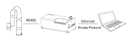

---
layout:
  title:
    visible: false
  description:
    visible: false
  tableOfContents:
    visible: false
  outline:
    visible: false
  pagination:
    visible: false
---

# Home Page

<table data-view="cards"><thead><tr><th></th><th data-hidden></th><th data-hidden></th><th data-hidden data-card-cover data-type="files"></th><th data-hidden data-card-target data-type="content-ref"></th></tr></thead><tbody><tr><td>Private TCP protocol</td><td></td><td></td><td><a href=".gitbook/assets/TCP.svg">TCP.svg</a></td><td><a href="communication_protocol/">communication_protocol</a></td></tr><tr><td>Python</td><td></td><td></td><td><a href=".gitbook/assets/Python.svg">Python.svg</a></td><td><a href="https://github.com/xArm-Developer/xArm-Python-SDK">https://github.com/xArm-Developer/xArm-Python-SDK</a></td></tr><tr><td>ROS</td><td></td><td></td><td><a href=".gitbook/assets/ROS.svg">ROS.svg</a></td><td><a href="https://github.com/xArm-Developer/xarm_ros">https://github.com/xArm-Developer/xarm_ros</a></td></tr><tr><td>ROS2</td><td></td><td></td><td><a href=".gitbook/assets/ROS2.svg">ROS2.svg</a></td><td><a href="https://github.com/xArm-Developer/xarm_ros2">https://github.com/xArm-Developer/xarm_ros2</a></td></tr><tr><td>test</td><td></td><td></td><td><a href=".gitbook/assets/test.png">test.png</a></td><td></td></tr></tbody></table>

