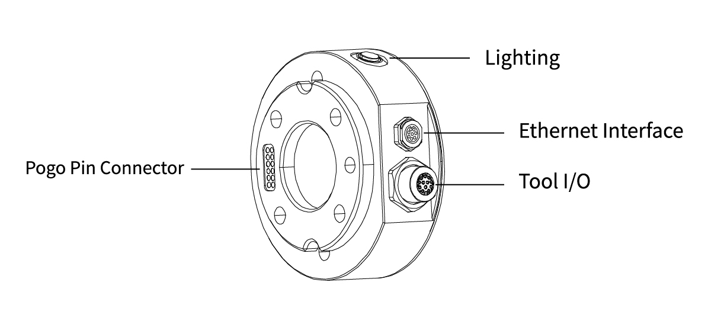

# 4. Robotic Electrical Interface

## 4.1 End Flange
The End-effector flange has 6 M6 threaded holes and one Ф6 positioning hole, where the end-effector of two different sizes can be mounted. If the effector does not have a positioning hole, the orientation of the end-effector must be documented in a file format, to avoid errors and unexpected results when re-installing the end-effector.   

The end-effector flange referenced ISO 9409-1-50-4-M6 standard.  

Mechanical dimensions of end-effector flange (unit: mm)





## 4.2 Tool IO
At the tool side of the robotic arm, there is an avionic socket 12-pin female industrial connector. This connector provides power and control signals for the grippers and sensors used on a particular robotic arm tool. Please refer to the figure below: 


There are 12 pins inside the cable with different colors, each color represents different functions, please refer to the following table:

| PIN | Color  | Signal       | PIN | Color       | Signal               |
| --- | ------ | ------------ | --- | ----------- | -------------------- |
| 1   | Brown  | +24V (Power) | 7   | Black       | Tool Output 0 (TO0)  |
| 2   | Blue   | +24V (Power) | 8   | Grey        | Tool Output 1 (TO1)  |
| 3   | White  | 0V (GND)     | 9   | Red         | Tool Input 0 (TI0)   |
| 4   | Green  | 0V (GND)     | 10  | Purple      | Tool Input 1 (TI1)   |
| 5   | Pink   | User 485-A   | 11  | Orange      | Analog input 0 (AI0) |
| 6   | Yellow | User 485-B   | 12  | Light Green | Analog input 1 (AI1) |

Electrical Specifications:

| Parameter                  | Min. Value | Typical Value | Max. Value | Unit |
| -------------------------- | ---------- | ------------- | ---------- | ---- |
| Supply Voltage in 24V Mode | 20         | 24            | 30         | V    |
| Supply Current             | -          | -             | 1800       | mA   |


**NOTE**  
It is strongly recommended to use a protection diode for inductive loads.

**DANGER**  
Make sure that the connecting tool and the gripper do not cause any danger when the power is cut, such as dropping of the work-piece from the tool. 

### 4.2.1 Tool Digital Input(TI)
The digital input is already equipped with a pull-down resistor. This means that the reading of the floating input is always low.     

Electrical Specifications:

| Parameter          | Min  | Typical | Max | Unit |
| ------------------ | ---- | ------- | --- | ---- |
| Input Voltage      | -0.5 | -       | 30  | V    |
| Logic Low Voltage  | -    | -       | 1.0 | V    |
| Logic High Voltage | 1.6  | -       | -   | V    |
| Input Resistance   | -    | 47k     | -   | Ω    |


The following figure shows the connection with the simple switch.


### 4.2.2 Tool Digital Output(TO)
The digital output is implemented in the form of NPN with an open collector (OC). When the digital output is activated, the corresponding connector will be driven to GND. When the digital output is disabled, the corresponding connector will be open (open collector/open drain).   

Electrical Specifications:

| Parameter                 | Min  | Typical | Max | Unit |
| ------------------------- | ---- | ------- | --- | ---- |
| Open-circuit Voltage      | -0.5 | -       | 30  | V    |
| Voltage when sinking 50mA | -    | 0.05    | 0.2 | V    |
| Sink Current              | 0    | -       | 100 | mA   |
| Current through GND       | 0    | -       | 100 | mA   |


**CAUTION**  
There is no current protection on the digital output of the tool, which can cause permanent damage if the specified value exceeded.

The following example illustrates how to use the digital output. As the internal output is an open collector, the resistor should be connected to the power supply according to the load. The size and power of the resistor depend on the specific use.   


**NOTE** 
It is highly recommended to use a protection diode for inductive loads as shown below. 


### 4.2.3 Tool Analog Input(TAI)
The tool analog input is a non-differential input.   

Electrical Specifications:

| Parameter                                            | Min  | Typical | Max | Unit |
| ---------------------------------------------------- | ---- | ------- | --- | ---- |
| Input Voltage in Voltage Mode                        | -0.5 | -       | 3.3 | V    |
| Resolution                                           | -    | 12      | -   | Bit  |
| Input Current in Current Mode                        | -    | -       | -   | mA   |
| Pull-down Resistors in the 4mA to 20mA Current Range | -    | -       | 165 | Ω    |
| Resolution                                           | -    | 12      | -   | Bit  |

**CAUTION**  
1. In the current/voltage mode, the analog input does not provide over-voltage protection. Exceeding the limits in the electrical code may result in permanent damage to the input port.
2. In current mode, the pull-down resistance depends on the range of the input current. 

The following figures show how the analog sensor can be connected to a **non-differential** output.  
* Voltage Mode

* Current Mode
  

The following figures show how the analog sensor is connected to the differential output. Connect the negative output to GND (0V), and it can work like a non-differential sensor.   
* Voltage Mode

* Current Mode


### 4.4.4 Tool RS485
The Tool side provide an RS485 interface, use can communicate it with third-party devices that supports RS485.  

The id of our end tool is 9. 

PIN Connection:
1. PIN5: RS485-A
2. PIN6: RS485-B
3. PIN1 & PIN2: 24v
4. PIN3 & PIN4: GND

* If end effector supports standard Modbus RTU, user can debug it via '[Settings-Externals-Modbus RTU](https://docs.ufactory.cc/user_manual/ufactoryStudio/7.settings.html#_7-2-5-modbus-rtu)'.
* If end effector doesn't support standard Modbus RTU, user can send the command via [getset_tgpio_modbus_data](https://github.com/xArm-Developer/xArm-Python-SDK/blob/master/example/wrapper/common/5000-set_tgpio_modbus.py), please set is_transparent_transmission to True.

## 4.3 Pogo Pin Connector
  

Electrical specifications comply with Tool IO specifications.

## 4.4 Lighting
We provide a button and LED at tool end, press it and it will be Blue.  
The function of this button has not been defined yet, user can custom and develop it.
Tool Digital IO: TI2, TO2.  

```python
# SET TO2 to high level，the LED will be Blue.
arm.set_tgpio_digital(ionum=2, value=1)
# GET TI2，for custom develop
arm.get_tgpio_digital(ionum=2)
```

## 4.5 Ethernet Interface
The user Ethernet interface(RJ45) of the arm base is connected to the Ethernet interface(M8 4-pole) of the end flange through a physical internal **1000M** Ethernet cable, which further enhances the stability of the system. **Standard CAT5E** Ethernet cable, compatible with most third-party vision devices. You can experiment with using it as a physical signal wire if you want.


### Definition of Industrial Connector

| 8-Pin Connector |          |              |          |
| -------------------------- | -------- | ------------ | -------- |
| Pin Sequence               | Signal   | Pin Sequence | Signal   |
| 1                          | MX2-/DC- | 5            | MX1+/DB+ |
| 2                          | MX3+/DD+ | 6            | MX0+/DA+ |
| 3                          | MX3-/DD- | 7            | MX2+/DC+ |
| 4                          | MX0-/DA- | 8            | MX1-/DB- |