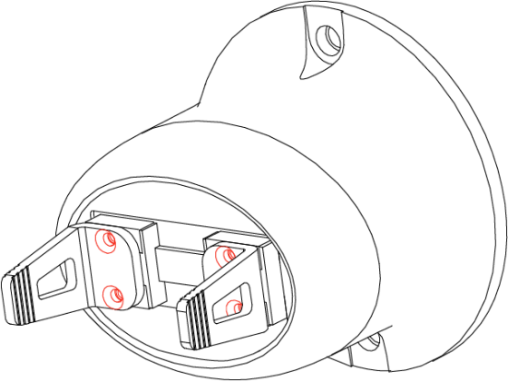
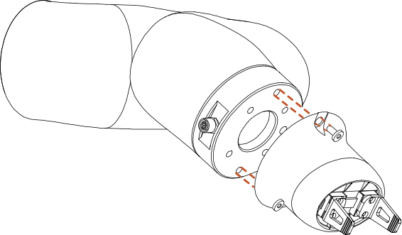
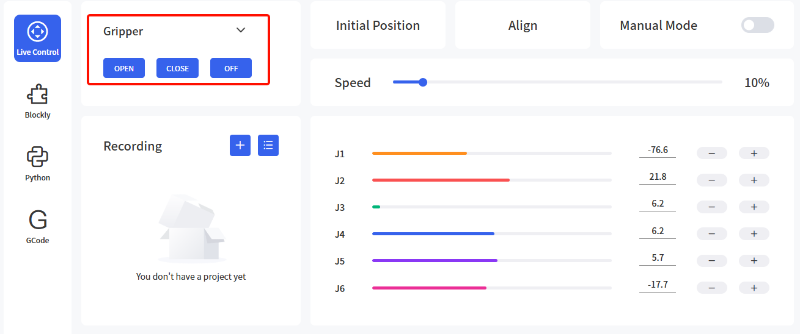
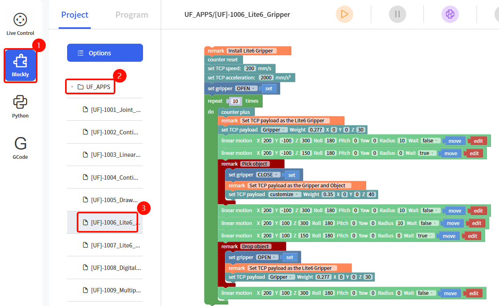
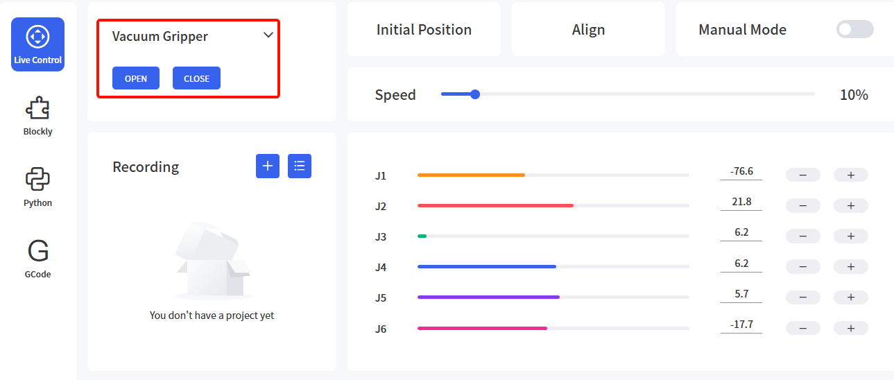
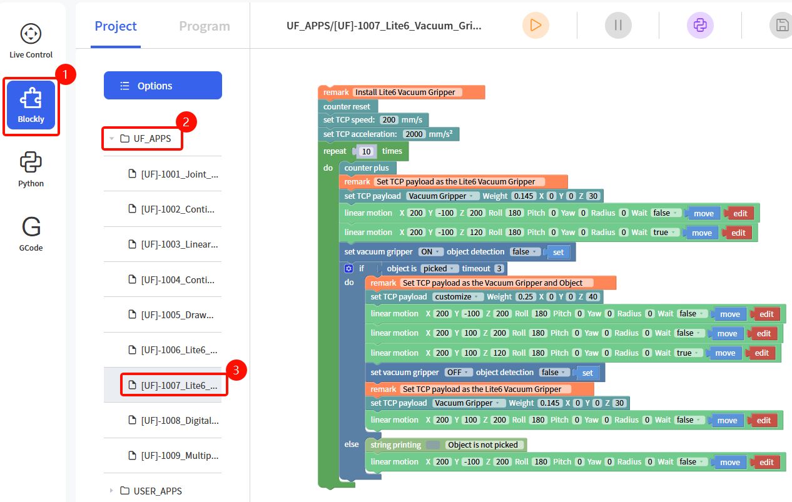

# 5. End-Effector

## 5.1 Gripper Lite

The Gripper Lite is the end-effector of the robotic arm, which can grasp objects dynamically. There are two installation methods for the mechanical claw of Lite 6: normal installation, the stroke range of the mechanical claw is 0-16mm, and reverse installation, the stroke range of the mechanical claw is 20-38mm. Regardless of the installation method, the stroke of the gripper is only 16mm. The maximum payload of the gripper ≤600g.

There are two states of the gripper, open and close.

- **Note:**
  - There are two ways to install the Gripper Lite, using the tool to unscrew the 4 red screws, Figure 1 can be changed to Figure 2.
  - The default installation method is Figure 1, with a stroke range of 20-38mm.

|  |  |
| :-----------------------------------------: | :-----------------------------------------: |
|                  Figure 1                   |                  Figure 2                   |

### 5.1.1 Gripper Lite Installation

Installation Procedure:

1. Move the robotic arm to a safe position. Avoid collision with the robotic arm mounting surface or other equipment.
2. Power off the robotic arm by pressing the emergency stop button on the control box.
3. Fix the gripper on the end of the robotic arm with 2*M6 bolts.
4. Connect the robotic arm and the gripper with the gripper connection cable.

**Note:**

1. When wiring the gripper connection cable, be sure to power off the robotic arm, to set the emergency stop button in the pressed state, and to ensure that power indicator of the robotic arm is off, so as to avoid robotic arm failure caused by hot-plugging.
2. Due to limited length of the gripper connection cable, the gripper connector and the tool/end effector connector must be on the same side.
3. When connecting the gripper and the robotic arm, be sure to align the positioning holes at the ends of the gripper and the robotic arm. The male pins of the connecting cable are relatively thin, please be careful to avoid bending the male pins during disassembly.

### 5.1.2 Precautions

| Precautions                 |                                                              |
| ----------------------------- | ------------------------------------------------------------ |
|  | When a robotic arm equipped with a gripper is used for trajectory planning, it is necessary to perform a safety assessment on whether to return to the zero-point or whether the operation can be performed and to avoid collisions. |

### 5.1.3 Control

#### 5.1.3.1 Live Control

Enter the Live control page, select Gripper and then by clicking the "Open/Close" button, you can control the opening and closing of the gripper.

#### 5.1.3.2 Control via Blockly

Find the example file **[UF]-1006_Lite6_Gripper** in the Blockly module.

The role of this program: Execute this program to control the gripper to grasp the target object at the specified position, and then place it at the target position.

#### 5.1.3.3 Python-SDK Control

- The interface of controlling gripper:
  - `arm.open_lite6_gripper()`: open gripper
  - `arm.close_lite6_gripper()`: close gripper
  - `arm.stop_lite6_gripper()`: stop gripper

Python-SDK: https://github.com/xArm-Developer/xArm-Python-SDK

## 5.2 Vacuum Gripper Lite

The Vacuum Gripper Lite can dynamically suck and release smooth flat objects with a payload of ≤600g. The Vacuum Gripper Lite has only 1 suction cup.

**Note:** If the surface of the object is not smooth, there will be air leakage from the suction cup which makes the object fail to be sucked up firmly. 

### 5.2.1 Vacuum Gripper Lite Installation

Installation Procedure: 

1. Move the robotic arm to a safe position. Avoid collision with the robotic arm mounting surface or other equipment.
2. Power off the robotic arm by pressing the emergency stop button on the control box.
3. Fix the vacuum gripper on the end of the robotic arm with 2 M6 bolts.
4. Connect the robotic arm and the vacuum gripper with the vacuum gripper connection cable.

**Note:**

1. When connecting the vacuum gripper connection cable, be sure to power off the robotic arm, and to ensure that power indicator of the robotic arm is off, so as to avoid robotic arm failure caused by hot-plugging.
2. Due to the length limitation of the vacuum gripper connection cable, the vacuum gripper interface and the tool IO interface must be in the same direction.
3. When connecting the vacuum gripper and the robotic arm, be sure to align the positioning holes on the two ends of the interface. The male pins of the connecting cable are relatively thin, so be careful to avoid bending them during disassembly.

### 5.2.2 Control

#### 5.2.2.1 Live Control

Enter the Live control page, select Vacuum Gripper and then by clicking the "Open/Close" button, you can control the opening and closing of the vacuum gripper.

#### 5.2.2.2 Control via Blockly

Find the example file **[UF]-1007_Lite6_Vacuum_Gripper** in the Blockly module.

The role of this program: execute this program to control the vacuum gripper to suck the target object at the specified position, and then place the target object at the target position.

**Note:** When the vacuum gripper is installed on the robotic arm, the TCP Payload of the vacuum gripper should be set in the Blockly program. When the total weight of the vacuum gripper changes after the object is sucked, a new TCP Payload needs to be set.

#### 5.2.2.3 Python-SDK Control

- The interface of controlling vacuum gripper:
  - `arm.set_vacuum_gripper(True, wait=False)`: open vacuum gripper
  - `arm.set_vacuum_gripper(False, wait=False)`: close vacuum gripper

Python-SDK: https://github.com/xArm-Developer/xArm-Python-SDK