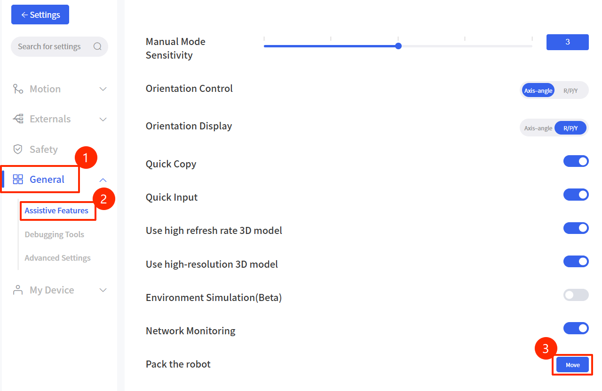

# 7. Production Information

## 7.1 Product Label
* Robotic Arm

## 7.2 Disposal and Environment
* Low humidity (25%-85% non-condensing)
* Altitude: <2000m
* Ambient temperature: 0°C ~ 50°C
* Avoid direct sunlight (indoor use)
* No corrosive gas or liquid.
* No flammable materials.
* No oil mists.
* No salt sprays.
* No dust or metal powder.
* No mechanical shock, vibration.
* No electromagnetic noise.
* No radioactive materials.

## 7.3 Transportation
* Move the robot to the packaging position by UFactory studio, then put the Lite6 robot and Control Box in the original packaging. 
  * 

* Transport the robot in the original packaging.
* Lift both tubes of the robot arm at the same time when moving it from the packaging to the installation place. Hold the robot in place until all mounting bolts are securely tightened at the base of the robot.
* The controller box shall be lifted by the handle.
* Save the packaging material in a dry place, you may need to pack down and move the robot in the future.

## 7.4 Power Supply
The power cut-off method of this product is a plug/socket connection, so when using this product, it is recommended to equip with a suitable switching device with sufficient breaking capacity (such as an air switch; insulation voltage: 400V AC; rated current: 10A)

## 7.5 Special Consumables
Fuse Specifications：15A 250V 5×20mm Time-Lag glass body cartridge fuse.

## 7.6 Stop Categories
**Stop Category 1** and **Stop Category 2** decelerates the robot with drive power on, which enables the robot to stop without deviating from its current path.

| Safety Input                             | Description     |
| ---------------------------------------- | --------------- |
| Emergency Stop Button of the Control Box | Stop Category 1 |
| Safeguard Stop of Control Box(SI)        | Stop Category 2 |

## 7.7 Certification
[LCSA051123040S-CE-LVD.pdf](http://www.ufactory.cc/wp-content/uploads/2025/04/LCSA051123040S-CE-LVD证书.pdf)  
[LCSA051123041E001-CE-EMC.pdf](http://www.ufactory.cc/wp-content/uploads/2025/04/LCSA051123041E001-CE-EMC-证书.pdf)  
[LCSA051123043R-RoHS.pdf](http://www.ufactory.cc/wp-content/uploads/2025/04/LCSA051123043R-RoHS证书.pdf)

## 7.8 DH Parameters
[Lite6 DH Parameters](https://docs.supportarticle.ufactory.cc/support_articles/developer/kinematic-and-dynamic-parameters/lite6.html)

