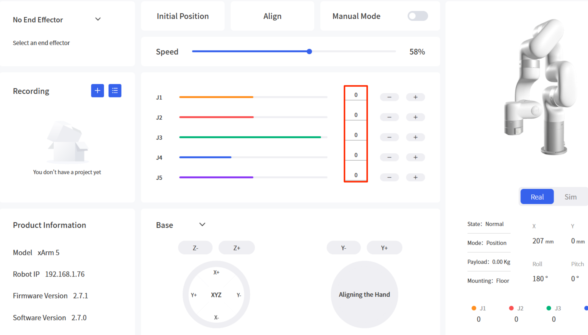
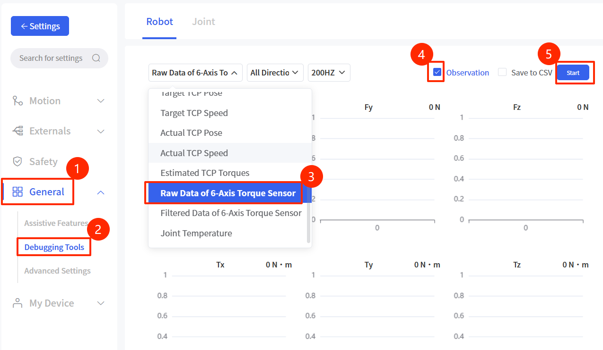
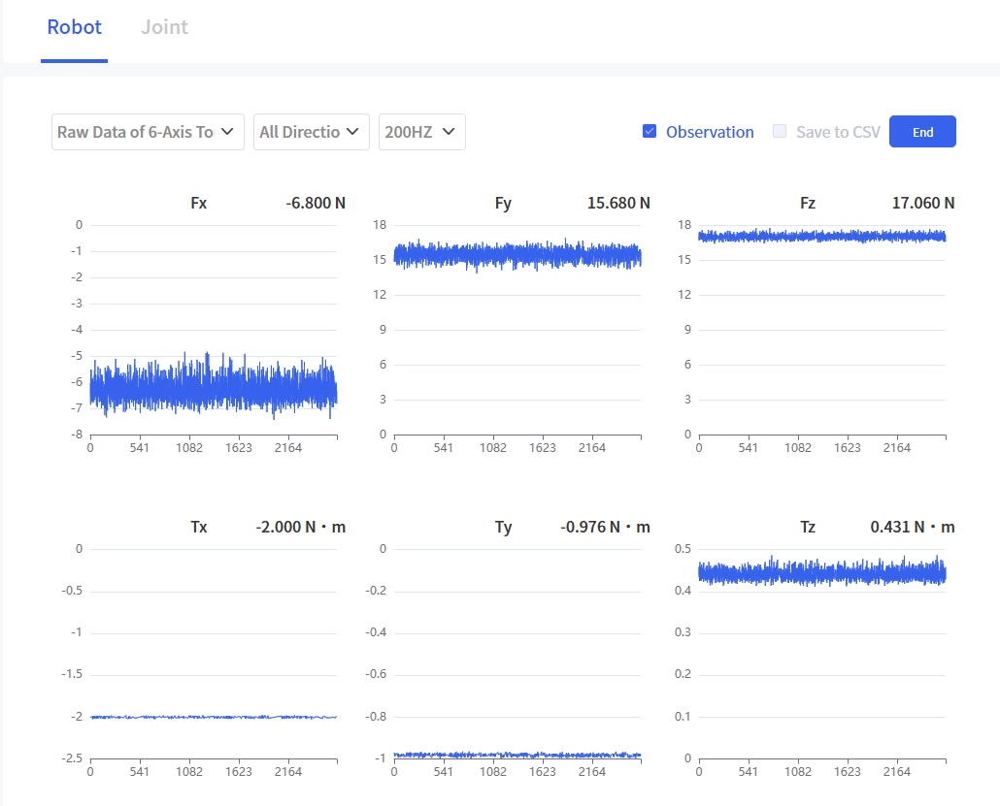

# How to Determine if a 6 Axis Force Torque Sensor is Damaged

## 1. Troubleshooting Steps

1. Press the E-stop button.

2. Keep only the 6 Axis Force Torque Sensor at the end of the robotic arm, and remove other end-effectors and cables.

3. Release the E-stop button and enable, then control the robotic arm to return to the zero position (i.e., all joint angles are 0°).

4. In the “Debugging Tools” of UFACTORY Studio, observe the Raw Data of 6-Axis Torque Sensor.

5. Compare the observed raw values with the **static raw value range**. If the raw values exceed the range, it indicates that the sensor is damaged.
   - **Static Raw Value Range**

| Fx(N)     | Fy(N)     | Fz(N)     | Tx(N·m) | Ty(N·m) | Tz(N·m) |
| --------- | --------- | --------- | ------- | ------- | ------- |
| [-60, 60] | [-60, 60] | [-60, 60] | [-2, 2] | [-2, 2] | [-2, 2] |

## 2. Solution

If the sensor raw values are confirmed to be out of range after the above troubleshooting, the force torque sensor is damaged. Please contact UFACTORY technical support for after-sales processing and provide the following information during feedback:

1. Screenshot of the observed raw values
2. 6 Axis Force Torque Sensor SN
3. Photos/videos of the sensor's appearance
4. Whether the sensor has experienced any collision, etc.