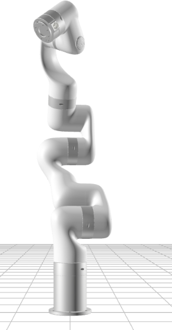
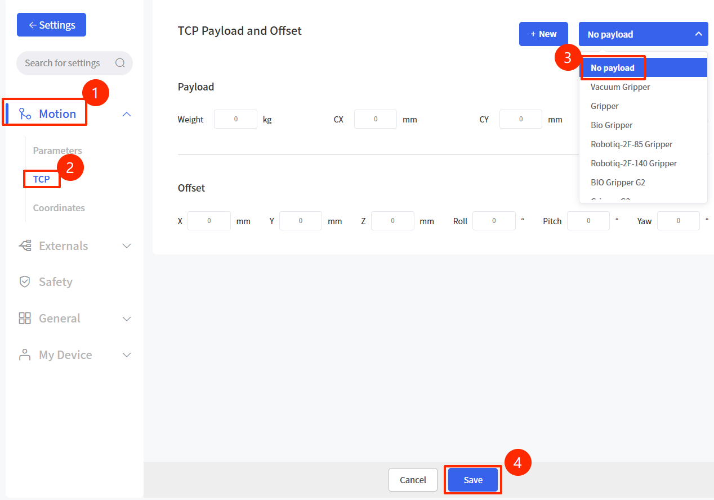
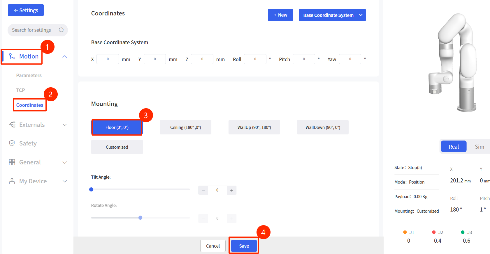
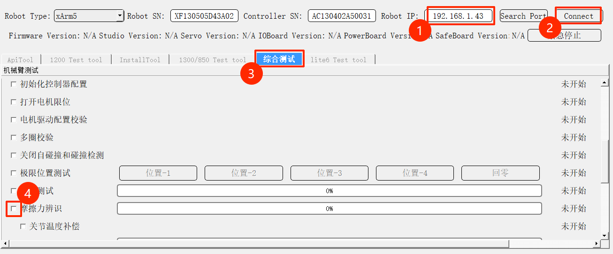
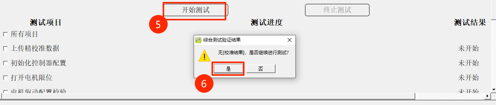
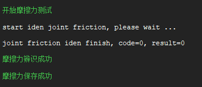

# How to Perform Friction Identification

>  [!Note]
>
> Before conducting friction identification, please consult technical support for confirmation

## 1. Safety Tips

1. **Clear the Workspace**: During the identification process, the robotic arm will perform large-range movements at various speeds. Ensure there are no obstacles, personnel, or cable interference within the full reach of the arm.

2. **Remove End-Effector Loads**: When performing friction identification, please remove all end-effectors and cables to ensure the robotic arm's end-flange is in a no-load state.

## 2. Preparation

1. **Set Payload to 0**: In the "Settings-Motion-TCP"  of UFACTORY Studio, set the payload weight and offsets to 0.
1. **Complete No-Load State**: Remove all end-effectors and detach all external cables from the xArm tool end

3. **Set Mounting to Floor**: In the "Coordinates" settings of UFACTORY Studio, set the Mounting to **Floor (0°,0°)**. **The robot arm must be installed horizontally.**

4. **Enable the Arm**: Ensure the robotic arm is in the **Enabled** state and there are no error codes.  
5. **Confirm Space**: Re-verify that the robotic arm's workspace is clear and open.  
6. **Software Preparation**: Download and extract the [xarm-tool-gui](https://drive.google.com/file/d/1Cf1rgCzSbfvCKGWRLoE4uFWr_R6y7g7k/view?usp=drive_link)

## 3. Operating Steps

1. Run **xarm-tool-gui**. 
2. Enter the controller **IP address** and click **Connect**.  

3. Check if the **Robot SN in the input box** matches the **SN on the base sticker**. If they do not match, manually enter the **base sticker SN** into the **input box**.

4. Switch to the 【**综合测试**】 tab. Uncheck 【**所有项目**】 and check only **【摩擦力辨识】**.  

5. Click **【开始测试】**. A confirmation box will appear. After re-confirming that the surrounding environment is safe, click **【是】**.  

6. Once identification begins, the arm will move continuously for approximately **5 minutes**.  

7. Upon completion, the log area will display "**joint friction iden finish**" and "**摩擦力辨识成功、摩擦力保存成功**".  

8. Press the **E-Stop** button and wait for 5 seconds → Release the E-Stop → **enable** the arm to complete the process.

