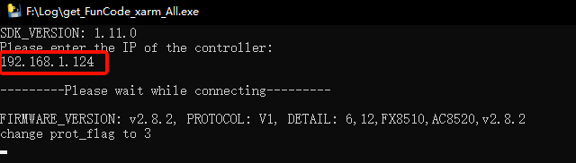

# How to judge whether the joint servo zero point is lost?

Take xArm6 as an example.

Product: XF1304, XI1304, XS1304, UF 850

UFactory Studio: 2.4.0+

Application scenario: If the TCP payload is set correctly, and the collision detection sensitivity is ≤3, but the software still keeps reporting C31 or S15 errors, the servo zero point may have been lost.

* If the arm was purchased after July 2024, we backup the data of original joint servo zero point, please use the tool below to obtain the data and provide the CSV file to us, we will compare the data internally.
* If not,  please follow the steps below to get the current of the corresponding joint.

### Get CSV file

1. Move the arm to the zero position\[0,0,0,0,0,0].
2. Download [get_FunCode_xarm_All.exe](https://drive.google.com/drive/folders/13oqBKDGo3I83_FYuH6vKBa4N9we1UpC_), and Launch it. (only for Windows System)
3. Enter the IP of the controller, and press enter.
4. Wait for 2-3 minutes, it will automatically create a folder named **getParm** in the directory where the script is located. Please provide us with all the CSV files generated in this folder.

### Get a diagram of the current

Please follow the steps to check the current of the corresponding joint.

1. Remove all end effectors, set TCP payload and offest as 0.
2. Disable 'Settings-General-Advanced Settings-Collision Detection'.
3. Move the arm to the zero position\[0,0,0,0,0,0].
4. Download  [UFactory Assist](https://drive.google.com/drive/folders/1qH8IJ2_Irw4aYf54yJOwN1-3D4R0CYxL)(Windows version) and [Blockly project](https://drive.google.com/drive/folders/1qH8IJ2_Irw4aYf54yJOwN1-3D4R0CYxL)(move J3 to -90°).
5. Launch UFactory Assist, choose 'Actual Joint Current', J3, 200HZ, click 'observation' and Start.
6. Run the Blockly project, click 'End' button in UFactory Assist, and take a screenshot of the current diagram with us.&#x20;

The current should be around 2A, please send the screenshot to [support@ufactory.cc](mailto:support@ufactory.cc) for double check.

