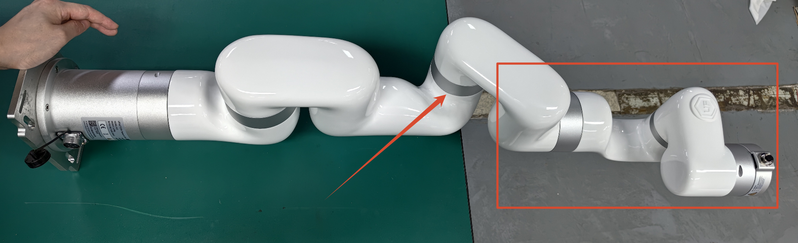
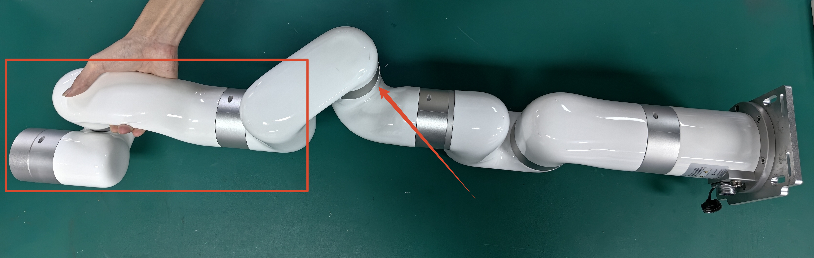

# How to reset the joint servo zero point?

Product: XF1304, XI1304, XS1304, UF 850

UFactory Studio: 2.4.0+

Please contact technical support<[support@ufactory.cc](mailto:support@ufactory.cc)>for confirmation before resetting; otherwise the warranty may be affected.

## Preparation

### Joint3-xArm5/xArm6

1. Move all the end effectors, and set TCP payload as 0.
2. Place the arm horizontally on the table like the image below(J3 around -175 degree), make sure J4J5J6 is suspended, and 1 person to hold the arm to make sure it will not move.

### Joint4-UF850

1. Remove all the end effectors, and set TCP payload as 0.
2. Move the arm back to zero position.

### Joint4-xArm7

1. Move all the end effectors, and set TCP payload as 0.
2. Place the arm horizontally on the table like the image below(J4 around 175 degree), make sure J5J6J7 is suspended, and 1 person to hold the arm to make sure it will not move.

## Reset command

1. Press down the E stop button and release.
2. **Don't enable the robot**. Send the servo reset command(Please reach to support@ufactory.cc> to get the command) via 'Settings-General-Debugging Tools-Joint', J\* will move slightly, you will hear a sound like 'click' and J\* don't move any more, indicating the reset process is over, then press down the E stop button and release. 
4. Reboot the entire system, and enable the robot.
5. Unlock Joint \* via 'Settings--General--Debugging Tools--Joint', move joint\* to its original zero position,  send `D13 I*`, press down the E stop button and release to take effect, it will set the current position of Joint\* as 0°.

