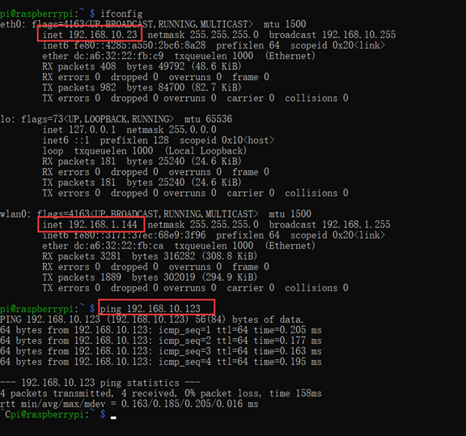
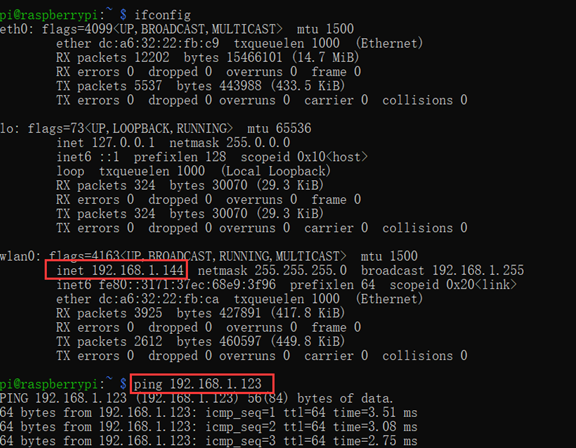

# How to connect the Raspberry Pi to xarm with ethernet cable and control the Pi through WiFi?

Raspberry Pi is a quite famous developing tool for developers, and some of our customers also prefer to try Raspberry Pi as the host of robot. Usually we connect the xarm control box through ethernet port of Raspberry Pi, and remotely control the Raspberry Pi through WiFi by using our own laptop. Here is the instructions which might help you to setup the Raspberry Pi with xarm control box successfully.

### 1. Hardware Preparation 

Raspberry Pi 4

Ethernet Cable

Robotic Arm

xArm AC Control Box

Power cable for the Control Box

Power cable for the Robotic Arm

Communication cable for the Robotic Arm

### 2. Software Preparation 

Raspberry Pi OS with desktop\
Release：10\
Codename: buster\
Release date: May 7th 2021

Download link:[https://www.raspberrypi.org/software/operating-systems/#raspberry-pi-os-32-bit](https://www.raspberrypi.org/software/operating-systems/#raspberry-pi-os-32-bit)

(We did the test based on this OS, other versions should be the same)

### 3. Connection&#x20;

#### Method 1:

Raspberry Pi directly connects to xArm controller box via the network cable.

Access method:

PC access to Raspberry Pi via wifi, Raspberry Pi access to xArm via ethernet IP.

xArm default network segment : 192.168.1.xxx

Need to meet the conditions to access:

**1. Raspberry Pi wifi IP and eth IP are in different network segments.**

**2. The robot arm IP and eth IP are in the same network segment.**

How to modify the eth IP of Raspberry Pi?

1\. Disconnect the network cable connecting the Raspberry Pi to the xArm.

2\. PC access to Raspberry Pi via wifi

e.g. cmd ssh [pi@192.168.144](mailto:pi@192.168.144) (SSH piName@pi wifi IP address)

3\. Modify eth IP, save and reboot Raspberry pi.

pi@raspberrypi:\~ $ sudo nano /etc/dhcpcd.conf

<figure><figcaption></figcaption></figure>

After the modification is successful, reconnect the Raspberry Pi network cable to the xArm, check the Raspberry Pi config. If it meets the conditions to access, you can ping xArm now.

<figure><figcaption></figcaption></figure>

#### Method 2

Raspberry Pi and xArm are connected to the same route, xArm is connected to the router through a network cable.

Access method:

PC access to Raspberry Pi via wifi, Raspberry Pi access to xArm via eth IP.

In this connection way, Raspberry Pi can ping the xArm directly.

<figure><figcaption></figcaption></figure>

