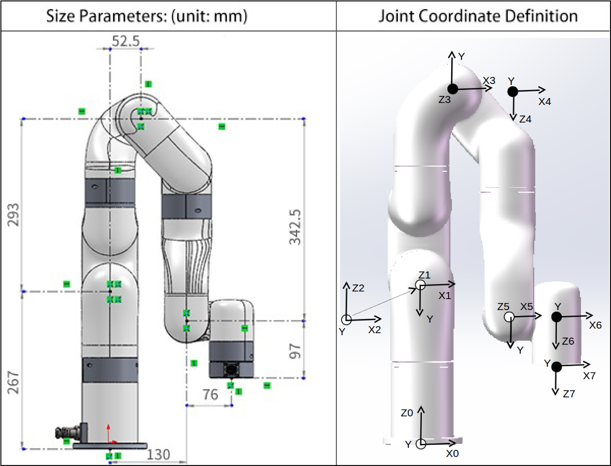

# xArm 7

<mark style="color:blue;">**1. Modified D-H Parameters**</mark>

<figure><figcaption></figcaption></figure>

<table><thead><tr><th width="147.33333333333331">Kinematics</th><th width="117">theta(rad)</th><th width="99">d(mm)</th><th width="123">alpha(rad)</th><th width="104">a(mm)</th><th>offset(rad)</th></tr></thead><tbody><tr><td>Joint1</td><td>0</td><td>267</td><td>0</td><td>0</td><td>0</td></tr><tr><td>Joint2</td><td>0</td><td>0</td><td>-pi/2</td><td>0</td><td>0</td></tr><tr><td>Joint3</td><td>0</td><td>293</td><td>pi/2</td><td>0</td><td>0</td></tr><tr><td>Joint4</td><td>0</td><td>0</td><td>pi/2</td><td>52.5</td><td>0</td></tr><tr><td>Joint5</td><td>0</td><td>342.5</td><td>pi/2</td><td>77.5</td><td>0</td></tr><tr><td>Joint6</td><td>0</td><td>0</td><td>pi/2</td><td>0</td><td>0</td></tr><tr><td>Joint7</td><td>0</td><td>97</td><td>-pi/2</td><td>76</td><td>0</td></tr></tbody></table>

<mark style="color:blue;">**2. Standard D-H Parameters**</mark>

<figure><figcaption></figcaption></figure>

<table><thead><tr><th width="147.33333333333331">Kinematics</th><th width="117">theta(rad)</th><th width="99">d(mm)</th><th width="123">alpha(rad)</th><th width="104">a(mm)</th><th>offset(rad)</th></tr></thead><tbody><tr><td>Joint1</td><td>0</td><td>267</td><td>-pi/2</td><td>0</td><td>0</td></tr><tr><td>Joint2</td><td>0</td><td>0</td><td>pi/2</td><td>0</td><td>0</td></tr><tr><td>Joint3</td><td>0</td><td>293</td><td>pi/2</td><td>52.5</td><td>0</td></tr><tr><td>Joint4</td><td>0</td><td>0</td><td>pi/2</td><td>77.5</td><td>0</td></tr><tr><td>Joint5</td><td>0</td><td>342.5</td><td>pi/2</td><td>0</td><td>0</td></tr><tr><td>Joint6</td><td>0</td><td>0</td><td>-pi/2</td><td>76</td><td>0</td></tr><tr><td>Joint7</td><td>0</td><td>97</td><td>0</td><td>0</td><td>0</td></tr></tbody></table>

<mark style="color:blue;">**3. Mass Parameters**</mark>

.png>)

<mark style="color:blue;">**xArm 7 - Model 1**</mark>

<table><thead><tr><th width="190">Dynamics</th><th width="184.33333333333331">Mass(kg)</th><th>Center of Mass(mm)</th></tr></thead><tbody><tr><td>Link1</td><td>2.177</td><td>[0.15, 27.24, -13.75]</td></tr><tr><td>Link2</td><td>1.716</td><td>[0.22, -124.7, 18.9]</td></tr><tr><td>Link3</td><td>1.485</td><td>[46.0, -22.3, -8.47]</td></tr><tr><td>Link4</td><td>1.574</td><td>[-69.75, -112.5, 13.2]</td></tr><tr><td>Link5</td><td>1.209</td><td>[-0.35, 17.6, -28.4]</td></tr><tr><td>Link6</td><td>1.214</td><td>[63.65, 30.84, 21.7]</td></tr><tr><td>Link7</td><td>0.17</td><td>[0.0, -6.77, -10.98]</td></tr></tbody></table>

<mark style="color:blue;">**xArm 7 - Model 2**</mark>

<table><thead><tr><th width="190">Dynamics</th><th width="184.33333333333331">Mass(kg)</th><th>Center of Mass(mm)</th></tr></thead><tbody><tr><td>Link1</td><td>2.46</td><td>[0.13, 30.1, -12.0]</td></tr><tr><td>Link2</td><td>1.916</td><td>[0.2, -129.6, 16.9]</td></tr><tr><td>Link3</td><td>1.69</td><td>[46.76, -25.3, -7.46]</td></tr><tr><td>Link4</td><td>1.774</td><td>[70.66, -116.6, 11.7]</td></tr><tr><td>Link5</td><td>1.357</td><td>[-0.3, 15.6, -25.3]</td></tr><tr><td>Link6</td><td>1.362</td><td>[65.0, 33.4, 21.3]</td></tr><tr><td>Link7</td><td>0.17</td><td>[0.0, -6.77, -10.98]</td></tr></tbody></table>

<mark style="color:blue;">**xArm 7 - Model 3**</mark>

<table><thead><tr><th width="190">Dynamics</th><th width="184.33333333333331">Mass(kg)</th><th>Center of Mass(mm)</th></tr></thead><tbody><tr><td>Link1</td><td>2.382</td><td>[0.13, 29.4, -12.4]</td></tr><tr><td>Link2</td><td>1.869</td><td>[0.2, -128.56, 17.35]</td></tr><tr><td>Link3</td><td>1.638</td><td>[46.6, -24.63, -7.68]</td></tr><tr><td>Link4</td><td>1.727</td><td>[70.5, -115.75, 12.0]</td></tr><tr><td>Link5</td><td>1.32</td><td>[-0.32, 16.04, -26.0]</td></tr><tr><td>Link6</td><td>1.325</td><td>[64.7, 32.8, 21.4]</td></tr><tr><td>Link7</td><td>0.17</td><td>[0.0, -6.77, -10.98]</td></tr></tbody></table>
