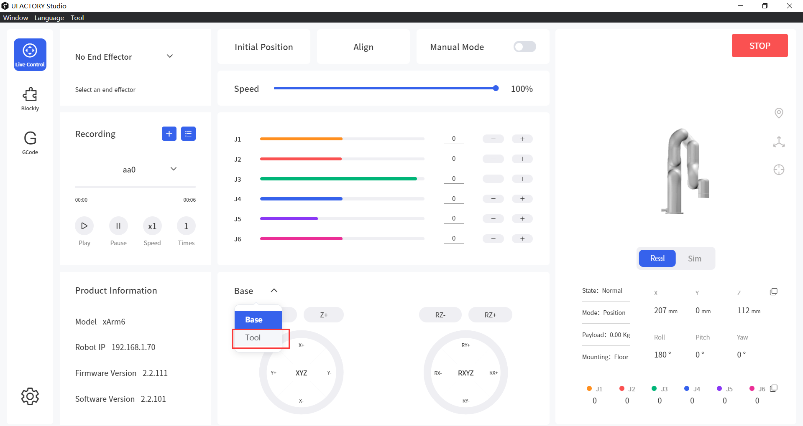

# Why the robot performs the same when adjusting the Roll and Yaw?

It normally happens when the Pitch=±90°, it's the[ <mark style="color:blue;">**Gimbal lock**</mark>](https://en.wikipedia.org/wiki/Gimbal\_lock), the arm will lose one degree of freedom.

There are 2 typical features of the gimbal lock situation on the robotic arm.

1\. When the robot is at a pos of Pitch=±90°, adjusting the Roll of the robot will get the same result as adjusting the Yaw. You can bypass this issue by switching to the 'Tool Coordinate' on UFACTORY Studio or using the 'set\_tool\_position' of the UFACTORY Python or C++ SDK.

<figure><figcaption></figcaption></figure>

2\. When the robot is at a pos of Pitch=±90°, the robot will report a different Roll and Yaw with the pos you sent to the robot. As the robot will lose one degree of freedom, **we keep Yaw=0°**. The value of Roll can refer to the following matrix.

Consider Roll, pitch and yaw angles have the values of α, β and γ respectively. The rotation matrix(R) of the TCP orientation should be:

A simple way to verify is:  (Roll\_send - Roll\_report) ±  (Yaw\_send - Yaw\_report) = 0 or ±360°.

<figure><figcaption></figcaption></figure>

### Example for feature1

### Example for feature2

1\) Move your arm to \[350, 0, 200, 90, 0, 0]

2\) Send pos \[350, 0, 200,  0, 90, 30] to the robot.

3\) Check the pos of the robot, it's \[350, 0, 200, -30, 90, 0]

