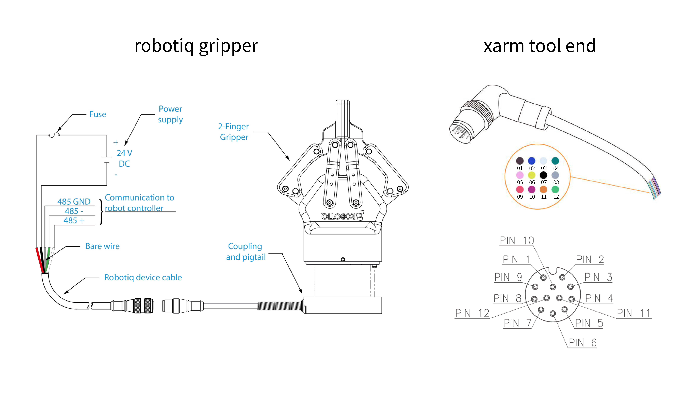
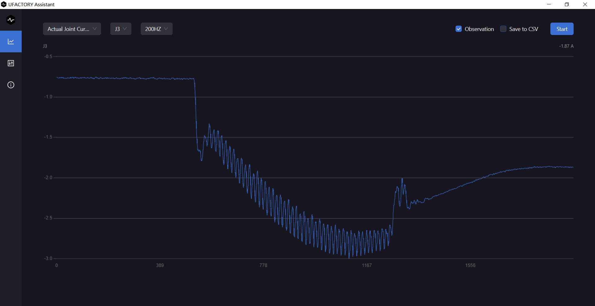

# How to use Robotiq Gripper on xArm tool end?

### 1. Hardware

* Gripper: Robotiq 2F-85/ Robotiq 2F-140
* Robotic Arm: xArm5/ xarm6/ xArm7

### 2. Cable connection

#### 1) Pin Definition

<figure><figcaption></figcaption></figure>

#### 2) Connection

<table data-full-width="false"><thead><tr><th width="197" align="center">Robotiq connector</th><th width="198" align="center">Robotiq connector</th><th width="174" align="center">xarm tool end</th><th align="center">xarm tool end</th></tr></thead><tbody><tr><td align="center"><strong>Color</strong></td><td align="center"><strong>Signal</strong></td><td align="center"><mark style="color:orange;"><strong>Color</strong></mark></td><td align="center"><mark style="color:orange;"><strong>Signal</strong></mark></td></tr><tr><td align="center">red</td><td align="center">+24V DC</td><td align="center">Brown&#x26;Blue</td><td align="center">+24V DC</td></tr><tr><td align="center">black</td><td align="center">-24V DC</td><td align="center">white</td><td align="center">GND</td></tr><tr><td align="center">white</td><td align="center">485-A</td><td align="center">pink</td><td align="center">User 485-A</td></tr><tr><td align="center">green</td><td align="center">485-B</td><td align="center">yellow</td><td align="center">User 485-B</td></tr><tr><td align="center">grey</td><td align="center">485 GND</td><td align="center">green</td><td align="center">GND</td></tr></tbody></table>

### 3. Parameter Config

The main parameter is the Baud rate, TCP offset, TCP payload, and self-collision prevention model.

#### 1) Config the parameter via UFactory Studio

Baud rate: 'Settings-Externals-Modbus RTU - **Robot Arm** - Baud Rate', and modify to 115200.

<figure><figcaption></figcaption></figure>

TCP Payload and offset: 'Settings-Motion-TCP'.

<figure><figcaption></figcaption></figure>

Self-collision prevention model: 'Settings-Live Control-End Effector', choose Robotiq Gripper.

<figure><figcaption></figcaption></figure>

#### 2) Config the parameter via Python SDK

Baud rate:


```python
# Modify the baud rate to 115200, the default is 2000000.
arm.set_tgpio_modbus_baudrate(115200)  
```


TCP Payload and offset:

```python
// Code Example
# Robotiq 2F/85 Gripper
arm.set_tcp_load(0.925, [0, 0, 58])
arm.set_tcp_offset([0, 0, 174, 0, 0, 0])
arm.save_conf()

# Robotiq 2F/140 Gripper
arm.set_tcp_load(1.025, [0, 0, 73])
arm.set_tcp_offset([0, 0, 244, 0, 0, 0])
arm.save_conf()
```

Self-Collision Prevention Model:

```python
// Code Example
# Robotiq 2F/85 Gripper
arm.set_collision_tool_model(4)

# Robotiq 2F/140 Gripper
arm.set_collision_tool_model(5)
```

### 4. Control Method

#### 1) Control it via UFactory Studio.

UFactory Studio - Live Control:

<div align="left">

<figure><figcaption></figcaption></figure>

</div>

UFactory Studio - Blockly:

<figure><figcaption></figcaption></figure>

UFactory Studio - Settings - Externals - Modbus RTU.

You need to send the Modbus RTU command to control the Robotiq Gripper yourself on this page.

<pre><code>// Example 1
<a data-footnote-ref href="#user-content-fn-1">09 10 03 E8 00 03 06 00 00 00 00 00 00 73 30</a>
09: Slave ID
10: Function Code 16(Preset Multiple Registers)
03E8: Address of the first register
0003: Number of registers written to
06: Number of data bytes to follow(3 registers x 2 bytes/register = 6 bytes)
0000: Value to write to register 0x03E9
0000: Value written to register 0x03EA
0000: Value written to register 0x03EB
7330: CRC
</code></pre>

```
// Example 2
09 10 03 E8 00 03 06 01 00 00 00 00 00 72 E1
```

<figure><figcaption></figcaption></figure>

#### 2) Control it via Python SDK

Using robotiq\_xxx method:

```python
// Code Example
arm.set_tgpio_modbus_baudrate(115200)
arm.robotiq_reset()
arm.robotiq_set_activate()
code, ret = arm.robotiq_close()
print('robotiq_close, code={}, ret={}'.format(code, ret))
code, ret = arm.robotiq_open()
print('robotiq_open, code={}, ret={}'.format(code, ret))
```

Using getset\_tgpio\_modbus\_data:

```python
// Code Example
code, ret = arm.getset_tgpio_modbus_data([0x08, 0x06, 0x01, 0x00, 0x00, 0x01])
print('set_bio_gripper_enable, code={}, ret={}'.format(code, ret))
code, ret = arm.getset_tgpio_modbus_data([0x08, 0x10, 0x07, 0x00, 0x00, 0x02, 0x04, 0x0, 0x0, 0x0, 0x82])
print('open_bio_gripper, code={}, ret={}'.format(code, ret))
code, ret = arm.getset_tgpio_modbus_data([0x08, 0x10, 0x07, 0x00, 0x00, 0x02, 0x04, 0x0, 0x0, 0x0, 0x32])
print('close_bio_gripper, code={}, ret={}'.format(code, ret))
```

For your reference:

[robotiq\_xxx](https://github.com/xArm-Developer/xArm-Python-SDK/blob/master/example/wrapper/thridparty/set\_robotiq\_gripper.py)

[getset\_tgpio\_modbus\_data](https://github.com/xArm-Developer/xArm-Python-SDK/blob/master/example/wrapper/common/5000-set\_tgpio\_modbus.py)



**Note:** When using the SDK to control the gripper, there is no need to send the CRC, we will add it automatically.


Note:

[^1]: 
