# 目录:  
* [1. 前言](#1-前言)
* [2. 连接机械臂](#2-连接机械臂)
  * [2.1 硬件连接](#21-硬件连接)
  * [2.2 软件连接](#22-软件连接) 
* [3. 实时控制界面](#3-实时控制界面)
  * [3.1 产品基础信息](#31-产品基础信息)
  * [3.2 使能和STOP按钮](#32-使能和STOP按钮)
  * [3.3 位置和关节控制](#33-位置和关节控制)
  * [3.4 仿真与真实机械臂](#34-仿真与真实机械臂)
  * [3.5 末端执行器](#35-末端执行器)
  * [3.6 轨迹录制](#36-轨迹录制)
* [4. Blockly界面](#4-Blockly界面)
  * [4.1 页面简介](#41-页面简介)
  * [4.2 Blockly工作区](#42-Blockly工作)
  * [4.3 Blockly编程](#43-Blockly编程)
    * [4.3.1 设置](#431-设置)
    * [4.3.2 运动](#432-运动)
    * [4.3.3 IO](#433-IO)
    * [4.3.4 末端工具](#434-末端工具)
    * [4.3.5 外接设备](#435-外接设备)
    * [4.3.6 导入](#436-导入)
    * [4.3.7 逻辑](#437-逻辑)
    * [4.3.8 循环](#438-循环)
    * [4.3.9 运算](#439-运算)
    * [4.3.10 进阶](#4310-进阶)
  * [4.4 Python IDE模块](#44-PythonIDE模块)
* [5. Gcode界面](#5-Gcode界面)
  * [5.1 G指令](#51-G指令)
  * [5.2 M指令](#52-M指令)
  * [5.3 注意事项](#53-注意事项)
* [6. 设置界面](#6-设置界面)
  * [6.1 运动参数](#61-运动参数)
  * [6.2 外接设备](#62-外接设备)
  * [6.3 安全设置](#63-安全设置)
  * [6.4 我的设备](#64-我的设备)
  * [6.5 设备信息](#65-设备信息)
* [7. Blockly典型示例](#7-Blockly典型示例)
  * [7.1 xArm机械爪的使用](#71-xArm机械爪的使用)
  * [7.2 xArm真空吸头的使用](#72-xArm真空吸头的使用)
  * [7.3 控制器数字IO的使用](#73-控制器数字IO的使用)
* [8. 运动学特性](#8-运动学特性)
  * [8.1 机械臂的运动方式](#81-机械臂的运动方式)
  * [8.2 xArm5运动特性](#82-xArm5运动特性)
  * [8.3 奇异点](#83-奇异点)
* [9. 机械臂状态与模式说明](#9-机械臂状态与模式说明)
  * [9.1 机械臂模式](#91-机械臂模式)
  * [9.2 机械臂状态](#92-机械臂状态)
* [10. 机械臂运动参数表](#10-机械臂运动参数表)
* [11. 术语定义](#11-术语定义)
* [12. 报错及处理](#12-报错及处理)
  * [12.1 控制器错误代码](#121-控制器错误代码)
  * [12.2 关节伺服错误代码](#122-关节伺服错误代码)
  * [12.3 Python SDK报警信息](#123-PythonSDK报警信息)
* [13. 软件/固件升级方式](#13-软件/固件升级方式)
   * [13.1 在线升级](#131-在线升级)
   * [13.2 离线升级](#132-离线升级)

# 1. 前言
&ensp;&ensp;UFACTORY Studio是一个控制机械臂的图形化用户应用程序，可以用来设置机械臂参数，实时控制机械臂姿态，可以通过拖拽Blockly命令来创建机械臂的运动程序。UFACTORY Studio提供了完善的机器人系统状态信息、故障提示与故障处理方案，即使您通过Python SDK/C++/ROS或机械臂自定义TCP协议来创建您的程序，我们仍然建议您在调试、编程阶段，始终保持UFACTORY Studio处于运行状态。    

&ensp;&ensp;UFACTORY Studio可通过浏览器访问，现已兼容的浏览器有：Google Chrome、Firefox、Safari、Microsoft Edge(Chromium内核)。   

&ensp;&ensp;适用产品：**xArm5、xArm6、xArm7、UFACTORY 850、Lite6。**
# 2. 连接机械臂
## 2.1 硬件连接
&ensp;&ensp;推荐控制器与PC直连，以xArm为例如下图：  
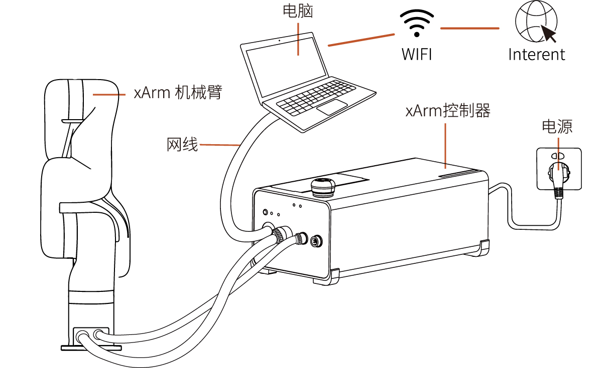</br>
&ensp;&ensp;其他连接方式请参考硬件连接。


## 2.2 软件连接
&ensp;&ensp;机械臂默认IP为192.168.1.xxx，**请确保电脑IP和机械臂IP处于同一网段，但不能完全一致。**即PC端的IPV4网段必须在192.168.1.1-192.168.1.255之间。
如何设置电脑IP请参考[快速安装手册-软件连接](https://www.cn.ufactory.cc/_files/ugd/896670_96742aa662884c389854f66dad3c4cbe.pdf)。   

&ensp;&ensp;打开浏览器，在搜索栏中输入**控制器IP+:18333**，可快速访问UFACTORY Studio。   

例如：控制器IP为192.168.1.201
访问链接：<u>192.168.1.201:18333</u></br>
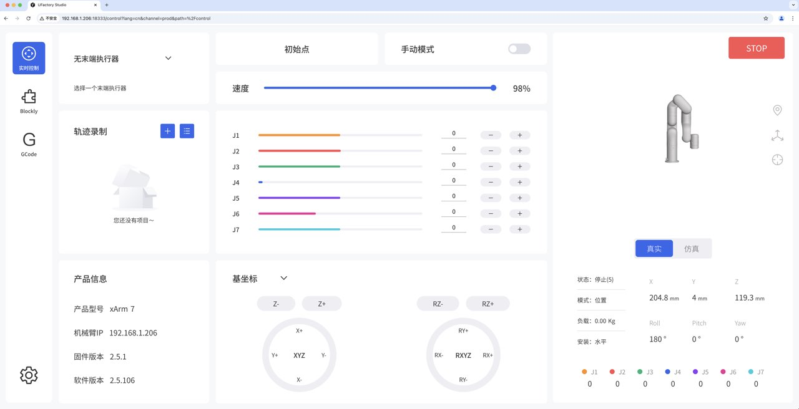</br>

# 3. 实时控制界面
&ensp;&ensp;用于实时控制机械臂的位置，调整机械臂的运动姿态，末端工具，轨迹录制等。
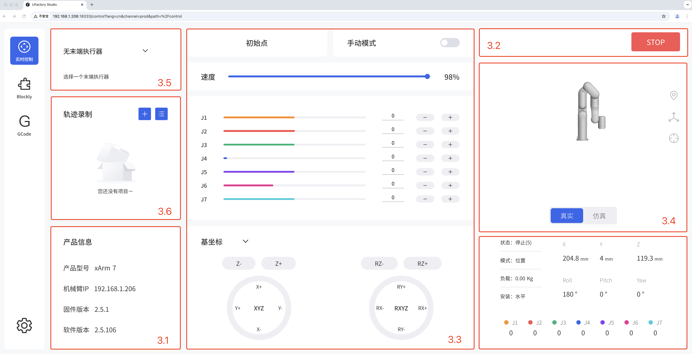</br>
## 3.1 产品基础信息
&ensp;&ensp;产品信息界面显示产品基础信息，如型号，机械臂IP，固件及软件版本，机械臂状态，模式，负载，安装方式等。  </br>  
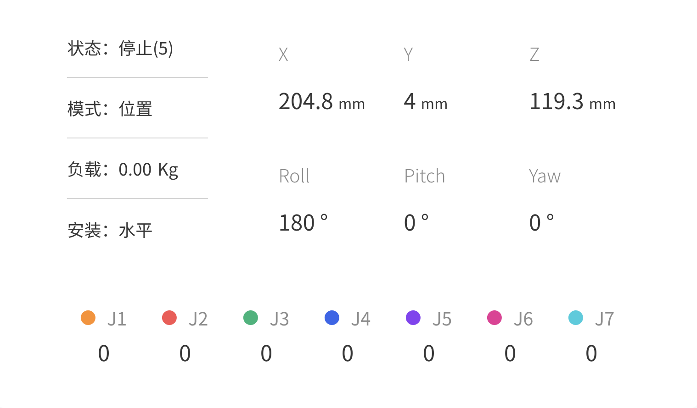</br>
* **IP地址：** 显示当前机械臂控制器的IP。  
* **模式：** 显示机械臂当前模式，默认为位置模式。  
* **负载：** 显示手臂当前的负载参数，默认为0kg。  
* **安装：** 显示手臂当前的安装方式，默认为水平。 
* **位置信息：** 显示机械臂当前TCP坐标[X,Y,Z,R,P,Y]。若选择轴角显示方式，则为[X,Y,Z,Rx,Ry,Rz]。可在辅助功能中切换。     
* **关节信息：** 显示机械臂各关节角度，单位为度。

## 3.2 使能和STOP按钮
</br>
* **使能：** 使能机械臂各关节，使能成功后，该按钮消失。  
* **STOP：** 机械臂立刻停止运动并清除所有缓存指令，不会断机械臂的使能状态。**软急停。**

## 3.3 位置和关节控制
</br>
* **初始点：** 长按为连续运动，机械臂回到默认初始点位。点按为步进运动，可在设置-运动参数-基础参数-初始点位置中设置自定义初始点（关节坐标）。    
默认初始点：    
&ensp;&ensp;xArm/850：``` [0,0,0,0,0,0,0]``` </br>
&ensp;&ensp;Lite6：```[0,9.9,31.8,0,21.9,0]```  </br>
</br>
* **末端调平：** 将末端法兰调整为水平。长按为连续运动，点按为步进运动。（xArm7因构型问题暂时不提供此按钮）
* **手动模式：** 可手动拖拽机械部关节到达目标位置点。</br> 
&ensp;&ensp;&ensp;&ensp;1. 开启手动模式前，请确保机械臂的安装方式和负载设置与实际符合，否则会有危险。</br>
&ensp;&ensp;&ensp;&ensp;2. 机械臂需要正确加载SN才能开启手动模式，可在设置-我的设备中查看软件获取的机械表SN。</br>
&ensp;&ensp;&ensp;&ensp;3. 查看并对比机械臂底座电源口贴的SN，与软件中的是否一致。</br>
* **速度：** 用于条件实时控制界面机械臂的运动速度，默认为50% = 115mm/s，1% = 2.3mm/s， 100%=230mm/s。（此页面速度最大值不是机械臂真实的最大运动速度，如需让机械臂高速运行，可在Blockly运动程序中添加速度指令）</br>
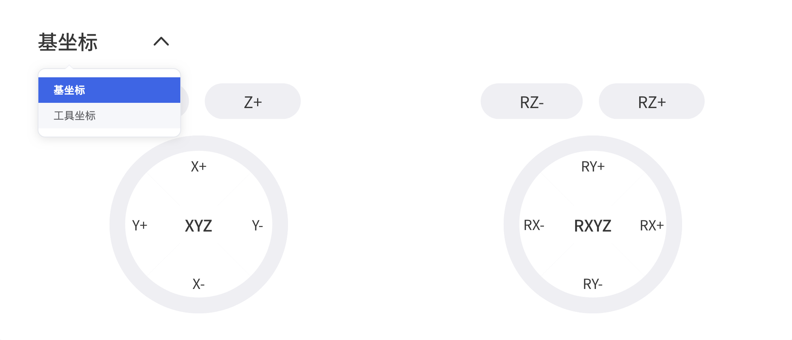</br>
* **直线运动：** 用户可以基于基坐标系，工具坐标系来控制机械臂的运动状态。笛卡尔空间运动的机械臂使工具在点之间进行线性移动，这意味这每个关节都会执行更为复杂的移动，以使工具保持在直线路径上。目标点确认后，末端路径是唯一的，轨迹过程中对应的姿态是随机的。</br>
&ensp;&ensp;&ensp;&ensp;1. 基坐标系XYZ控制工具的位置，单位是毫米（mm）。TCP坐标系的Roll/Pitch/Yaw控制工具的方向，单位是度（°）。</br>
&ensp;&ensp;&ensp;&ensp;2. 默认为轴角控制（Rx/Ry/Rz），可在设置-辅助功能中切换为RPY控制，如下图：</br>
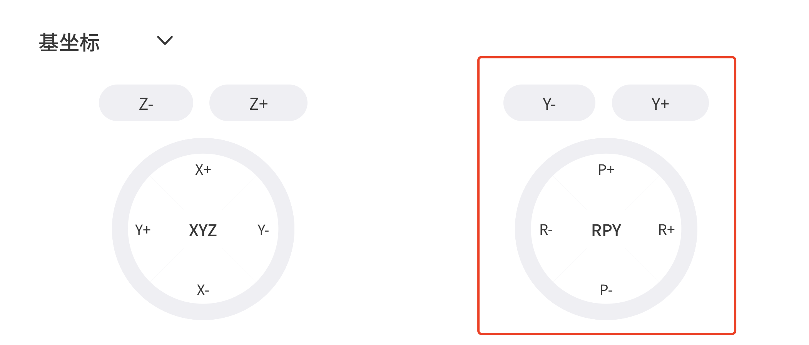</br>

***
<font color=blue size=4>TCP坐标系定义：</font></br>
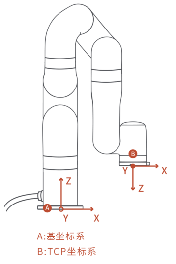</br>
&ensp;&ensp;机械臂末端执行器法兰中心点（TCP）来定义的TCP坐标系，是依次绕基坐标系的X/Y/Z轴旋转[180°, 0°,0°]的结果。TCP坐标系的X/Y/Z空间指向会根据旋转角度的改变而改变。
* Roll /Pitch/Yaw分别绕选定坐标系的X/Y/Z旋转，设置数值的±表示在旋转角度范围内圆的数值，其旋转方向会根据两点之间较小的角度方向旋转，这一点尤其要注意，严格控制两点之间的偏转角度大小来控制旋转方向，必要时在两点之间插入第三个点。如下图所示，如果要从位置点A偏转到位置点B，机械臂走的是α夹角方向，如果需要走β夹角方向，需要在β夹角之间插入新的位置点，而且要保证插入的位置点与A形成的夹角小于α。</br>
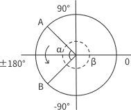</br>
* Roll/Pitch/Yaw三者的±180°在空间上的点是重合的，取值范围都为±180°，所以机械臂上报位置时，±180°都有可能。
* RPY [rad] 滚动角、俯仰角和偏航角 (RPY)。RPY 旋转矩阵（X、Y、Z 旋转）由以下公式确定：
`Rrpy ( r, p,y) = R Z (y ) · R Y (p ) · R X ( r )`  </br>
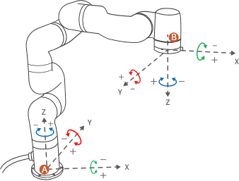</br>
&ensp;&ensp;&ensp;&ensp;&ensp;&ensp;A：基坐标系&ensp;&ensp;B：TCP坐标系</br>
</br>
***

* **关节运动：** 机械臂通过协调每一个关节的旋转角度来控制末端执行器的位置，末端轨迹不是直线，速度单位是°/s。目标点确定之后，末端路径和轨迹过程中对应的姿态都是唯一的，目标点有多个关节联动时，完成这条指令每个关节用时一样。</br>
 &ensp;&ensp;&ensp;&ensp; 长按为连续运动，点按为步进运动。</br>
 &ensp;&ensp;&ensp;&ensp; 进度条：显示当前关节可移动范围。</br>
</br>
**确定关节旋转方向，可参考下图：**  </br>
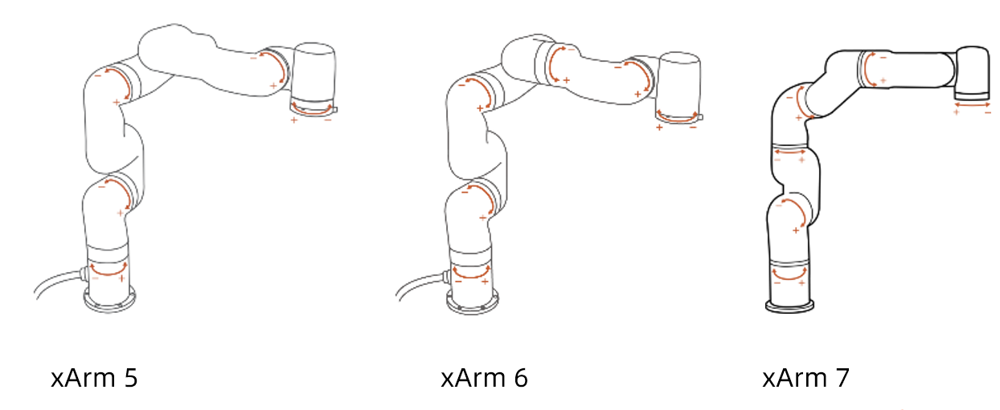</br>
## 3.4 仿真与真实机械臂
&ensp;&ensp;两种模式均需要连接真是机械臂。当切换为仿真机械臂时，真实机械臂不运动。但在仿真模式下设置的参数，应用于真实机械臂。
&ensp;&ensp;例如，在仿真模式下设置TCP负载为0.6kg，切换回真实机械臂时负载也为0.6kg。</br>
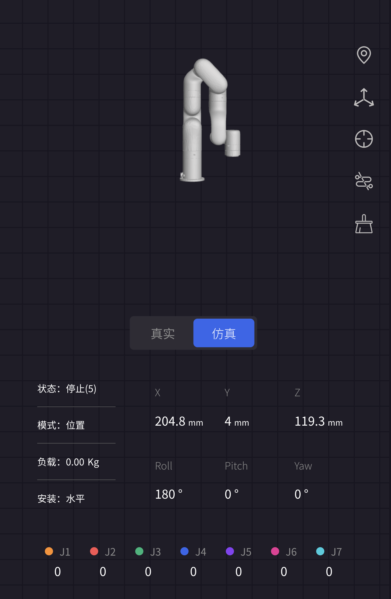</br>

* ![[icon_reset.jpg]](assets/icon_reset.jpg) **重置视角：** 将3D视图视角设置为默认状态。
* ![[icon_base.jpg]](assets/icon_base.jpg) **基坐标：** 显示当前基坐标系。
* ![[icon_TCP.jpg]](assets/icon_TCP.jpg) **工具坐标：** 显示当前工具坐标系。
* ![[icon_plotpath.jpg]](assets/icon_plotpath.jpg) **绘制轨迹：** 绘制机械臂运行轨迹。
* ![[icon_cleanpath.jpg]](assets/icon_cleanpath.jpg) **清除轨迹：** 清除已绘制的轨迹。

&ensp;&ensp;如下图，显示基坐标与工具坐标，绘制轨迹。</br>
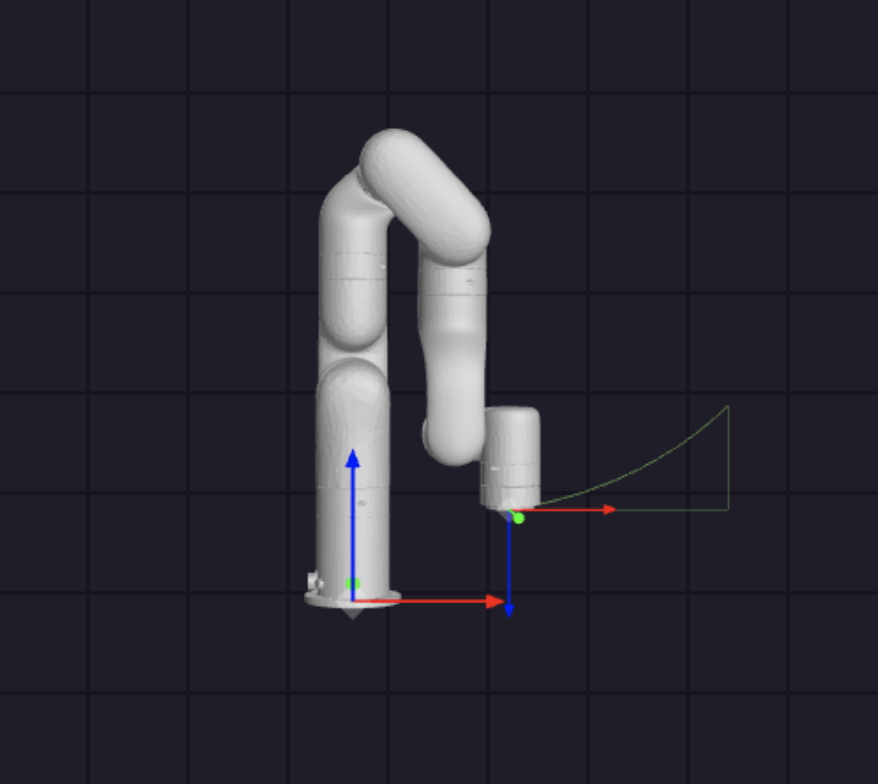</br>
## 3.5 末端执行器
&ensp;&ensp;软件支持的末端执行器有：机械爪、真空吸头（插接式和触点式）、xArm BIO机械爪、Robotiq-2F-85机械爪、Robotiq-2F-140机械爪。
&ensp;&ensp;默认为无末端执行器。</br>
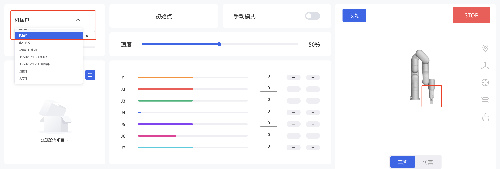</br>

&ensp;&ensp;选择对应末端执行器时，若检测到当前机械臂波特率和默认末端执行器波特率不符，弹框提示用户选择设置为默认波特率，点击是即可保存。例如：xArm机械爪默认波特率为2000000，Robotiq机械爪默认波特率为115200。  </br>
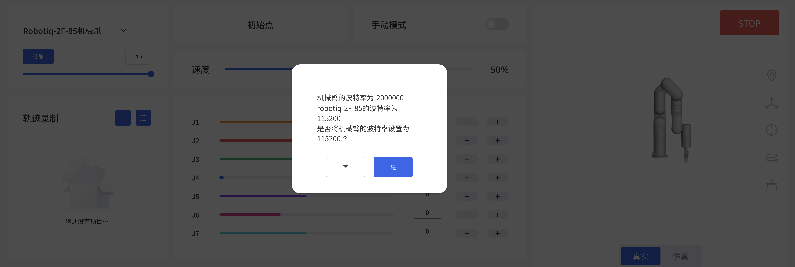</br>

&ensp;&ensp;支持自定义圆柱体和长方体，如下图：</br>
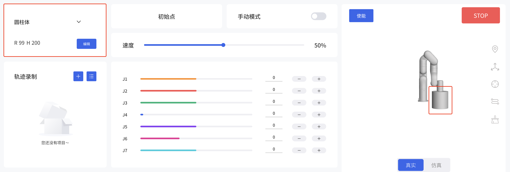</br>
## 3.6 轨迹录制
&ensp;&ensp;用于记录并回放用户拖拽机械臂进行示教的轨迹，最长录制时间为5分钟，可设置轨迹回放倍数，录制好的轨迹可导入Blockly项目中。
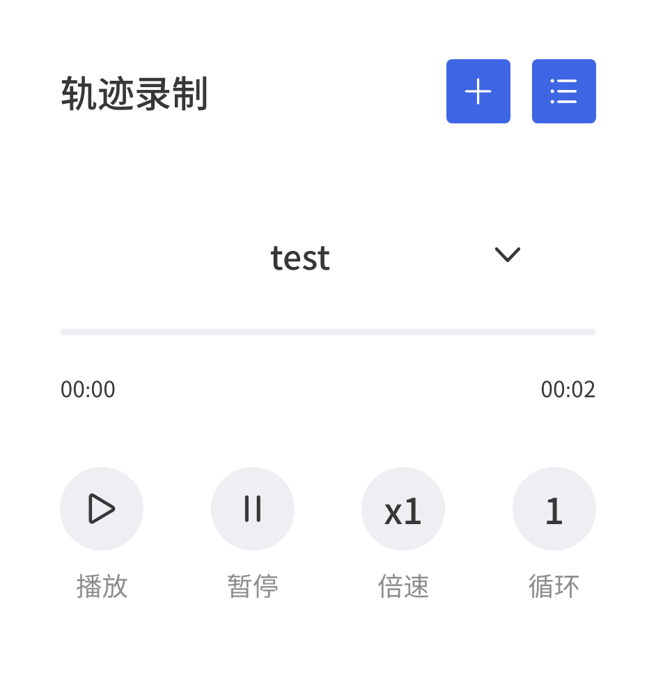</br>
![[icon_play.jpg]](assets/icon_play.jpg) **播放：** 播放当前轨迹文件。 </br>
![[icon_pause.jpg]](assets/icon_pause.jpg) **暂停：** 暂停播放当前轨迹文件。</br>
![[icon_speed.jpg]](assets/icon_speed.jpg) **倍数：** 倍数播放，可选1倍，2倍，4倍。</br>
![[icon_times.jpg]](assets/icon_times.jpg) **循环次数：** 循环播放次数，最大为999次。</br>
![[icon_create.jpg]](assets/icon_create.jpg) **新建文件：** 单击后弹出菜单：输入轨迹名称，点击录制并拖动手臂（**Lite6需要按住末端按钮**），轨迹录制完成，单击保存按钮。</br>
![[icon_list.jpg]](assets/icon_list.jpg) **导入/删除文件：** 导入和删除选中的轨迹文件。</br>

&ensp;&ensp;新建文件过程如图：  </br>
</br>
  
&ensp;&ensp;轨迹文件列表：</br>
</br>

# 4. Blockly界面
&ensp;&ensp;Blockly是一个图形化编程工具，可以通过拖拽代码块的方式编程来控制机械臂，无需手动编写代码。
## 4.1 页面简介
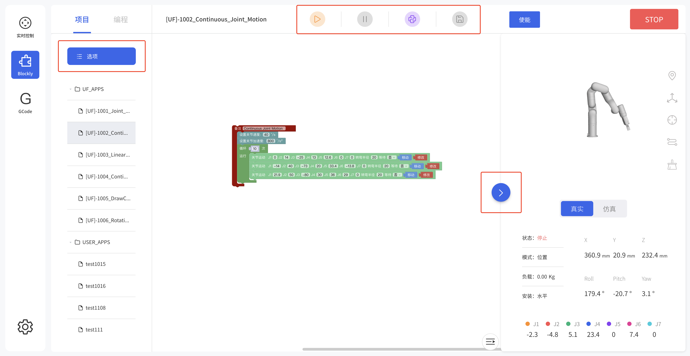</br>
 **运行：** 运行当前Blockly项目。 </br>
 **暂停：** 暂停正在运行的Blockly项目。</br>
 **转Python：** 跳转到Python IDE模块。</br>
 **保存：** 保存对Blockly项目的更改。</br>
 **缩放日志区：** 隐藏/显示日志区域。</br>
 **缩放3D区：** 隐藏/显示3D模型区域。</br>
 **文件操作：** 新建、导入、下载、复制、重命名、删除。</br>
## 4.2 Blockly工作区
&ensp;&ensp; 将代码块拖入到操作面板，**代码块执行的顺序是自上而下，从左至右**，可同时拖拽改代码块后面连着的代码。拖拽代码块到左边非工作区删除，或者可以选择代码块后按键盘Enter/Delete键。</br>
 **重置：** 页面回到默认大小和代码块居中位置。</br>
 **放大：** 放大代码块。</br>
**缩小：** 缩小代码块。</br>

**工作区右键功能**   </br>
&ensp;&ensp; 在非代码块的空白工作区右键，功能主要针对所有的代码块：</br>
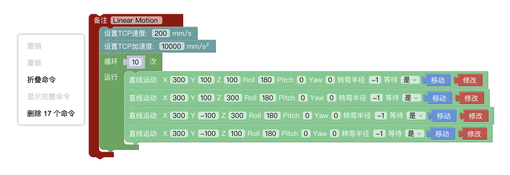</br>
* **撤销：** 撤销上一次的操作。 </br>
* **重做：** 还原上一次撤销的操作。</br>
* **折叠命令：** 折叠所有代码块。</br>
* **显示完整命令：** 显示所有折叠的代码块。</br>
* **删除命令：** 删除代码块。</br>

**代码块右键功能**   </br>
&ensp;&ensp; 在代码块上右键，功能主要针对当前的码块：</br>
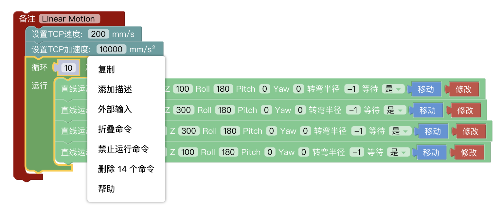</br>
* **复制：** 复制当前包裹的所有代码块。支持键盘复制/粘贴快捷键粘贴到其他文件（ctrl+c，ctrl+v，ctrl+x）。
* **添加描述：** 针对该代码块添加描述，弹出标识符，点击该符号可打开/关闭描述弹窗，如下图：</br>
</br>
* **外部输入：** 设置代码块的参数块在最后边。
* **内部输入：** 设置代码块的参数块和代码在一起。
* **折叠命令：** 折叠当前包裹的代码块。
* **禁止运行命令：** 禁止运行当前包裹的代码块，与此相反的是恢复运行命令。
* **删除命令：** 删除当前鼠标选中的代码块。</br>

**移动/修改代码块** </br>
</br>
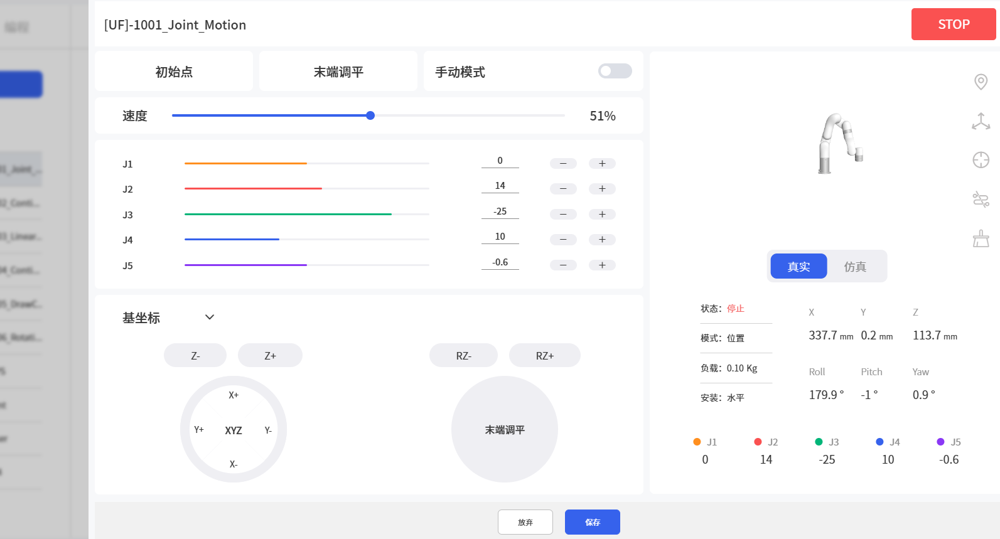</br>
&ensp;&ensp; 点击修改，弹出实时控制界面，可重新编辑当前指令的运动坐标。
&ensp;&ensp; 长按移动按钮，使机械臂移动到当前指令的位置点。点击保存，保存更改。

**注意：**
* 在一段指令里面，有顺序A/B/C/D...等多个点，如果点击移动让机械臂从A点位置跳过B点直接到C点或者C点以后的位置，为避免损害周边设施，必须要进行安全评估。
* 因为笛卡尔指令的复杂性，笛卡尔空间轨迹规划，需要做逆运动学求解。因而可能存在无解、多解、逼近解的情况。从A点到B点走笛卡尔指令时的解不理想时，必要时在两点之间插入第三个关节指令。

## 4.3 Blockly编程
### 4.3.1 设置
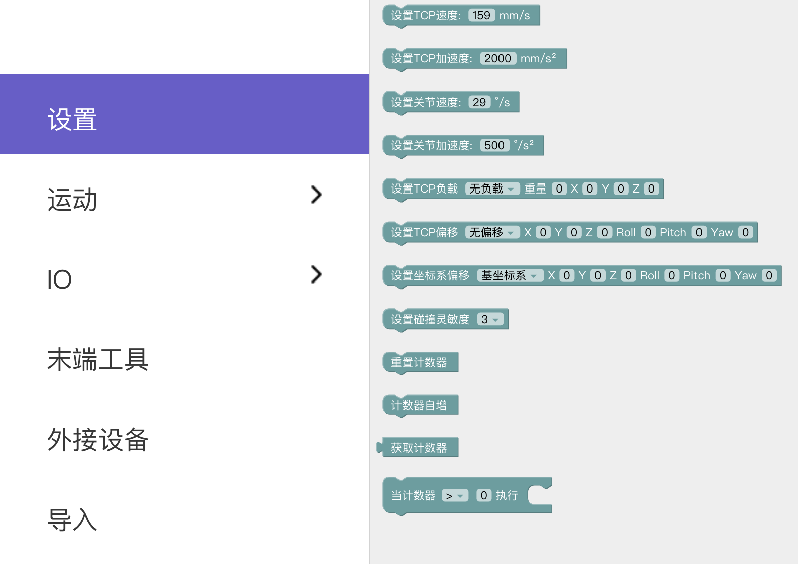</br>
* **设置TCP速度**: 设置直线运动的速度，单位是mm/s。参数范围：xArm/UF850:0-1000, Lite6:500 </br>
* **设置TCP加速度**: 设置直线运动的加速度，单位是mm/s²。参数范围：1-50000 </br>
* **设置关节速度**: 设置关节运动的速度，单位是°/s。参数范围：0-180</br>
* **设置关节加速度**：设置关节运动的加速度，单位是°/s²。参数范围1-1146 </br>
* **设置TCP负载**：设置当前项目的负载，下拉列表引用TCP负载。</br>
* **设置TCP偏移**：设置当前项目的末端偏移，下拉列表引用TCP偏移。</br>
* **设置坐标系偏移**:设置当前项目的基坐标偏移，下拉列表引用坐标系偏移数据。</br>
* **设置碰撞灵敏度**：默认为3，参数范围：0、1、2、3、4、5 </br>
* **重置计数器**：该指令将控制器内的计数器重置为0。 </br>
* **计数器自增**：每次执行到该指令时会使控制器的计数器自增1。 </br>
* **获取计数器**：获取计数器的值。 </br>
* **当计数器(>)(0)执行**：when执行事件，满足条件时执行。 </br>
### 4.3.2 运动
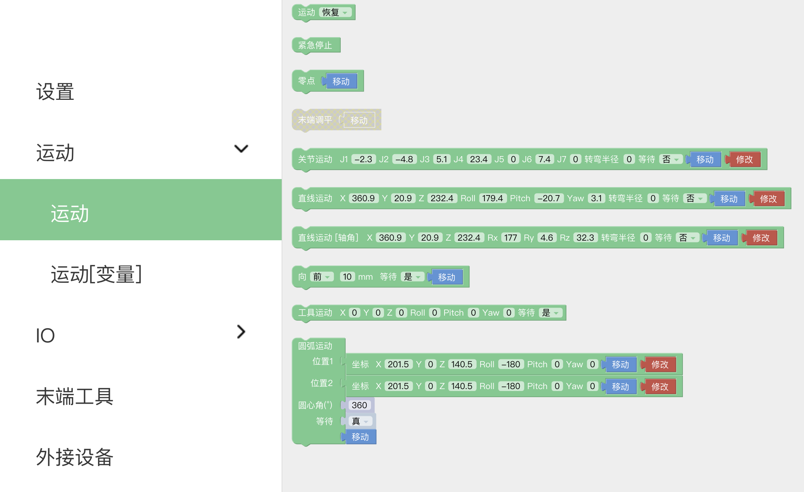</br>
* **运动（恢复）**：设置机械臂的状态。可选参数：恢复、暂停、停止。停止将退出程序。 </br>
* **紧急停止**：机械臂立即停止运动，退出Blockly程序并清空所有缓存指令。</br>
* **零点：** 机械臂回所有关节值都为0的姿态。</br>
* **末端调平：** 将末端调整为水平。</br>
* **关节运动：** 设置关节运动的各个关节值，单位是°。在真实机械臂模式下，从侧边拖出的关节运动指令数据是真实机械臂当前姿态数据。</br>
* **直线运动（XYZRPY）：** 直线运动，姿态控制方式为RPY</br>
* **直线运动[轴角]（XYZRxRyRz）：** 直线运动，姿态控制方式为轴角。</br>
* **向前**：机械臂基于当前位置做相对运动，单位是mm。可选参数：前、后、左、右、上、下</br>
* **工具运动（XYZRPY）：** 机械臂相对于工具坐标系做相对运动。</br>
* **圆弧运动：** 表示位置1到位置2走圆弧运动，但该命令前面还需再加入一个位置点，三点确定一个圆，单位是mm。圆心角：该圆弧的度数，设置360°时可以走完一整个圆弧。（注意：要想实现平滑的轨迹运动，需要设置等待=假）</br>
* **支持输入变量的运动：**  </br>
&ensp;&ensp; 与上面的运动代码块功能相似，可输入的值支持变量，方便客户编程。
例如下图，将X设置为变量。
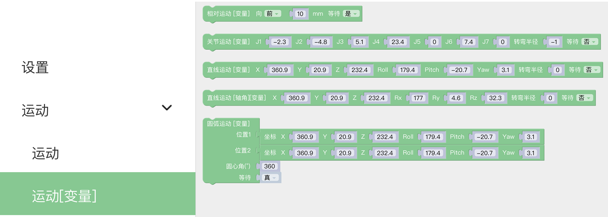</br>
### 4.3.3 IO
#### 4.3.3.1 控制器IO
&ensp;&ensp; xArm/UF850有16个数字输入、16个数字输出、2个模拟输入、2个模拟输出。
&ensp;&ensp; Lite6有8个数字输入、8个数字输出、2个模拟输入、2个模拟输出。</br>
&ensp;&ensp; 控制器数字输入IO为低电平触发。</br>
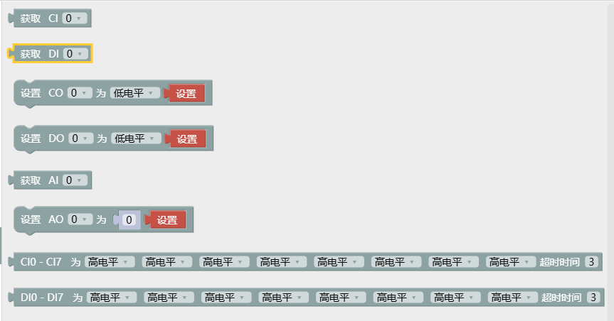</br>
**获取CI(0)：** 获取CI0-CI7的值。返回：0或1

**获取DI(0)：** 获取DI0-DI7的值。返回：0或1

**设置CO(0)为(低电平)：** 设置(CO0-CO7)为(低电平/高电平)，点击设置可单独执行该指令。

**设置DO(0)为(低电平)：** 设置(DO0-DO7)为(低电平/高电平)，点击设置可单独执行该指令。

**获取AI(0)**：获取AI0、AI1的值。返回：0-3V

**CI0-CI7为(高/低)电平,超时时间(3):** 判断CI0-CI7的值，满足条件时执行事件。当超过超时时间(3)s仍不满足条件时，执行下一条代码块。

**DI0-DI7为(高/低)电平,超时时间(3):** 判断DI0-DI7的值，满足条件时执行事件。当超过超时时间(3)s仍不满足条件时，执行下一条代码块。  

**位置触发：**   </br>
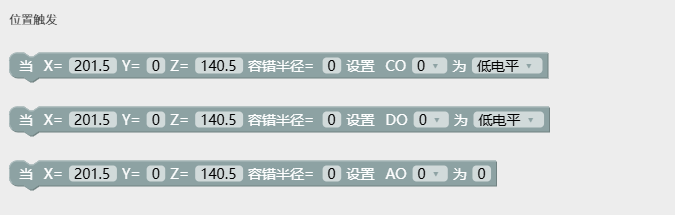</br>
* 当机械臂到达指定位置时，以触发位置点（X,Y,Z）为中心指定的球面体区域（球面体半径为容错半径）触发IO。该指令可用于在特定位置触发IO的场景。
* X,Y,Z 代表机械臂要到达的指定位置的坐标值，单位毫米。
* 容错半径是指，TCP位置触发的数字IO操作中，以触发位置点为中心指定一个球面体区域，只要系统检测TCP位置进入这个附近区域时即触发IO。如果不设置容错半径，则机械臂以非0的速度通过指定点时可能因无法准确检测到而导致漏触发。

**事件：**    </br>
</br>
* 当(CI0-CI7)为(高电平/低电平)时执行：当条件满足时执行该代码块包含的指令。
* 当(DI0-DI7)为(高电平/低电平)时执行：当条件满足时执行该代码块包含的指令。
* 当(AI0/AI1)(=)(0)时执行：当监听的模拟IO数值满足条件时执行代码块包含的指令，条件有 =，≠，>，≥，<，≤ 。
* UFactory studio的IO触发逻辑：</br>
&ensp;&ensp; &ensp;&ensp; **当（when，跳变触发）：** 每100ms获取一次IO状态，将第一次获取到的状态作为初始值。从第二次获取到的IO状态与上一次获取的IO状态比较，**有变化时**触发满足条件的回调。  </br>
&ensp;&ensp; &ensp;&ensp; **如果（if，水平触发）：** 第一次检测到IO状态满足条件时，触发满足条件的回调。
#### 4.3.3.2 工具IO
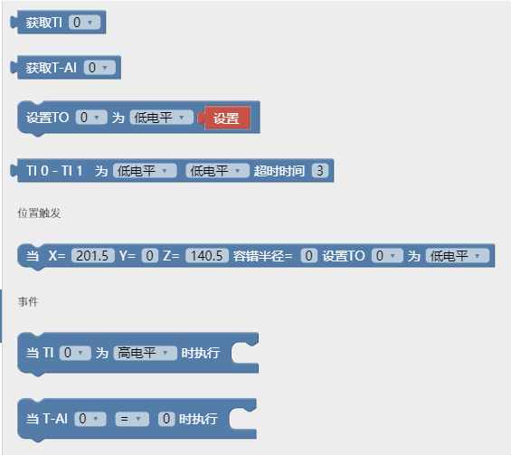</br>
&ensp;&ensp;可参考控制器IO的代码块，功能相似。
### 4.3.4 末端工具
**机械爪** </br>
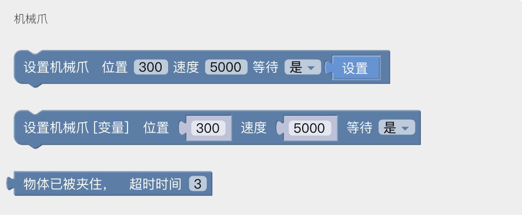</br>
</br>
&ensp;&ensp; 软件自动检测手臂类型，并显示对应代码块。 </br>
&ensp;&ensp; **xArm/UF850：** 设置机械爪位置、设置机械爪位置(变量)、物体已被夹住。 位置：-10-850，速度：1000~5000  </br>
&ensp;&ensp; **Lite6：** 设置机械爪张开、物体已被夹住。 可选参数：张开、闭合、停止 </br>

**BIO机械爪**</br>
</br>
&ensp;&ensp; **BIO机械爪：** 初始化机械爪，设置BIO机械爪打开、检测BIO机械爪已经夹住物体。
机械爪使用时必须先进行初始化。 速度：200-2400

**Robotiq机械爪**</br>
</br>
&ensp;&ensp; **Robotiq机械爪：** 初始化Robotiq机械爪、设置Robotiq机械爪位置/速度/力度。
位置：0-255，速度：0-255，力度：0-255


**真空吸头** </br>
</br>
&ensp;&ensp; 获取真空吸头状态：返回0或1。 0：吸住  1：  </br>
&ensp;&ensp; 检测到物体已经(吸住)：吸住或释放，超过超时时间不满足条件则执行下一个代码块。  </br>
&ensp;&ensp; 设置真空吸头(开)是否拾取检测(否)：打开或关闭吸头。  </br>

### 4.3.5 外接设备</br>
#### **直线滑轨** 
</br>
&ensp;&ensp; 当手臂检测到连接了滑轨时显示此代码块，否则不可使用。 设置直线滑轨：位置、速度。

#### **Modbus RTU** 
</br>
&ensp;&ensp; 设置/获取RS-485端口Modbus RTU指令： 机械臂/控制盒。  </br>
&ensp;&ensp; 仅支持**标准ModbusRTU**，会在输入的指令后自动加CRC。 </br>
&ensp;&ensp; 例如：控制xArm机械臂开到位置600，并获取当前位置。 </br>
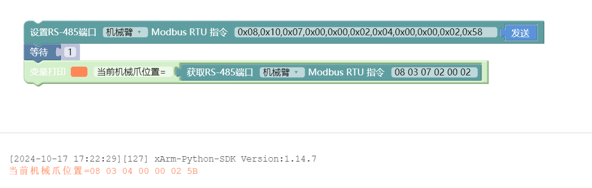</br>

#### **力矩传感器**
</br>
设置力矩传感器力控制：
坐标系：基坐标、工具坐标。  </br>
力方向：Fx,Fy,Fz,Tx,Ty,Tz。  力大小：Fx(-105,105)  Fy(-105,105)  Fz(-140,140)   TxTyTz(-2.8,2.8)

#### **Modbus TCP**
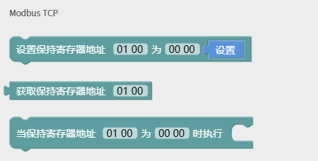</br>
&ensp;&ensp; Modbus TCP寄存器定义请参考：[Modbus TCP寄存器](https://docs.ufactory.cc/modbustcp_cn)
&ensp;&ensp; 当保持寄存器地址()为()时执行：需要检测到该寄存器地址的值有跳变，则触发事件。 </br>
&ensp;&ensp; 例如下图，将寄存器01 A0的值设置为12 34，触发手臂运动。 </br>
</br>

### 4.3.6 导入
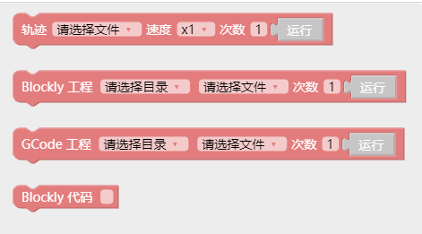</br>
&ensp;&ensp; 可支持导入轨迹文件、Blockly工程、Gcode代码。可选择运行次数。 </br>
&ensp;&ensp; 点击运行可单独执行对应的文件项目。 </br>

### 4.3.7 逻辑
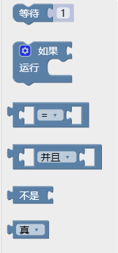</br>
**等待：** 等待()秒后发送后面的指令。
如果(条件1) 运行（指令1）：如果条件1成立，则会运行指令1，否则就跳过。
如果/否则语句的设置：
* 点击运行命令块上的设置按钮，然后命令块会弹出一个选择框，如下图：</br>
  
* 将上图中否则代码块拖到右边如果代码块下方，使两个代码块结合，如下图：</br>
  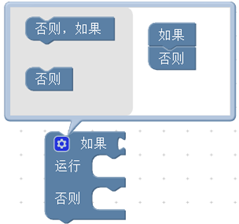
* 此时点击设置按钮，1. 选择框收回，如果/否则语句设置完成，如下图：</br>
</br>
  
### 4.3.8 循环 
</br>
**一直循环 ：** 里面包含的指令无限循环。  </br>
**循环() 运行：** 循环（）次里面包含的指令。</br>
**重复运行，当：** 当条件不成立时，跳出循环。</br>
**跳出循环：** 终止循环。</br>

### 4.3.9 运算
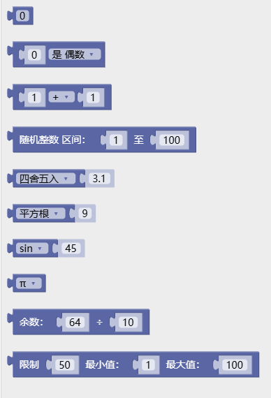</br>
&ensp;&ensp; 可使用上面的代码块做加减乘除，指数运算等一些复杂的运算。</br>

### 4.3.10 进阶
#### **文字**
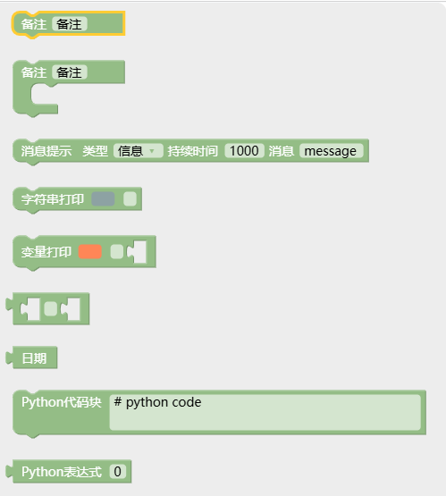</br>
**备注：** 备注该代码块，起指示作用，可改变颜色。</br>
**消息提示：** 类型（信息/成功/警告/错误），持续时间表示消息显示的时间，单位是秒（s）；message表示提示的消息内容。</br>
**字符串打印：** 可在下方打印输入的字符串，并设置字体颜色。</br>
**变量打印：** 可打印添加的变量，并设置字体颜色。</br>
**日期：** 可输出运行该指令时的日期。</br>
**Python代码块：** 可以自定义编写python代码,使其变成Blockly中的一个块，并在程序中使用</br>
**Python表达式：** 可以自定义Python表达式。</br>

#### **变量**
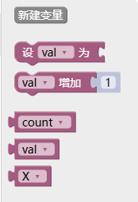</br>
&ensp;&ensp; 用户可以新建变量。变量操作：设置变量值、通过加减操作改变变量值。</br>
&ensp;&ensp; 可重命名变量、删除变量。</br>

#### **函数**
</br>
**定义函数（函数名）：** 可定义新函数，不带返回值。</br>
**定义函数（函数名）输出[]：** 可定义新函数，带返回值。</br>
**如果()输出()：** 条件判断句，只能放在内置函数中。  </br>

注意：定义的函数要放在主程序的前面。

## 4.4 PythonIDE模块
&ensp;&ensp; 点击Blockly页面的图标进入到Python IDE页面。 Python IDE是Python开发集成环境，可直接使用xArm-Python-SDK API和查看Blockly项目自动转换的Python代码。</br>
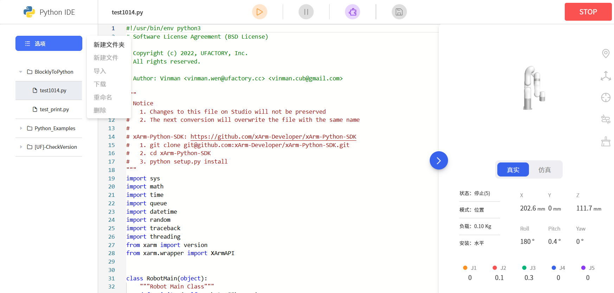</br>
&ensp;&ensp; 点击选项，或右键项目，可新建文件夹、新建文件、导入文件、下载文件、重命名文件、删除文件，图标功能与Blockly相似。</br>

# 5. Gcode界面
&ensp;&ensp;支持新建、导入、下载GCode文件。通过发送GCode指令，控制手臂。
## 5.1 G指令

| G指令                  | 格式                                    | 说明                                                                                            |
| -------------------- | ------------------------------------- | --------------------------------------------------------------------------------------------- |
| G0&ensp;&ensp;&ensp; | G0 X Y Z A B C                        | 固定速度为240mm/s                                                                                  |
| G1                   | G1 X Y Z A B C F                      | XYZ单位mm，ABC对应roll/pitch/yaw，单位°，F为速度，单位mm/min                                                 |
| G2                   | G2 X Y Z R P F</br>G2 X Y Z I J K P F | 半径格式圆（顺时针），XYZ表示目标位置，R表示圆半径，P表示整圆圈数，F表示速度</br>中心格式圆弧（顺时针），XYZ表示目标位置，IJK对应圆心，P表示整圆圈数，F表示速度<br> |
| G3                   | G3 X Y Z R P F</br>G3 X Y Z I J K P F | 半径格式圆（逆时针），XYZ表示目标位置，R表示圆半径，P表示整圆圈数，F表示速度</br>中心格式圆弧（逆时针），XYZ表示目标位置，IJK对应圆心，P表示整圆圈数，F表示速度     |
| G4                   | G4 P                                  | 休眠指令，P为要休眠的秒数                                                                                 |
| G17                  |                                       | 圆弧指令设置XY平面，G2/G3默认使用该平面                                                                       |
| G18                  |                                       | 圆弧指令设置XZ平面                                                                                    |
| G19                  |                                       | 圆弧指令设置YZ平面                                                                                    |
| G20                  |                                       | 单位为英寸，影响G0/G1                                                                                 |
| G21                  |                                       | 单位为毫米，影响G0/G1                                                                                 |
| G90                  |                                       | 绝对定位，影响G0/G1/G2/G3</br>G0/G1默认用该模式，G2/G3的XYZ默认用该模式                                            |
| G90.1                |                                       | 圆弧指令使用绝对定位，影响G2/G3                                                                            |
| G91                  |                                       | 相对定位，影响G0/G1/G2/G3                                                                            |
| G91.1                |                                       | 圆弧指令使用相对定位，影响G2/G3</br>G2/G3的IJK参数默认使用该模式                                                     |

## 5.2 M指令

| M指令    | 格式       | 说明                                                                                                                                                                                                                                                     |
| ------ | -------- | ------------------------------------------------------------------------------------------------------------------------------------------------------------------------------------------------------------------------------------------------------ |
| M2/M30 |          | 停止程序，收到该指令重置参数 单位使用毫米（G21），绝对定位（G90），圆弧平面为XY（G17）,G1默认速度为100mm/s                                                                                                                                                                                       |
| M62    | M62 P&ensp;&ensp;&ensp;    | 设置COx为高电平，队列执行，P为0-15</br>0-7：CO0-CO7， 8-15：DO0-DO7                                                                                                                                                                                                    |
| M63    | M62 P    | 设置COx为低电平，队列执行，P为0-15</br>0-7：CO0-CO7， 8-15：DO0-DO7                                                                                                                                                                                                    |
| M64    | M62 P    | 设置COx为高电平，立即执行，P为0-15</br>0-7：CO0-CO7， 8-15：DO0-DO7                                                                                                                                                                                                    |
| M65    | M62 P    | 设置COx为低电平，立即执行，P为0-15</br>0-7：CO0-CO7， 8-15：DO0-DO7                                                                                                                                                                                                    |
| M67    | M67 E Q  | 设置AOx，队列执行，E为0-1，Q为0-10V                                                                                                                                                                                                                               |
| M68    | M68 E Q  | 设置AOx，立即执行，E为0-1，Q为0-10V                                                                                                                                                                                                                               |
| M100   | M100 P Q | P1为使能，P0为断使能</br>Q为关节ID（缺省为8，即所有关节）                                                                                                                                                                                                                    |
| M101   |          | 清除错误                                                                                                                                                                                                                                                   |
| M102   |          | 清除警告                                                                                                                                                                                                                                                   |
| M103   | M103 P   | 设置模式，P为要设置的模式                                                                                                                                                                                                                                          |
| M104   | M104 P   | 设置状态，P为要设置的状态                                                                                                                                                                                                                                          |
| M115   | M115 P Q | 设置TOx的数字输出</br>P为0-4，Q为0/1/10/11</br>Q0设置低电平，队列执行。Q1设置高电平，队列执行</br>Q10设置低电平，立即执行。Q11设置高电平，立即执行                                                                                                                                                         |
| M116   | M116 P Q | 控制末端设备</br>P1：xArm机械爪，Q表示机械爪位置</br>P2：xArm真空吸头，Q0吸取Q1释放（队列执行）</br>Q10吸取Q11释放（立即执行）</br>P3：BIO机械爪，Q0闭合，Q1张开</br>P4/P5：Robotiq机械爪，Q表示位置（0~255）</br>P11：Lite6机械爪，Q0闭合Q1张开（队列执行）</br>Q10闭合Q11张开（立即执行）</br>P12：Lite6真空吸头，Q0吸取Q1释放（队列执行）</br>Q10吸取Q11释放（立即执行） |

## 5.3 注意事项
* 固件版本：v2.2.0+
* 使用端口：504
* 回复数据：5字节
* 建议每次发一行非空数据（带换行符），固件按行回复
```python
sock.send(b'G0 X300\n')
```
* 要接收回复，否则缓冲区可能会满
```python
sock.recv(5)
```
* 最多同时缓存2000条队列指令（G0/G1/G2/G3/G4/M62/M63/M67），一旦缓存满了，处理进程会阻塞直到缓存指令被消耗至少1条，阻塞过程无法处理任何Gcode指令。

&ensp;&ensp;示例：
```python
import socket
sock = socket.socket(socket.AF_INET, socket.SOCK_STREAM)
sock.setsockopt(socket.SOL_SOCKET, socket.SO_REUSEADDR, 1)
sock.setblocking(True)
sock.connect(('192.168.1.67', 504))

def send_and_recv(data):
    for line in data.split('\n'):
        line = line.strip()
        if not line:
            continue
        sock.send(line.encode('utf-8', 'replace') + b'\n')
        ret = sock.recv(5)
        code, mode_state, err = ret[0:3]
        state, mode = mode_state & 0x0F, mode_state >> 4
        cmdnum = ret[3] << 8 | ret[4]
        if code != 0 or state >= 4 or err > 0:
            print('code: {}, mode: {}, state: {}, err: {}, cmdnum: {}, cmd: {}'.format(code, mode, state, err, cmdnum, line))

# move x to x=500mm, speed= 10000 mm/min
send_and_recv('G1 X500 F10000')
```
# 6. 设置界面
## 6.1 运动参数
### 6.1.1 基础参数
</br>
**关节步长：** 设置单关节旋转的步进值，对应点动板的关节运动。

**位置步长：** 设置笛卡尔空间坐标系X/Y/Z轴的步进值，对应点动板的直线运动。

**姿态步长**：设置笛卡尔空间坐标系Roll/Pitch/Yaw的步进值，对应点动板的直线运动。

**碰撞检测**：机械臂运动过程中，检测到的力矩和理论力矩超过一定范围时，机械臂会立刻停止。碰撞灵敏度等级为1-5，等级越高，手臂越灵敏，触发碰撞保护所需的外力越小。请设置正确负载和安装方式，否则容易触发碰撞保护。在某些高负载和高速运动时，可能会误报，建议将碰撞灵敏度调低，但不建议将其调到3以下。

**初始点位置**：设置机械臂初始点，可帮助用户在规划轨迹时，使机械臂回到相对安全的位置。该位置设置的初始点即为实时控制界面初始点按钮的位置。点击设置按钮，软件自动跳转自实时控制界面，将手臂移动到想要设置的初始点，点击保存按钮。
### 6.1.2 TCP设置
&ensp;&ensp;查看手臂当前的TCP负载和偏移，并根据实际情况设置TCP负载和重心偏移。

**TCP负载：** 指实际的（末端执行器+工件）的重量，单位是kg；X/Y/Z轴表示TCP的重心位置，单位是mm。当末端实际没有任何负载时，TCP负载和重心均要设置为0.

**TCP偏移：** 设置TCP（末端执行器）坐标系与定义在法兰中心的工具坐标系之间的相对偏移，单位是mm。如图上B点TCP偏移，位置坐标X,Y,Z决定了TCP的位置，而Roll，Pitch，Yaw决定了其方向。当指定的值均为0时，TCP与工具法兰的中心点重合。
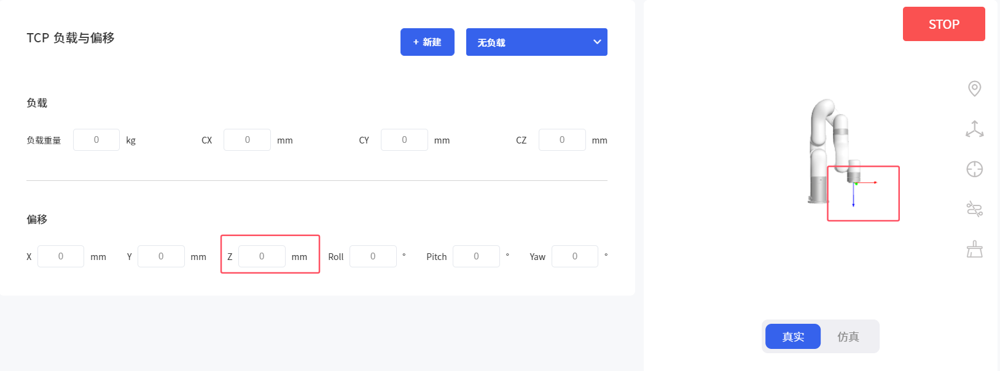</br>
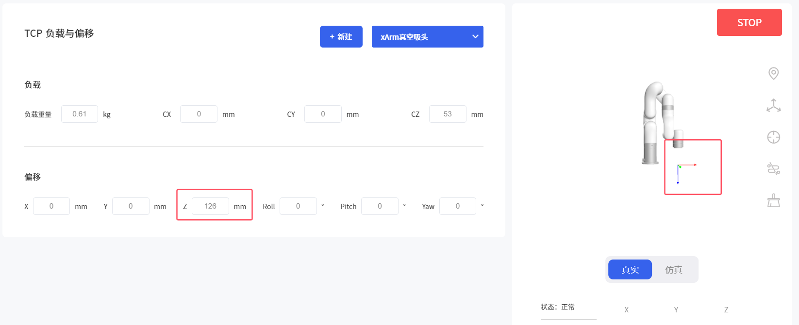</br>
在该页面可设置机械臂当前负载和记录备用负载数据，并在Blockly编程时引用。

**默认TCP负载和偏移：[kg,Cx,Cy,Cz][x,y,z,roll,pitch,yaw]**    </br>
&ensp;&ensp;无负载：[0,0,0,0]，[0,0,0,0,0,0] </br>
&ensp;&ensp;xArm真空吸头：[0.61,0,0,53]，[0,0,126,0,0,0]</br>
&ensp;&ensp;xArm机械爪：[0.82,0,0,48]，[0,0,172,0,0,0]</br>
&ensp;&ensp;xArm BIO机械爪：[0.72,22.39,3.22,23.55]，[159.5,0,59.5,0,0,0]</br>
&ensp;&ensp;Robotiq-2F-85机械爪：[0.925,0,0,58]，[0,0,174,0,0,0]</br>
&ensp;&ensp;Robotiq-27-140机械爪：[1.025,0,0,73]，[0,0,244,0,0,0]</br>

**新建负载和TCP偏移：**  </br>
* 方式一：手动输入。</br>
&ensp;&ensp;&ensp;&ensp;用户知道负载的重量和负载重心，点击新建按钮后，选择手动输入。负载重心以工具坐标系（如上图点B）为基点设置。</br>
&ensp;&ensp;&ensp;&ensp;注意：新建负载的名称一旦确定后，不能更改名称。选择新建的负载，可点击删除，系统默认的负载无法删除。</br>
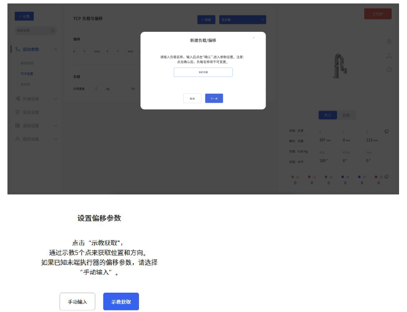</br>
</br>

* 方式二：机械臂自动辨识。</br>
&ensp;&ensp;&ensp;&ensp;手臂必须水平安装。点击自动辨识，手臂自动进行一系列动作计算出TCP负载参数，如下图，此时请确保机械臂附近设备和人员的安全。TCP负载设置完成后，点击下一步，点击自动辨识按钮，开始TCP负载自动辨识。</br>
&ensp;&ensp;&ensp;&ensp;此步骤通过示教4个点来获取偏移参数。</br>
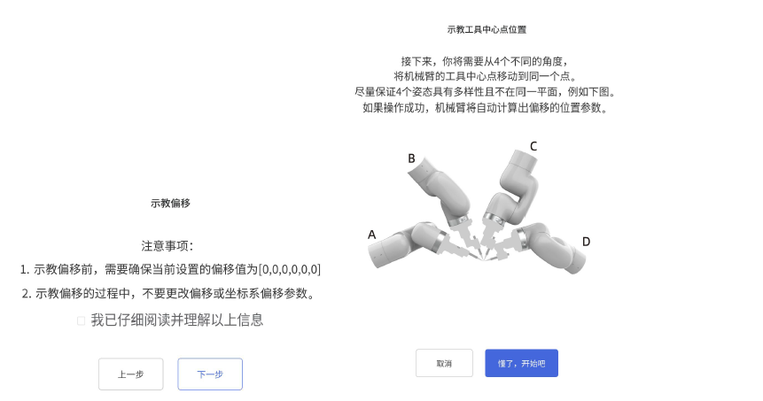</br>

### 6.1.3 坐标系

**基坐标系：** 可设置基坐标系偏移来自定义用户坐标系，如图A点基坐标系，XYZ是相对于自定义用户坐标系依次偏移的坐标值，RPY是相对于自定义用户坐标系旋转的角度值，是以一定的顺序绕自定义用户坐标系旋转三次得到的方位。

**新建基坐标系：** </br>
* 方式一：手动输入</br>
* 方式二：示教获取，通过示教4个点，来获取用户坐标系参数。</br>
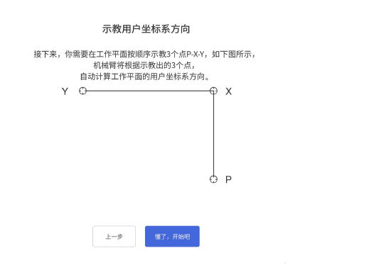</br>
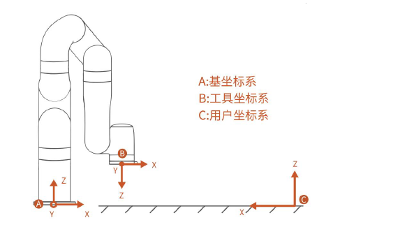</br>

示例： </br>
&ensp;&ensp;在坐标系{A}下： B(207,0,112,180,0,0) DAC  = 1000mm  </br>
&ensp;&ensp;如果用户想要设置坐标系{C}为参考坐标系，则需要在用户坐标系{C}下来表示坐标系{A}的方位。</br>
则：如图所示，基坐标系的偏移应为(1000,0,0,0,0,180)</br>
TCP坐标由：B(207,0,112,180,0,0) 变为B'(793,0,112,180,0,180)</br>  


**安装方向：** 设置机械臂的安装方式，告知控制器当前机械臂的实际安装方向与重力方向的关系。如果机械爪安装方式设置不正确，机械臂将无法准确识别重力方向，会导致机械臂频繁触发碰撞检测，还将导致机械臂进入手动模式后触发“手动模式运动异常”的报错。</br>
&ensp;&ensp;对于SN为XF1300/XI1300/XS1300及更新版本的机械表，机械臂内置的IMU（惯性测量单元）会检测重力方向，当您设置的安装方向与IMU检测的安装方向偏差超过10°时，软件会弹出错误提示。</br>
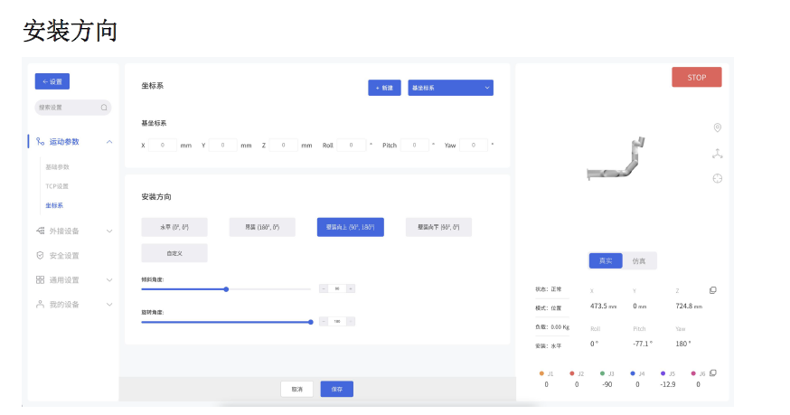</br>
&ensp;&ensp;主要参数：倾斜角、旋转角  </br>

***

<font color=Blue size=4>如何确认倾斜角和旋转角？</font>  </br>
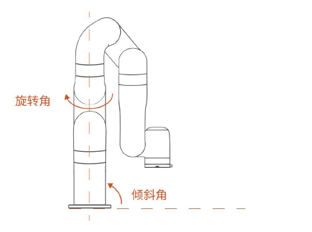</br>
&ensp;&ensp;机械臂的初始位置点：在水平线上，机械臂零点姿态下，人面向机械臂时，机械臂末端在人的左手边且指向斜面向下方向为初始位置点。 </br>
* **倾斜角：** 机械臂的初始位置点与实际要安装的机械臂的底座夹角作为倾斜角，其范围是0~180°。 </br>
* **旋转角：** 机械臂初始位置点到机械臂实际要安装的末端方向间的旋转角度作为旋转角。</br>

&ensp;&ensp;旋转角±方向的确定方法：右手握紧，拇指指向垂直于安装斜面机械臂机身的方向，四指指向为正方向，反之为负方向。旋转角范围是±180°。</br>
</br>
</br>

***
## 6.2 外接设备
### 6.2.1 机械臂IO
&ensp;&ensp;此页面可监测机械臂末端数字输入、模拟输入，并设置机械臂数字输出。  
&ensp;&ensp;更新频率：5HZ
&ensp;&ensp;数字输入：TI0、TI1， 默认为0-低电平。
&ensp;&ensp;数字输出：TO0、TO1。
&ensp;&ensp;机械臂模拟输入：TAI0、TAI1，默认为0V，最高为3.3V。 </br>
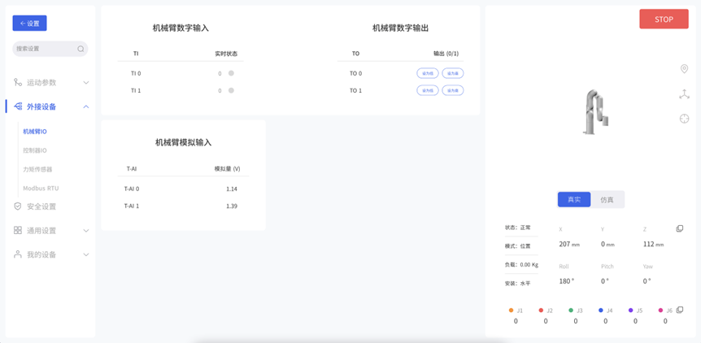</br>
### 6.2.2 控制器IO
&ensp;&ensp;根据控制器类型，xArm(>=1300版本控制器)/UF850显示32路数字输入输出，Lite6显示16路数字输入输出，只有当IO设置为通用输入/输出时，才可在Blockly项目和SDK中做自定义设置，否则改自定义设置不生效。

#### **IO状态：**   
该页面可以查看数字输入、数字输出、模拟输入、模拟输出的状态，可以设置数字输出、模拟输出。</br>
&ensp;&ensp;数字输入：CI0-CI7、DI0-DI7，默认为1-高电平。</br>
&ensp;&ensp;数字输出：CO0-CO7、DO0-DO7，默认为0-低电平。</br>
&ensp;&ensp;控制器模拟输入：AI0、AI1。</br>
&ensp;&ensp;控制器模拟输出：AO0、AO1，默认为0V，最高为10V。</br>
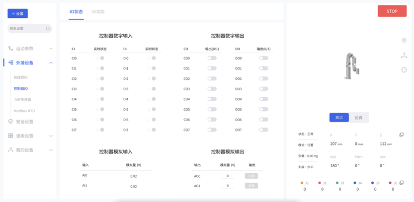</br>

#### **IO功能：**
**输入配置：**  </br>
&ensp;&ensp;CI0-CI7：通用输入、停止运动、防护重置、离线任务、手动模式、缩减模式、使能机械臂。</br>
&ensp;&ensp;DI0-DI7：通用输入、离线任务、手动模式、使能机械臂。</br>
* **通用输入：** 控制器输入只有被设置为通用输入时，用户才可以在Blockly或SDK程序中自定义使用该IO，否则会导致功能冲突。例如，CI0如果被配置为离线任务，则在任何程序中，都不应再使用CI0。
* **停止运动：** 触发IO，则机械臂立即停止运动。
* **防护重置：** 触发IO，是处于防护停止状态的机械臂恢复运动。需要配合SI使用。
* **离线任务：** 离线任务可添加多个Blockly项目，实现脱离电脑与网络连接，通过触发IO运行项目。如上图所示，CI0设置为离线任务，并添加了Blockly项目。点击添加按钮添加Blockly/Python项目，点击x删除项目。
* **手动模式：** 设置为示教模式，输入信号**持续**为低电平时可自由拖拽机械臂。
* **缩减模式：** 触发IO，机械臂进入缩减模式。
* **使能机械臂**：通过触发IO来使能机械臂。


**输出配置：**
&ensp;&ensp;CO0-CO7/DO0-DO7：通用输出、运动停止、运动中、有错误、有警告、发生碰撞、手动模式生效、缩减模式生效、离线任务进行中、机械臂已使能、紧急停止按钮被按下。
* **通用输出：** 控制器输出只有被设置为通用输出时，用户才可以在Blockly或SDK程序中自定义使用该IO，否则会导致功能冲突。例如，CO0如果被配置为运动停止，则在任何程序中，都不应再使用CO0。
* **运动停止：** 手臂进入紧急停止状态，输出高定平。符合该紧急停止的动作有： 1）控制器急停按钮被按下，机械臂电源切断。 2）通过控制器输入(CI)进入紧急停止。  3）通过软件中红色STOP按钮和Blockly中紧急停止代码块。 4）SDK中的set_state(4)。
* **运动中：** 机械臂在运动状态时，输出高电平。
* **有错误：** 机械臂有错误时，输出高电平。
* **有警告：** 机械臂报碰撞错误时，输出高电平。
* **发生碰撞：** 机械臂报碰撞错误时，输出高电平。
* **手动模式生效：** 手动模式开启时，输出高电平。
* **缩减模式生效：** 缩减模式开启时，输出高电平。
* **离线任务进行中：** 机械臂在运行离线任务时，输出高电平。
* **机械臂已使能：** 机械臂已使能时，输出高电平。
* **紧急停止按钮被按下：** 控制器上急停按钮被按下时，输出高电平。
### 6.2.3 力矩传感器
</br>
&ensp;&ensp;**是否安装六维力矩传感器：** 使用所有力矩功能前，需要打开此按钮，和力矩进行通信连接。</br>
&ensp;&ensp;**负载辨识：** 机械臂做一系列动作，识别出当前末端负载质量，质心，偏移量的参数。</br>
&ensp;&ensp;**手动模式方向：** 只能选平移或旋转，不可同时选择。 例如，选择平移，选择XY， 点击激活，此时可沿XY方向拖动手臂。</br>
### 6.2.4 直线滑轨
### 6.2.5 Modbus RTU
&ensp;&ensp;用户可以调试机械臂末端Modbus RTU和控制器Modbus RTU，仅支持**标准Modbus RTU**协议的设备，若不支持标准Modbus RTU，请使用SDK进行控制。
以调试机械臂末端Modbus RTU获取机械爪的位置信息为例：
</br>
* RS-485端口：选择机械臂。  
* Modbus波特率：选择2000000（出厂默认）。
* 在命令框中输入指令，例如 0x08,0x03,0x07,0x02,0x00,0x02，软件会自动加上CRC校验。
* 勾选指令，点击发送。
* 在日志框中可看到发送和回复的数据。  

如需循坏发送，需设置延时，勾选指令，开启循环按钮后，点击发送。
超时时间：1~9999ms。
Modbus波特率：4800, 9600, 19200, 38400, 57600, 115200, 230400, 460800, 921600, 1000000, 1500000, 2000000（默认）, 2500000
### 6.2.6 Modbus TCP
&ensp;&ensp;用户可发送标准Modbus TCP指令，IP地址默认为手臂IP，端口默认为502, 均不可修改。</br>
&ensp;&ensp;输入命令后，勾选发送，点击发送，可在日志中看到发送和返回的数据。</br>
&ensp;&ensp;以发送Modbustcp指令触发Blockly项目为例：</br>
Modbus TCP寄存器定义请参考：[Modbus TCP寄存器](https://docs.ufactory.cc/modbustcp_cn)  

&ensp;&ensp;例如下图： 
发送00 01 00 00 00 06 01 06 00 04 03 E8，将控制器模拟输出AO1设置为1V。</br>
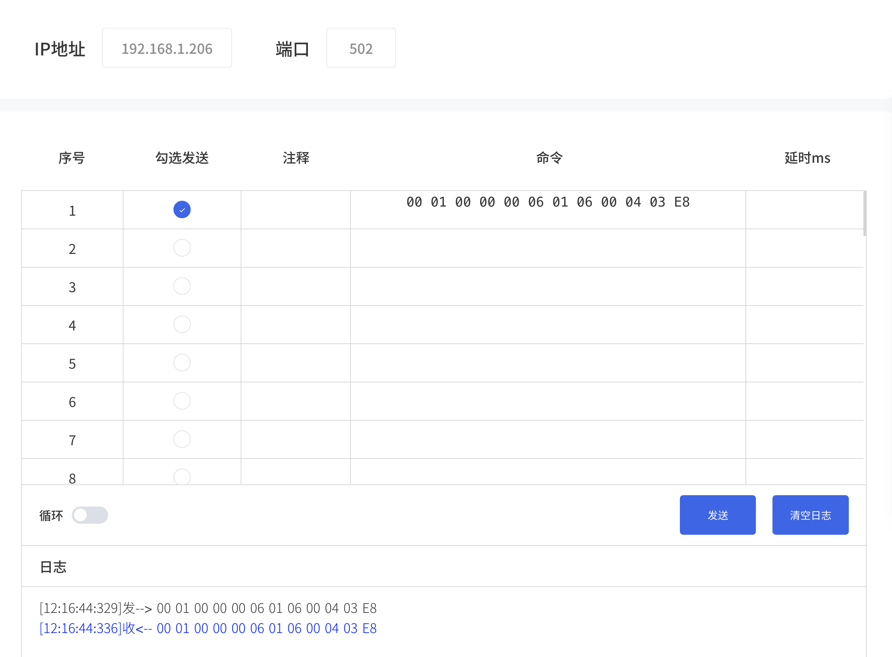</br>

## 6.3 安全设置
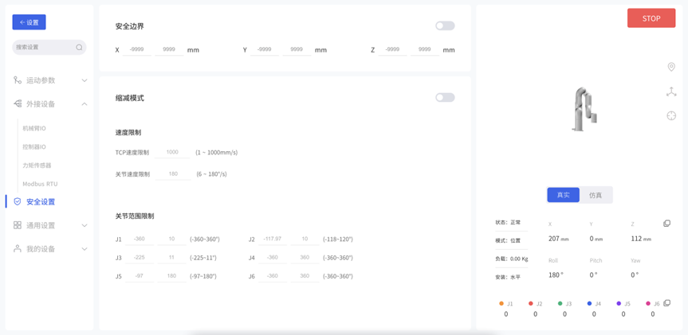</br>
### 6.3.1 安全边界
&ensp;&ensp;该模式被激活后，可以限制机械臂笛卡尔空间的边界范围，如果工具中心点（TCP）超出设置的安全边界，机械臂将停止运动，此时用户可将机械臂回归初始点或移动到安全边界以内。
### 6.3.2 缩减模式
&ensp;&ensp;该模式被激活后，机械臂的最大TCP速度、关节速度、关节范围将被限制。当在Blockly或python SDK等其他地方设置的速度超过设置的范围时，默认使用缩减模式限制的最大速度。
## 6.4 我的设备
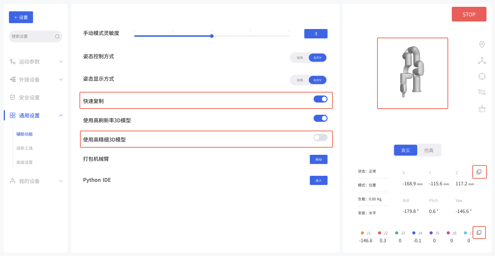</br>
### 6.4.1 辅助功能
**手动模式灵敏度：** 等级为1-5，默认为3。可以调整手动模式下的灵敏度，等级越高，手动模式下拖动手臂所需要的力越小。

**姿态控制方式：** 轴角， R/P/Y。默认为轴角，实时控制页面点动板中显示根据此选项为准。

**姿态显示方式：** 轴角， R/P/Y。默认为R/P/Y，实时控制页面机械臂坐标的显示根据此选项为准。

**快速复制：** 打开该按钮后，可在实时控制界面复制机械臂的TCP坐标和关节角度值。

**使用高刷新率3D模型：** 使用对应3D模型。

**使用高精细3D模型：** 使用对应3D模型。

**打包机械臂：** 长按将机械臂移动到打包位置。
&ensp;&ensp;xArm：[0,0,0,0,0,0,0]°
&ensp;&ensp;UF850:[0,90,0,0,0,0]°
&ensp;&ensp;Lite6:[180,0,0,0,0,-180]°

**Python IDE：** 点击进入Blockly-Python IDE模块。
### 6.4.2 调参工具
&ensp;&ensp;此页面可通过观测机械臂的一些参数值，进行图形绘制并导入到CSV，方便用户观察并记录。点击开始，开始绘图，希望结束时点击结束按钮，必须点击结束按钮，才可使用Studio软件的其他功能。

**机械臂**   </br>
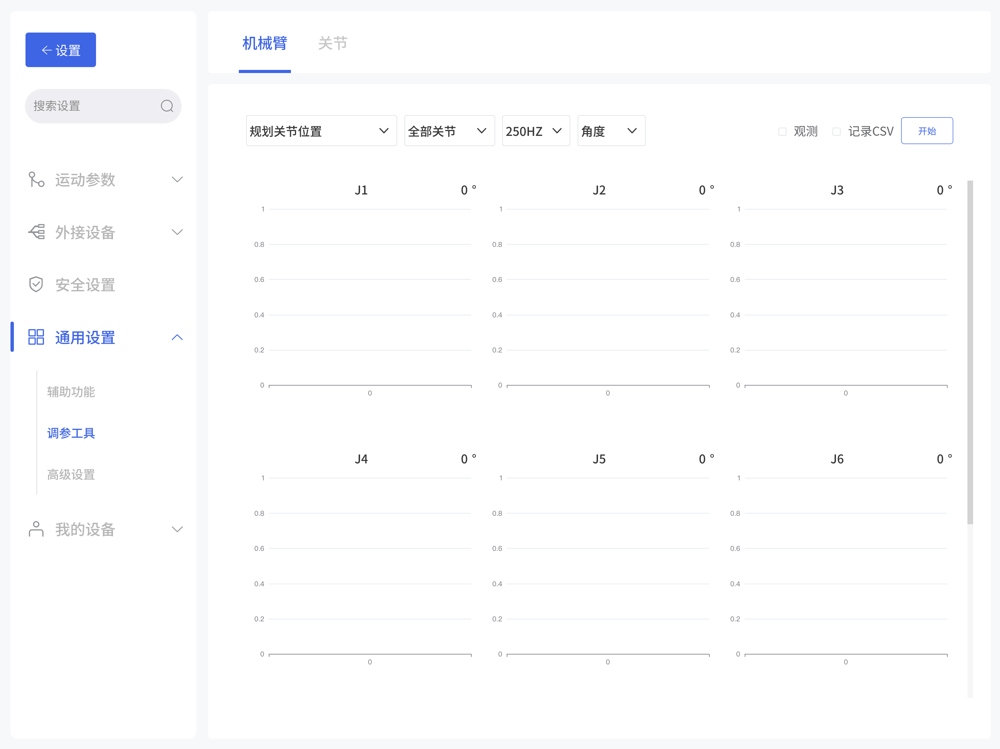</br>
可观测数据：
* 规划关节位置
* 规划关节速度
* 规划关节加速度
* 实际关节位置
* 实际关节加速度
* 实际关节电流
* 电流估算的关节力矩
* 规划TCP位置
* 规划TCP速度
* 实际TCP位置
* 实际TCP速度
* 电路估算的TCP力矩
* 力矩传感器(原始值)
* 力矩传感器(滤波值)
* 关节温度

频率：250HZ、5HZ
单位：角度、弧度
关节：所有关节、单关节

**关节**
&ensp;&ensp;此页面可以通过输入指令的方式对于机械臂进行调参或者查询当前机械臂的相关参数，该功能需要在技术支持的指引下进行，并可以通过页面对机械臂关节进行解锁，从而手动转动关节。</br>
</br>

注意：
该功能要在技术支持的指导下操作。（联系技术支持：[support@ufactory.cc）](mailto:support@ufactory.cc）)
* 为防止解锁后的关节没有力提供而掉落，**解锁关节时请务必用手托住机械臂**，做好保护机械臂和周边设施的措施。
* 解锁关节操作主要用于当机械臂报错时，可手动把机械臂姿态调整到相对安全的位置。注意超过关节范围时，需手动调整关节到范围内。
* 在“仿真机械臂模式”时，点击解锁关节按钮，也会解锁机械臂的真实关节。
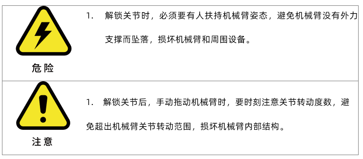</br>
### 6.4.3 高级设置
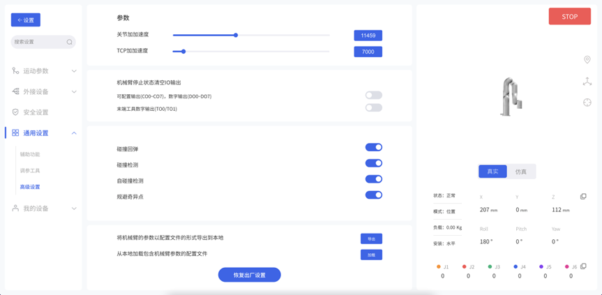</br>
&ensp;&ensp;此页面需要输入密码才能进行访问，默认密码是：admin</br>
&ensp;&ensp;请妥善保管密码，当密码遗忘时，请联系技术支持进行密码重置。</br>
**关节加加速度：** 6-28647，默认为11459°/s³。</br>
**TCP加加速度：** 1~100000，默认为7000mm/s³。</br>
注意：
* 加加速度影响机械臂的加速性能，一般情况下，我们不建议修改该参数。
* 机械臂未使能/有错误/运动情况下，无法修改加加速度。

**机械臂停止状态清空IO输出：** 如果机械臂收到停止指令，则对应选择的以下选项将被设置回默认状态。
* 可配置输出(CO0-CO7)，数字输出(DO0-DO7)：
* 末端工具数字输出(TO0/TO1):

**碰撞回弹：** 当机械臂碰撞障碍物时，机械臂会反向回弹一定的距离。如果碰撞灵敏度不为0，该模式关闭后，机械臂会停留在检测到碰撞的位置。

**碰撞检测：**  检测手臂是否发生了碰撞。

**自碰撞检测：** 当检测到手臂即将发生自碰撞时，软件立刻停止手臂并弹出错误提示。

**使用近似解：** 当手臂遇到奇异点时，会在奇异点轻微调整一下姿态绕开。

**笛卡尔速度连续：** 设置速度连续，不减速到0。

**导出：** 将机械臂的参数以配置文件的形式导出到本地，可以将机械臂的参数以配置文件的形式导出。可导出的机械臂参数主要有：运动参数，TCP偏移，TCP负载，IO设置，安全边界，安装方式，设置的坐标系，高级参数。

**加载：** 从本地加载包含机械臂参数的配置文件。

**恢复出厂设置：** 机械臂将恢复出厂设置的参数。

注意：
* 当需要多台机械臂共享一套配置参数时，可通过导出按钮导出一台已经设置完好的机械臂的参数的配置文件，再将该配置文件通过加载按钮导入其他机械臂即可。
* 当控制器出现故障需要返修时，您可将机械臂的配置文件导出并保存，以免控制器在维修过程中出现原始数据丢失或变更的情况。
* 机械臂在恢复出厂设置后，其参数会发生变化，为了避免恢复出厂设置后，机械臂参数发生变化，请在机械臂恢复出厂设置前，导出机械臂的配置文件参数。
## 6.5 设备信息
### 6.5.1 设备信息
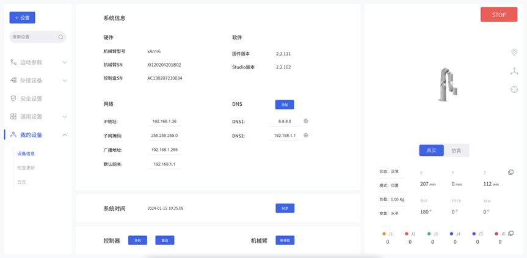</br>
&ensp;&ensp;在设备信息页面，可对控制器进行重启或者关机操作，查看当前机械臂的轴数，IP地址，固件版本，机械臂SN地址、控制器SN地址和软件版本。

**系统信息：** 显示连接机械臂的地址，机械臂固件版本，UFactory studio软件版本。

**网络设置：** 显示和修改机械臂的IP地址，子网掩码，广播地址，默认网关。可修改和添加DNS地址。**修改网络设置需要重启控制器生效**。

**系统时间：** 显示当前系统时间年月日，可点击同步当前电脑的时间。

**断使能：** 断机械臂使能。

注意：
若更改了IP地址，务必在控制器上做好标注。如果忘记或丢失修改后的IP地址，请参考下面的方法重置IP。
***
<font color=Blue size=4>如何重置IP？</font>  </br>
重置IP步骤：</br>
* (1) 按下急停开关，关闭控制器电源。
* (2) 用导线将RI0与GND连接。
</br>
* (3) 开启控制器电源，旋转急停开关，听到“滴”的一声之后，表示控制器IP已经重置成功。重置后的IP 为：192.168.1.111。
* (4) 请拔掉连接RI0和GND的导线，等待控制器启动完成（60秒）即可。
* (5) 在浏览器内输入IP+:18333访问UFactory Studio，连接机械臂。
***
### 6.5.2 检查更新
</br>
**检查更新：** 检查到有更新版本，点击下载最新版本固件和Studio的软件包，此步骤需要联网。

**安装：** 点击选中提前下载好的升级包，即可更新固件和studio到最新。
### 6.5.3 日志
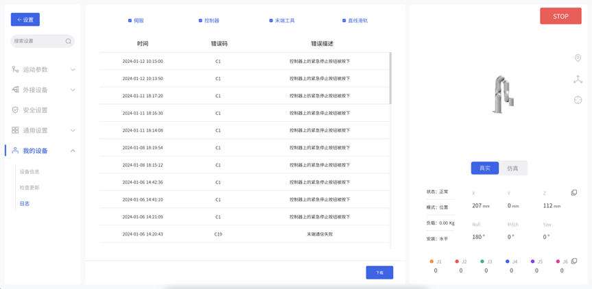</br>
&ensp;&ensp;显示伺服、控制器、末端工具、直线滑轨的报错日志。当手臂发生错误时，可点击下载按钮下载详细日志，并发送给技术支持进行分析。
# 7. Blockly典型示例
&ensp;&ensp;在UFactory Studio中Blockly内置了几个例子，可以参考例子进行编程。下面介绍其中几个较有代表性的例子。
## 7.1 xArm机械爪的使用
&ensp;&ensp;该Blockly程序在示例程序[UF] - 1007_xArm_Gripper。</br>
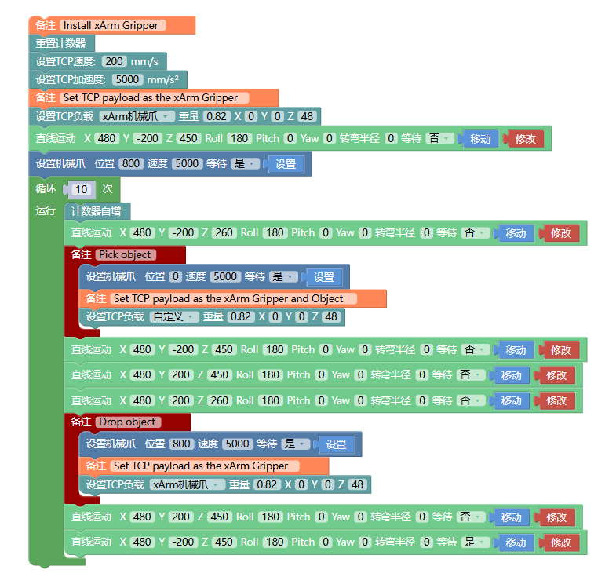</br>
&ensp;&ensp;这段程序的作用：执行此程序，可控制机械爪在指定位置夹取目标物，然后将目标物放到特定的位置。
&ensp;&ensp;设置TCP负载：该指令在上述程序中使用多次，其主要目的是**动态改变负载**，适应机械臂在夹取和释放物体的过程中TCP负载的变化。
## 7.2 xArm真空吸头的使用
&ensp;&ensp;该Blockly程序在示例程序[UF] - 1008_xArm_Vacuum_Gripper。</br>
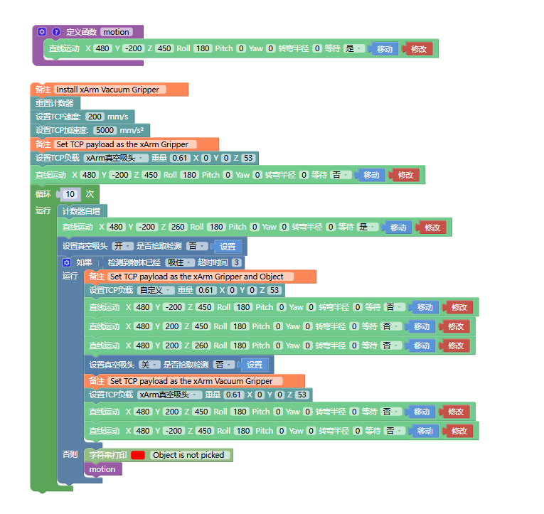</br>
这段程序的作用：执行此程序，可控制真空吸头在指定位置吸取目标物，然后将目标物放到特定的位置。
* 定义的函数要放在主程序的前面，如上图所示。
* 主要指令：
**设置真空吸头（开/关）**：可设置真空吸头开启和关闭状态。
* 是否拾取检测=是，同时检测了是否吸住物体，如果没有吸住物体，将会跳出整个程序；
* 是否拾取检测=否，不检测是否吸住物体。
**检测真空吸头已经（吸住/释放）**：检测真空吸头是否吸住（释放）物体，若检测到真空吸头已吸住（释放）物体，则跳出这条指令，执行下一个指令，如果超过了超时时间后，真空吸头还未吸住（释放）物体，则也会跳出该指令，执行下一个指令。</br>
**循环运动计数：** 通过添加计数器自增，机械臂每次执行到该指令时会使控制器的计数器自增1。可用于计算机械臂实际循环执行的次数。</br>
**重置计数器：** 该指令将控制器内的计数器重置为0。</br>
## 7.3 控制器数字IO的使用
&ensp;&ensp;该Blockly程序在示例程序[UF] - 1010_Ditital_IO。</br>
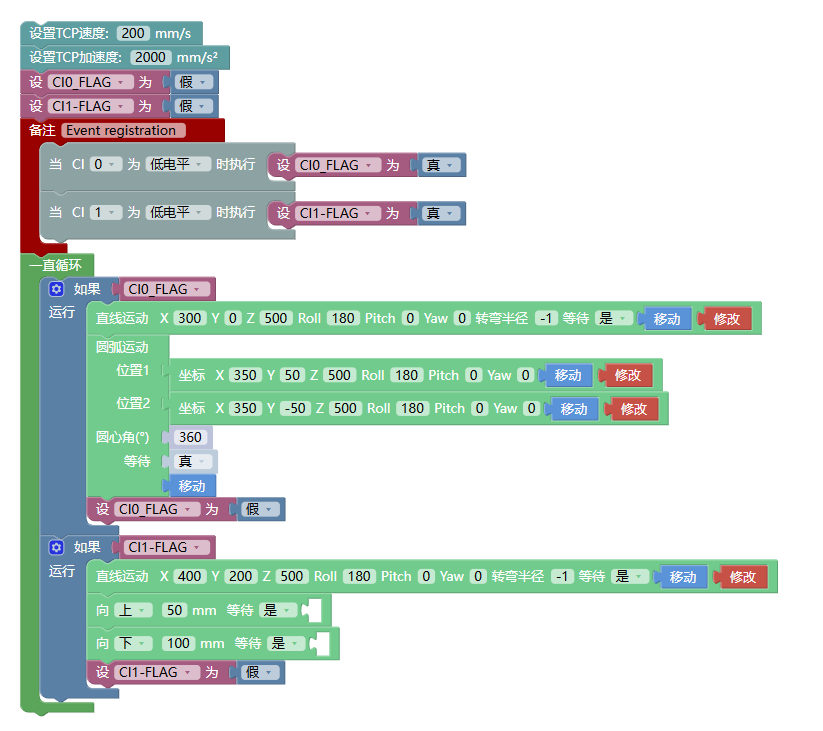</br>
&ensp;&ensp;这段程序的作用：可以通过触发数字IO，来执行相应的运动。CI0和CI1默认为低电平，当程序检测到CI0或CI1**跳变**为高电平时，改变变量值，从而触发一直循环中的如果事件，触发后重置变量值，达到触发一次CI则运行一次相应动作的效果。
# 8. 运动学特性
## 8.1 机械臂的运动方式
### 8.1.1 关节运动
&ensp;&ensp;实现关节空间的点对点运动（单位：度），每个指令之间速度不连续。  

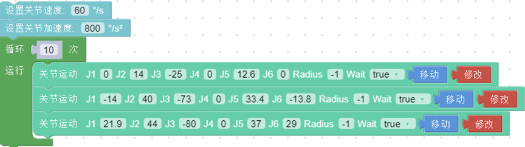</br>
* Wait参数：表示是否等待该命令执行完后再发送下一条命令。
* 移动：机械臂会运动到当前位置点。
* 修改：打开实时控制界面，调节当前点的坐标。

上例中机械臂的运动轨迹如下：</br>
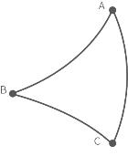</br>
Python示例：
~~~python
arm.set_servo_angle(angle=[0.0, 7.0, -71.2, 0.0, 0.0, 0.0], speed=8, mvacc=1145, wait=True)

arm.set_servo_angle(angle=[0.0, 7.0, -51.2, 0.0, 0.0, 0.0], speed=8, mvacc=1145, wait=True)

arm.set_servo_angle(angle=[0.0, 7.0, -91.2, 0.0, 0.0, 0.0], speed=8, mvacc=1145, wait=True)
~~~
&ensp;&ensp; set_servo_angle参数说明：
* `servo_id`：关节ID，None或8代表所有关节
* `angle`：关节角度或关节角度列表（默认关节角度单位为`is_radian=Flase`，即度）
* `speed`：关节速度。
* `mvacc`：关节加速度。
* `is_radian`：关节角度单位是否为弧度。
* `wait`：True：等待当前指令发完再发下一条指令；&ensp;&ensp; False：不等待，直接发下一条指令。
* `mvtime`：0，运动时间，暂无意义。
***
<font color=Blue size=4>如何规划连续的关节运动？</font></br>
&ensp;&ensp; 两条关节运动指令之间插入圆弧过渡，是规划机械臂进行连续的关节运动的一种方式。</br>
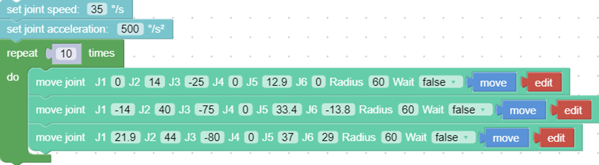</br>
&ensp;&ensp; 上例中机械臂的运动轨迹如下：</br>
</br>

**关键参数说明**
 **Radius=60**
`move joint`指令中的`Radius=60`，指设置的过渡圆弧的半径R= 60mm，用于实现关节运动转弯的平滑过渡。
`Radius`的参数可设置为 `Radius>0, Radius=0, Radius=-1`, 不同参数对应不同的轨迹。
* **`Radius>0：`** 例如设置Radius=60，转弯的轨迹如下图蓝色圆弧，可以实现平滑转弯效果。</br>
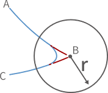</br>
* **`Radius=0：`** 转弯处不设置圆弧过渡，尖角转弯，如下图所示。</br>
</br>
* **`Radius<0：`** 转弯处不设置圆弧过渡，尖角转弯，如下图所示。</br>
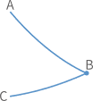</br>

**总结：**  </br>
&ensp;&ensp;  `move joint`指令中的wait表示是否需要等待本条指令执行完再发送下一条指令。
&ensp;&ensp; 如果需要规划连续运动，请确保**`wait=false, Radius≥0`**。  
* 关节速度在交融区域是平滑过渡的，交融部分执行的时间是不交融两段轨迹时间的一半， 所以如果关节运动交融半径比较小，速度提升感不会十分明显。
* 设置的Radius的值应该小于DAB和DBC（直线距离）。
***
### 8.1.2 直线运动
&ensp;&ensp;  实现笛卡尔坐标之间的直线运动（单位：mm），每个指令之间速度不连续。  

&ensp;&ensp;  用户可以基于基坐标系、TCP坐标系来控制机器人运动状态。笛卡尔空间运动的机器人使工具在路点之间进行线性移动。这意味着每个关节都会执行更为复杂的移动，以使工具保持在直线路径上。目标点确认后，末端路径是唯一的，轨迹过程中对应的姿态是随机的。基坐标系的X、Y 和 Z 控制工具的位置，箭头指向为+方向，单位是mm。TCP坐标系的Roll /Pitch/Yaw控制工具的方向，单位是度。  

&ensp;&ensp;  直线运动和圆弧直线运动属于笛卡尔空间轨迹规划，需要做逆运动学求解。因而可能存在无解、多解、逼近解的情况；而且由于关节空间和笛卡尔空间的非线性关系，可能会出现轴动运动超出其最大速度和加速度限制的情况。  

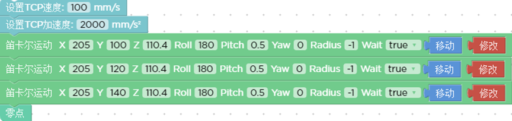</br>
Python示例：
~~~python
arm.set_tcp_jerk(2000)

arm.set_position(x=205.0, y=100.0, z=110.4, roll=180.0, pitch=0.5, yaw=0.0, speed=100,  radius=-1.0, wait=True)

arm.set_position(x=205.0, y=120.0, z=110.4, roll=180.0, pitch=0.5, yaw=0.0, speed=100,  radius=-1.0, wait=True)

arm.set_position(x=205.0, y=140.0, z=110.4, roll=180.0, pitch=0.5, yaw=0.0, speed=100,  radius=-1.0, wait=True)
~~~

&ensp;&ensp;  如果需要规划连续直线运动，请确保**`wait=false, Radius≥0`**。

**&ensp;&ensp;  注意：** 若为xArm5，则roll和pitch必须设置为roll=±180°，pitch=0°。
### 8.1.3 圆及圆弧运动
&ensp;&ensp;  圆弧运动根据三点坐标计算出空间圆的轨迹，三点坐标分别为（起点,位置1,位置2）。
&ensp;&ensp;  以当前点为起点，再设置两个位置点，三点确定一个圆。

**圆心角的设置：**
* **若0< 圆心角<360°或圆心角>360°：** 则机械臂的运动路径为相应度数的圆弧；
&ensp;&ensp; 若圆心角=60°，机械臂的运动轨迹为：
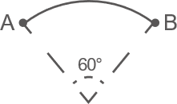</br>
* 圆心角（°）=360°，则机械臂可完整走完一整个圆弧；
* 若想连续画多个圆弧（例如，连续画10段圆弧），则将圆心角设置为所画圆弧度数的十倍。

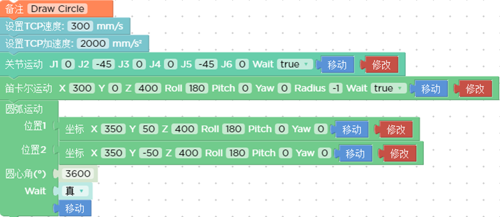</br>
* 起点，位置1和位置2确定一个整圆的三个参考点，若机械臂的运动路径为一段圆弧，则位置1 和位置2不一定为终点或者经过点；
* 若想让机械臂在运动过程中实现姿态变化，请将位置2的roll、pitch、yaw设为完成轨迹时的期望姿态；
* 圆心角（°）：表示该圆弧的度数，设置360°时可以走完一整个圆弧，可大于小于360°；

**示例讲解：**
&ensp;&ensp; 在此示例中，圆心角设置为3600°，代表每次可连续画十个圆，且机械臂每画完一个圆，还是停留在起点的。
&ensp;&ensp; 上例中起点，位置1和位置2分别为：</br>
A（300,0,400,180,0,0）B（350,50,400,180,0,0）C（350,-50,400,180,0,0）
* 机械臂以顺时针方向画圆，机械臂运动轨迹的方向如下图：</br>
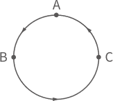</br>
* 如果将B点和C的位置交换，B点为（350,-50,400,180,0,0），C点为（350,50,400,180,0,0），则机械臂的将以逆时针方向画圆，机械臂运动轨迹如下：</br>
</br>

Python示例：
~~~python
arm.set_servo_angle(angle=[0.0, -45.0, 0.0, 0.0, -45.0, 0.0], speed=20, mvacc=500, wait=True)        

arm.set_position(*[300.0, 0.0, 400.0, 0.0, -90.0, 180.0], speed=300, mvacc=2000, radius=-1.0, wait=True)  

move_circle([350.0, 50.0, 400.0, 180.0, -90.0, 0.0], [350.0, -50.0, 400.0, 180.0, -90.0, 0.0], 1000.0, speed=300, mvacc=2000, wait=True)
~~~
## 8.2 xArm5运动特性
**笛卡尔空间**  </br>
&ensp;&ensp;xArm5的运动比较特殊，由于结构限制，笛卡尔空间的直线、圆弧运动实际灵活自由度为4, 即[x,y,z,yaw]，类似四自由度的SCARA机械臂。在开始笛卡尔控制之前，需要保证xArm5处于末端法兰面与底座完全水平的姿态，此时roll和pitch应为 [±180度，0度]，否则轨迹很容易无解。</br>
固件大于2.5.0时，提供**使用近似解**选项，可以解除此限制。 </br> 

**关节空间**  </br>
&ensp;&ensp;在关节空间时，机械臂有5个自由度可以控制，在需要末端使用其他姿态的情况下，可以切换至关节指令。而后再次使用关节指令回到法兰与底座水平的姿态即可以切换回笛卡尔控制。将J4的角度设为-(J2角度+J3角度)，从而调平末端。</br>
## 8.3 奇异点
***
<font color=Blue size=4>什么是奇异点？</font> </br>
&ensp;&ensp;当机械臂的的任意两个关节的轴心处于同一直线时会出现奇异点。处于奇异点时,机器人自由度将发生退化，将会造成某些关节角速度趋于无穷大，导致失控。常见情况是，当腕关节（倒数第2个关节）处于或接近第一关节轴线时，也会出现奇异点，因而尽量避免直接经过靠近基座中心区域的笛卡尔轨迹，容易造成1关节速度过大。</br>
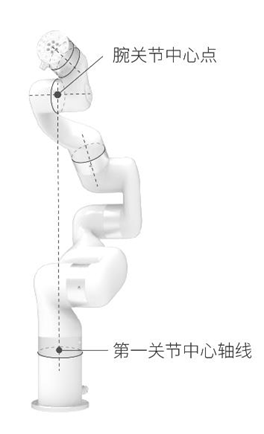</br>
***
**特性：** </br>
&ensp;&ensp;奇异点的特性为无法正确的进行规划运动。基于坐标的规划运动无法明确的反向转化为各轴的关节运动。机器人在奇异点附近进行规划运动（直线、圆弧等，不包括关节运动）时会报警停止，以避免通过奇异点时造成关节瞬间速度过快，所以示教时应尽量避开奇异点或以关节运动通过奇异点。</br>

**如何处理奇异点？** </br>
情况一：在机器人示教时遇到奇异点 </br>
* 将机器人的示教坐标系切换到关节。</br>

情况二：在程序运行时遇到奇异点</br>
* 打开[使用近似解]选项</br>
* 当运行程序时遇到奇异点，可以修改机器人的位置姿态，以避开路径当中存在的奇异点，重新进行到达目标点的路径规划。</br>

注意：
&ensp;&ensp;选择机械臂安装位置时，务必考虑机械臂正上方和正下方的圆柱体空间（如下图）。尽可能避免将机械臂腕关节（J5）移向圆柱体空间，因为这样会造成机械臂慢速运动时关节运动超速，从而降低机械臂的工作效率，且风险评估难以进行。</br>
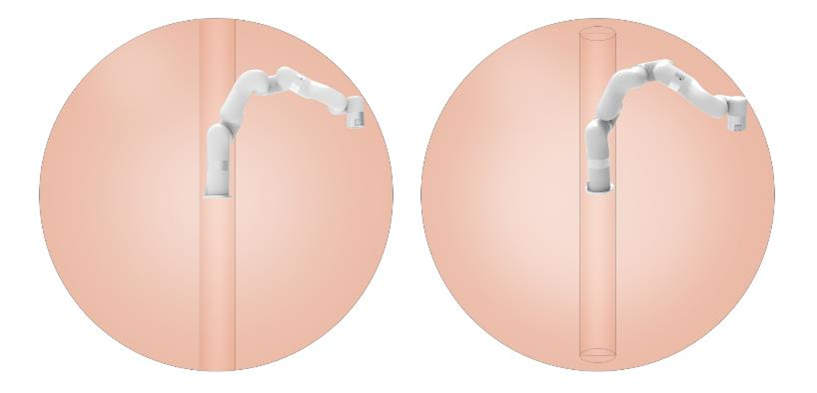</br>

# 9. 机械臂状态与模式说明
&ensp;&ensp;控制器提供7种运动模式和6种状态，对应PythonSDK中_set_mode_, _set_state_函数。
## 9.1 机械臂模式
#### 模式0：位置控制模式
控制器启动后默认进入的模式。
##### 1. 关节运动
&ensp;&ensp;实现关节空间的点对点运动（单位：度/弧度），每个指令之间速度不连续。</br>
&ensp;&ensp;示例代码：[set_servo_angle](https://github.com/xArm-Developer/xArm-Python-SDK/tree/master/example/wrapper/xarm6)   </br>
&ensp;&ensp;注意：此例子适用于xArm6，使用xArm5与xArm7请减少或增加对应关节角。&ensp;&ensp;
##### 2. 直线运动
&ensp;&ensp;实现笛卡尔坐标之间的直线运动（单位：毫米），每个指令之间速度不连续。  
&ensp;&ensp;可以用Roll/Pitch/Yaw表示机械臂姿态，也可以用轴角Rx/Ry/Rz表示机械臂姿态。 </br>
&ensp;&ensp;示例代码：[set_position](https://github.com/xArm-Developer/xArm-Python-SDK/blob/master/example/wrapper/common/1001-move_line.py), [set_position_aa](https://github.com/xArm-Developer/xArm-Python-SDK/blob/master/example/wrapper/common/1008-move_line_aa.py)
##### 3. 直线圆弧运动
&ensp;&ensp;实现笛卡尔坐标之间的直线运动（单位：毫米），在两条直线直接插入圆弧过渡，每个指令之间速度连续。  </br>
&ensp;&ensp;示例代码：[move_arc_lines](https://github.com/xArm-Developer/xArm-Python-SDK/blob/master/example/wrapper/common/1005-move_arc_line.py)
##### 4. 圆及圆弧运动
&ensp;&ensp;实现圆弧运动，根据三点坐标计算出空间圆的轨迹，三点坐标分别为（起点、参数1、参数2）。   </br>
&ensp;&ensp;示例代码：[move_circle](https://github.com/xArm-Developer/xArm-Python-SDK/blob/master/example/wrapper/common/3001-move_circle.py)
#### 模式1：伺服模式（servoj）
此模式对于上位机实时性要求很高，建议使用打了[实时补丁](https://docs.ros.org/en/foxy/Tutorials/Miscellaneous/Building-Realtime-rt_preempt-kernel-for-ROS-2.html)的Linux系统。
##### 1. 关节伺服模式
&ensp;&ensp;机械臂可以接受最高以250HZ频率发送的关节位置指令。每收到一条指令机械臂会立刻响应，并以最大速度（180°/s）和加速度执行移动至给定的关节位置，此命令不设置缓冲区，仅执行最新收到的目标点。若发送指令的频率超过250HZ，则多余的指令将会丢失。  
&ensp;&ensp;目前提供的SDK接口预留了速度、加速度和时间，但目前不起作用。如果客户有能力完成速度、加速度平滑的运动轨迹轨迹并映射到关节空间，servoj模式下可以代替控制器的规划，而令机械臂执行用户自己或第三方（比如ROS Moveit！）的规划算法，**如果用户无法自己实现轨迹规划及运动学逆解，请不要使用此模式。**    </br>
&ensp;&ensp;示例代码：[set_servo_angle_j](https://github.com/xArm-Developer/xArm-Python-SDK/blob/master/example/wrapper/common/7001-servo_j.py)
##### 2. 笛卡尔伺服模式
&ensp;&ensp;机械臂可以接受最高以250HZ频率发送的笛卡尔位置指令。每收到一条指令机械臂会立刻响应，并以最大速度和加速度执行移动至给定的笛卡尔位置，此命令不设置缓冲区，仅执行最新收到的目标点。若发送指令的频率超过250HZ，则多余的指令将会丢失。  
&ensp;&ensp;建议使用方法：以固定的频率（100HZ或200HZ）发布经过插值的平滑轨迹点（两点之间的单步距离不超过10mm），**切勿一次性给出过远的目标位置。**
&ensp;&ensp;用户发布指令频率控制在30HZ-250HZ的范围内，若低于30HZ，机械臂运动可能会不连续。使用此模式需要规划每一个轴的精细位置和预测机械臂的运动行为，开发难度很大。</br>  
&ensp;&ensp;示例代码：[set_servo_cartesian](https://github.com/xArm-Developer/xArm-Python-SDK/blob/master/example/wrapper/common/7002-servo_cartesian.py) , [set_servo_cartesian_aa](https://github.com/xArm-Developer/xArm-Python-SDK/blob/master/example/wrapper/common/7003-servo_cartesian_aa.py)
#### 模式2：关节示教模式（手动模式）
&ensp;&ensp;此模式下，机械臂进入零重力模式，用户可以自由拖动机械臂各连杆完成示教功能。如果拖动示教完成，请切换回模式0。  </br>
&ensp;&ensp;注意：开启示教模式之前，**务必确认机械臂安装方向和TCP负载设置正确**，否则手臂可能会由于重力补偿不准确而无法自我保持静止！   </br>
&ensp;&ensp;示例代码：
```bash
   arm.set_mode(2)
   arm.set_state(0)
```
#### 模式4：关节速度控制模式
&ensp;&ensp;指定所有关节目标速度（单位：rad/s），最大关节加速度可通过 _set_joint_maxacc_ 设置。</br>
&ensp;&ensp;示例代码：[vc_set_joint_velocity](https://github.com/xArm-Developer/xArm-Python-SDK/blob/master/example/wrapper/common/2000-joint_velocity_control.py)
#### 模式5：笛卡尔速度控制模式
&ensp;&ensp;指定TCP笛卡尔线速度（mm/s）和姿态角速度（rad/s），最大加速度可通过 _set_tcp_maxacc_ 设置。</br>
&ensp;&ensp;示例代码：[vc_set_cartesian_velocity](https://github.com/xArm-Developer/xArm-Python-SDK/blob/master/example/wrapper/common/1009-cartesian_velocity_control.py)
#### 模式6：关节在线规划模式
&ensp;&ensp;关节在线轨迹规划（控制器固件版本≥**v1.10.0**），实现关节指令的动态响应。当收到新的运动指令时，立刻当断当前正在进行的关节指令，从当前位置开始规划执行新的关节指令。</br>
&ensp;&ensp;示例代码：[set_servo_angle](https://github.com/xArm-Developer/xArm-Python-SDK/blob/master/example/wrapper/common/2006-joint_online_trajectory_planning.py)
#### 模式7：笛卡尔在线规划模式
&ensp;&ensp;笛卡尔在线轨迹规划（控制器固件版本≥**v1.10.0**），实现笛卡尔指令的动态响应。当收到新的运动指令时，立刻当断当前正在进行的笛卡尔指令，从当前位置开始规划执行新的笛卡尔指令。   </br>
&ensp;&ensp;注意：使用此模式时，_set_position_aa_ 中的`is_tool_coord`必须为False，即**只能以基坐标系为参考**，不能以工具坐标系做相对运动。 </br>
&ensp;&ensp;示例代码：[set_position](https://github.com/xArm-Developer/xArm-Python-SDK/blob/master/example/wrapper/common/1010-cartesian_online_trajectory_planning.py)
## 9.2 机械臂状态
#### 状态0：开启运动
&ensp;&ensp;可设置，手臂准备好运动或运动就绪状态。此状态下，机械臂能正常响应和执行运动指令。设置完成后，状态反馈自动调整为状态2（READY）。如果机械臂从错误、断电或停止状态中恢复，请在发送运动指令前将状态设置为0，否则发送的指令将被丢弃。
#### 状态1：手臂正在运动中
&ensp;&ensp;反馈。
#### 状态2：READY
&ensp;&ensp;反馈，手臂已准备好，可以接收执行指令。
#### 状态3：暂停
&ensp;&ensp;可设置可反馈。
#### 状态4：停止
&ensp;&ensp;可设置可反馈。
&ensp;&ensp;设置：立即停止运动，并清除所有缓存指令。之前发送的指令作废切无法接受新的指令，直至状态被设置回0。
&ensp;&ensp;反馈：无法接收新的指令，出现错误码自动跳转为此状态。
#### 状态5：系统重置
&ensp;&ensp;反馈。指系统设置（比如模式、负载、偏移、灵敏度等）发生了变化，自动跳转为MODE_CHANGED状态，无法接收执行新的指令，直到收到`set_state(0)`。
#### 状态6：减速停止
&ensp;&ensp;可设置可反馈。

# 10. 机械臂运动参数表

| 机械臂  | xArm5      | xArm6      | xArm7      | 850        | Lite6      |
| ---- | ---------- | ---------- | ---------- | ---------- | ---------- |
| 最大速度 | 180°/s     | 180°/s     | 180°/s     | 180°/s     | 180°/s     |
| 关节1  | ±360       | ±360       | ±360       | ±360       | ±360       |
| 关节2  | (-118,120) | (-118,120) | (-118,120) | (-132,132) | ±150       |
| 关节3  | (-255,11)  | (-225,11)  | ±360       | (-242,3.5) | (-3.5,300) |
| 关节4  | (-97,180)  | ±360       | (-11,225)  | ±360       | ±360       |
| 关节5  | ±360       | (-97,180)  | ±360       | ±124       | ±124       |
| 关节6  | 无          | ±360       | (-97,180)  | ±360       | ±360       |
| 关节7  | 无          | 无          | ±360       | 无          | 无          |

# 11. 术语定义
***
**控制器：** 机械臂的核心部分，它是机械臂控制系统的集成。 

***
**末端执行器：** 末端执行器安装在机械臂手腕（末端）的前端，用来安装夹持器和专用工具（如机械爪、真空吸头等），可以直接执行工作任务。  
***
**使能机械臂：** 给机械臂上电，且开启机械臂电机，机械臂使能后，可正常开始运动。  
***
**TCP：** 工具中心点（默认为法兰盘中心）。  
***
**TCP运动：** 目标位置为笛卡尔空间坐标点的运动，末端在运动中遵循指定的轨迹（圆弧，直线等）。  
***
**TCP负载（末端负载）：** 负载重量是指实际的（末端执行器+托运外物）的重量，单位是kg。X/Y/Z轴表示TCP的重心相对于默认工具坐标系（位于法兰中心）的位置，单位是mm。  
***
**TCP偏移（末端执行器偏移）：** 设置TCP（末端执行器）坐标系与定义在法兰中心的工具坐标系之间的相对偏移量，单位是mm。 
***
**Roll/Pitch/Yaw（RPY）：** Roll /Pitch/Yaw按顺序依次绕选定坐标系（基坐标系）的X/Y/Z旋转。
&ensp;&ensp;下面举例描述坐标系{B}姿态的一种方法：
例如首先将坐标系{B}和一个已知参考坐标系{A}重合。先将{B}绕**X轴**旋转γ，再绕**Y轴**旋转β，最后绕**Z轴**旋转α。
每个旋转都是绕着固定的参考坐标系{A}的轴，这种方法叫XYZ固定角坐标系，有时把他们定义为回转角（roll）、俯仰角（pitch）和偏转角（yaw）。
&ensp;&ensp;上面描述的就是XYZ欧拉角，旋转过程如下图所示：
![[RPY.png]](assets/RPY.png)  
  
  等价旋转矩阵为：
&ensp;&ensp;&ensp;&ensp;![[rotation_matrix.png]](assets/rotation_matrix.png)
注：γ对应roll；β对应pitch；α对应yaw。  
***
**轴角：** Rx/Ry/Rz与 Roll/Pitch/Yaw 一样， 使用 3 个值表示姿态，但不是三个旋转角度，而是一个三维旋转向量[x,y,z]和一个旋转角度 phi（标量）的乘积。
轴角表示的性质：
&ensp;&ensp;假设旋转轴为[x,y,z]， 旋转角度为 phi。则轴角表示即为[Rx, Ry, Rz] = [x*phi, y*phi, z*phi]，其中[x,y,z]为单位向量，phi 为非负值，因而[Rx, Ry, Rz]的向量长度(模)即可推算旋转角度，向量方向即为旋转方向。
如果想表示逆向旋转，则将旋转轴向量[x,y,z]取反， phi 值不变。
使用 phi 和[x,y,z]同样可以推导出单位四元数的姿态表示 q = [cos(phi/2), sin(phi/2)*x, sin(phi/2)*y, sin(phi/2)*z]。
&ensp;&ensp;例如：
当前 TCP 坐标系的姿态是基坐标系围绕某个空间向量旋转某个角度得到的。比如用基坐标系表示的旋转轴的向量为[1, 0, 0]，旋转角度为 180 度 (pi 弧度），则这个姿态的轴角表示即为[π, 0, 0]。如果旋转轴
为 [0.707, 0.707, 0]，旋转角度为 90 度(π/2 弧度），则轴角姿态为[0.707*(pi/2), 0.707*(pi/2), 0]。
***
**基坐标系：** 基坐标系是以机器人安装基座为基准、用来描述机器人本体运动的笛卡尔坐标系。
&ensp;&ensp;任何机器人都离不开基坐标系，也是机器人TCP在三维空间运动所必须的基本坐标系（面对机器人前后：X轴 ，左右：Y轴， 上下：Z轴）

**工具坐标系：** 由工具中心点TCP与坐标方位组成。
&ensp;&ensp;如果没有设置TCP偏移，那么默认工具坐标系位于法兰中心，是以工具中心点作为零点，机器人的轨迹参照工具坐标系。  

**用户坐标系：** 用户坐标系可定义为机器人运动范围内的任意位置，设定任意角度的X、Y、Z 轴，坐标系的方向根据客户需要任意定义。
![[coordinate_cn.png]](assets/coordinate_cn.png)
***
**手动模式：** 即示教模式或力矩模式，在该模式下，操作人员可直接手动控制机械臂。
***
**示教灵敏度：** 示教灵敏度范围1~5个等级。设定的值越大，示教灵敏度等级越高，开启示教模式拖拽关节所需的力越小。
***
**碰撞灵敏度：** 碰撞灵敏度范围0~5个等级,设置为0时表示不开启碰撞检测。设定的值越大，碰撞灵敏度等级越高，机械臂碰撞检测后所需的力越小。
***
**GPIO：** 通用型输入输出。
对于输入，可以通过读取某个寄存器来确定引脚电位的高低；
对于输出，可以通过写入某个寄存器来让这个引脚输出高电位或者低电位；
***
**安全边界：** 该模式被激活后，可以限制机械臂笛卡尔空间的边界范围，如果工具法兰中心（TCP偏移点）超出设置的安全边界，机械臂将停止运动。
***
**缩减模式：** 该模式被激活后，机械臂的笛卡尔运动的最大运动线速度、关节运动的最大关节速度和关节范围将受到限制。
***
# 12. 报错及处理
## 12.1 控制器错误代码
&ensp;&ensp;机器人硬件出现错误、控制软件出现错误、下发指令错误，会发出错误或警告，这个错误/警告信号会在用户发送任意指令时反馈回去，也就是这个反馈是被动的，并非主动上报。  

&ensp;&ensp;出现以下错误后，机器人会立即停止工作，并且丢弃控制器缓存指令。需手动清除错误后，机器人方可继续正常工作。根据上报的错误信息，重新调整机器人的运动规划。

| **报错代码** | **报警处理**                                                                                          |
| -------- | ------------------------------------------------------------------------------------------------- |
| C1       | 控制器上的紧急停止按钮被按下</br>请释放紧急停止按钮，然后点击“使能机械臂”。                                                     |
| C2       | 紧急停止按钮被按下</br>请将控制器的2组EI接地，然后点击“使能机械臂”。                                                       |
| C3       | 三态开关的紧急停止按钮被按下</br>请释放三态开关的紧急停止按钮，然后点击“使能机械臂”。                                                |
| C11-C17  | 请通过控制器上的紧急停止按钮重启机械臂。                                                                              |
| C18      | 力矩传感器错误                                                                                           |
| C19      | 末端通信失败</br>检查机械爪是否安装，波特率设置是否正确。                                                               |
| C21      | 运动学错误  <br>请重新规划路径。                                                                               |
| C22      | 自碰撞错误  <br>机械臂即将发生自碰撞，请重新规划路径。如果机械臂持续报自碰撞错误，请到“实时控制”界面开启“手动模式”，将机械臂拖回正常位置。                        |
| C23      | 关节角度超出限制    <br>请点击”初始点“按钮回到关节零点。                                                                 |
| C24      | 速度超出限制      <br>请检查机械臂是否超出运动范围，或减小运动速度和加速度。                                                       |
| C25      | 规划错误  <br>请重新规划路径或者减小运动速度。                                                                        |
| C26      | Linux RT 错误                                                                                       |
| C27      | 回复指令错误  <br>请重试，或通过控制器上的紧急停止按钮重启机械臂。                                                              |
| C29      | 其他错误                                                                                              |
| C30      | 反馈速度超出限制                                                                                          |
| C31      | 机械臂电流异常</br>关节ID[],理论力矩xx.xxNm，实际力矩xx.xxNm</br>请检查机械臂是否发生碰撞                               |
| C32      | 三点圆弧指令计算出错  <br>请重新设置圆弧指令。                                                                        |
| C33      | 控制器IO模块异常                                                                                         |
| C34      | 轨迹录制超时  <br>轨迹录制时间超过最大限制5分钟，建议重新录制。                                                               |
| C35      | 机械臂到达安全边界  <br>机械臂到达安全边界，请让机械臂在安全边界内运行。                                                           |
| C36      | 延时指令数量超限</br>1.请检查位置检测或IO延时指令指令是否过多。</br>2. 增加位置检测指令的容错半径。                                |
| C37      | 手动模式运动异常</br>关节ID[],转动角度xx.xx°</br>请检查机械臂的TCP负载设置和机械臂安装方式设置是否与实际匹配。                       |
| C38      | 关节角度异常</br>请通过控制器上的紧急停止按钮停止机械臂，并联系技术支持。                                                       |
| C39      | 控制器电源板主从IC通信异常</br>请联系技术支持。                                                                   |
| C40      | 无报错的关节轨迹求解失败。</br>请调整点位。                                                                      |
| C41      | 摩擦力文件内容无效。</br>请通过控制器上的紧急停止按钮重启机械臂。</br>如多次重启无效，请联系技术支持。                                  |
| C42      | 校准文件内容无效。</br>请通过控制器上的紧急停止按钮重启机械臂。</br>如多次重启无效，请联系技术支持。                                   |
| C43      | 动力学模型加载失败</br>请通过控制器上的紧急停止按钮重启机械臂。</br>如多次重启无效，请联系技术支持。                                   |
| C44      | SN缺失、错误或与固件类型不一致</br>SN：XXXXXXXXXXXXXX类型：<br>请按下控制器上的急停按钮，等待5秒后松开，然后进入"设置-我的设备-设备信息"页面，重启控制器。 |
| C50      | 六维力矩传感器错误</br>请查询六维力矩传感器用户手册错误码，定位问题并重新上电。                                                    |
| C51      | 六维力矩传感器模式设置错误</br>请确保机械臂没有处于手动模式，检查本指令给定值是否为0/1/2                                             |
| C52      | 六维力矩传感器零点设置错误</br>请检查传感器通信接线以及通电是否正常                                                          |
| C53      | 六维力矩传感器过载</br>请减小负载或施加的力                                                                      |
| C110     | 机械臂底座板通信异常                                                                                        |
| C111     | 控制器外接485设备通信异常                                                                                    |

&ensp;&ensp;上表中未出现的报警代码：如频繁出现，请联系技术支持。

## 12.2 关节伺服错误代码
&ensp;&ensp;报警处理方式可采用重新上电，步骤如下（重新上电需要走完以下所有步骤）：
* 通过控制器上的紧急停止按钮重新对机械臂上电
* 使能机械臂

| **报错代码**                          | **报警处理**                                                              |
| --------------------------------- | --------------------------------------------------------------------- |
| S0                                | 关节通信失败</br>请通过控制器上的紧急停止按钮重启机械臂。如多次重启无效，请联系技术支持。                   |
| S10                               | 电流检测异常 </br>请通过控制器上的紧急停止按钮重启机械臂。                                  |
| S11                               | 关节电流过大</br> 请通过控制器上的紧急停止按钮重启机械臂。                                 |
| S12                               | 关节速度过大</br> 请通过控制器上的紧急停止按钮重启机械臂。                                 |
| S14                               | 位置指令过大  <br>请通过控制器上的紧急停止按钮重启机械臂。                                      |
| S15                               | 关节过热  <br>如果机械臂长时间运行温度过高，请停机，等待机械臂冷却后重启机械臂。                           |
| S16                               | 编码器初始化异常  <br>请确保机械臂通电时，无外力推动机械臂运动。请通过控制器上的紧急停止按钮重启机械臂。               |
| S17                               | 单圈编码器错误</br>请通过控制器上的紧急停止按钮重启机械臂，如多次重启无效，请联系技术支持。                  |
| S18                               | 多圈编码器错误</br>请点击“清除错误”，随后将控制器电源开关推至OFF档，等待5秒后重新上电。如多次尝试无效，请联系技术支持。 |
| S19                               | 电池电压过低                                                                |
| S20                               | 驱动IC硬件异常 <br>请重新使能机械臂。                                               |
| S21                               | 驱动IC初始化异常 <br>请通过控制器上的紧急停止按钮重启机械臂                                    |
| S22                               | 编码器配置错误                                                               |
| S23                               | 电机位置偏差过大 <br>请检查机械臂运动是否受阻，末端负载是否超过机械臂额定负载，机械臂加速度值是否设置过大。             |
| S26                               | 第N关节正向超限 <br>请检测N关节角度值是否设置过大。                                        |
| S27                               | 第N关节负向超限 <br>请检测第N关节角度值是否设置过大，如果是，请点击清除报错后，手动解锁该关节并转动该关节至其运动范围内。     |
| S28                               | 关节指令错误  <br>机械臂未使能，请点击“使能机械臂”。                                        |
| S33                               | 驱动器过载 <br>请确保机械臂负载处于额定负载内。                                          |
| S34                               | 电机过载  <br>请确保机械臂负载处于额定负载内。                                            |
| S35                               | 电机类型错误  <br>请通过控制器上的紧急停止按钮重启机械臂。                                      |
| S36                               | 驱动器类型错误  <br>请通过控制器上的紧急停止按钮重启机械臂。                                     |
| S39                               | 关节过压  <br>请在运动设置中减少加速度值。                                              |
| S40                               | 关节欠压  <br>请在运动设置中减少加速度值，请检查控制器紧急停止开关是否松开。                             |
| S49                               | EEPROM读写错误  <br>请通过控制器上的紧急停止按钮重启机械臂。                                  |
| S52                               | 电机角度初始化失败  <br>请通过控制器上的紧急停止按钮重启机械臂。                                   |
| S58                               | 转矩指令超时<br>请通过控制器上的紧急停止按钮重启机械臂。                                   |

&ensp;&ensp;上表中未出现的报警代码：如频繁出现，请联系技术支持。
## 12.3 PythonSDK报警信息
&ensp;&ensp; 在用 Python 库设计机器人运动规划时，如果机器人出现故障，需要手动清除错误。清除错误后，仍需重新给机器人使能，设置运动模式，方可使机器人正常运动。此时根据上报的错误信息，应重新调整机器人的路径规划。
&ensp;&ensp; Python 库清除错误步骤：（如下接口，详细说明请查看 GitHub）
* 清除错误：clean_error()
* 重新使能机械臂：motion_enable(true)
* 设置运动状态：set_state(0)

| **报错代码**                               | **报警处理**                                     |
| -------------------------------------- | -------------------------------------------- |
| A-9                                    | 紧急停止                                         |
| A-8                                    | TCP位置指令超出机械臂运动范围，请调整TCP位置指令。                 |
| A-2                                    | 机械臂未准备好，请检查机械臂是否已经使能，机械臂状态是否设置正确。            |
| A-1                                    | 未连接到xArm控制器或连接中断，请检查网路连接。                    |
| A1                                     | 有错误未清除，请清除错误后重试。                             |
| A2                                     | 有警告未清除，请清除警告后重试。                             |
| A3                                     | 获取回复超时，请检查固件版本和网络连接。                         |
| A4                                     | TCP回复长度错误，请检查网络连接。                           |
| A5                                     | TCP回复序号错误，请检查网络连接。                           |
| A6                                     | TCP协议标志错误，请检查网络连接。                           |
| A7                                     | TCP回复指令与发送指令不匹配，请检查网络连接。                     |
| A8                                     | 发送指令错误，请检查网络连接。                              |
| A9                                     | 机械臂未准备好，请检查机械臂错误是否已清除，机械臂是否已经使能，机械臂状态是否设置正确。 |
| A11                                    | 其他错误，请联系技术支持。                                |
| A12                                    | 参数错误。                                        |
| A20                                    | 末端工具IO ID 错误。                                |
| A22                                    | 末端工具Modbus波特率错误。                             |
| A23                                    | 末端工具Modbus回复长度错误。                            |
| A31                                    | 轨迹读写失败。                                      |
| A32                                    | 轨迹读写超时。                                      |
| A33                                    | 运行轨迹超时。                                      |
| A41                                    | 真空吸头等待超时。                                    |
| A100                                   | 等待完成超时。                                      |
| A101                                   | 检测末端执行器状态失败次数过多。                             |
| A102                                   | 末端执行器有错误。                                    |
| A103                                   | 末端执行器未使能。                                    |

&ensp;&ensp;上表中未出现的报警代码：如频繁出现，请联系技术支持。
# 13. 软件/固件升级方式
## 13.1 在线升级
&ensp;&ensp;当PC端有网络连接时，可进行在线升级。</br>
* **方法一：** 使用UFactory studio进行在线升级。 </br>
&ensp;&ensp; 进入我的设备-检查更新，点击“检查更新”，如有新的版本，点击“下载”，下载完成后点击“安装”加载下载好的安装包，等待系统重启。重启耗时约2-3分钟。</br>
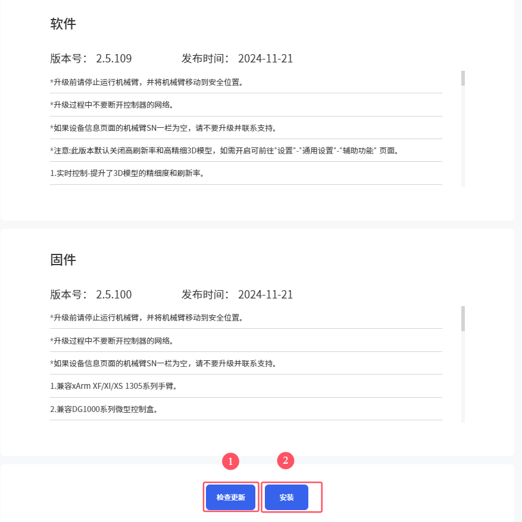</br>
## 13.2 离线升级
&ensp;&ensp;当PC端没有网络连接时，可使用离线升级。 </br>
* **方法一：** 使用UFactory Studio离线升级。 </br>
[GUI工具和软件/固件离线包](http://update.ufactory.cc/xArmTool-x86.zip) - xArm&UF850下载 </br>
[GUI工具和软件/固件离线包](http://update.ufactory.cc/xArmTool-Lite6.zip) - Lite6下载 </br>
&ensp;&ensp; 进入我的设备-检查更新，点击“安装”加载提前下载好的离线包，等待安装完成系统重启即可。 </br>
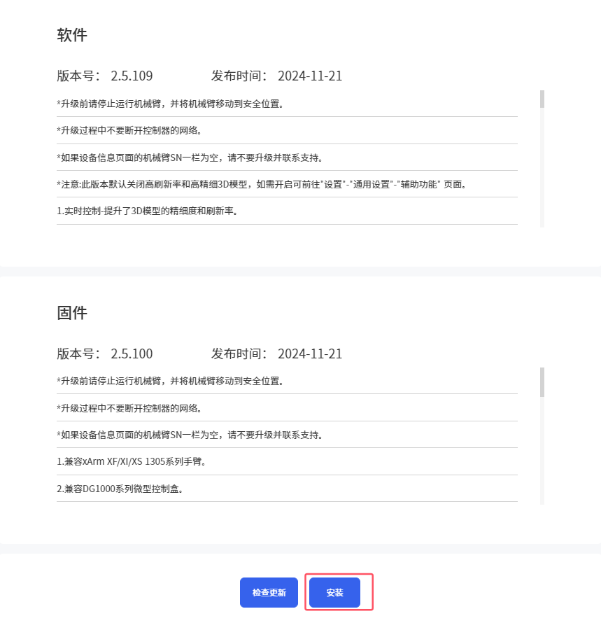</br>
* **方法二：** 使用xarm-tool-gui进行离线升级。 </br>
[GUI工具和软件/固件离线包](http://update.ufactory.cc/xArmTool-x86.zip) - xArm&UF850下载 </br>
[GUI工具和软件/固件离线包](http://update.ufactory.cc/xArmTool-Lite6.zip) - Lite6下载 </br>
&ensp;&ensp;  (1) 点击固件-离线安装，选择提前下载好的离线固件包，点击安装，界面弹出提示“安装固件成功”。 </br>
&ensp;&ensp;  (2)点击Studio-离线安装，选择提前下载好的离线Studio包，点击安装，界面弹出提示“安装Studio成功”。 </br>
&ensp;&ensp;  (3) 点击重启控制盒，等待2-3分钟控制器重启完成，重新连接即可。 </br>
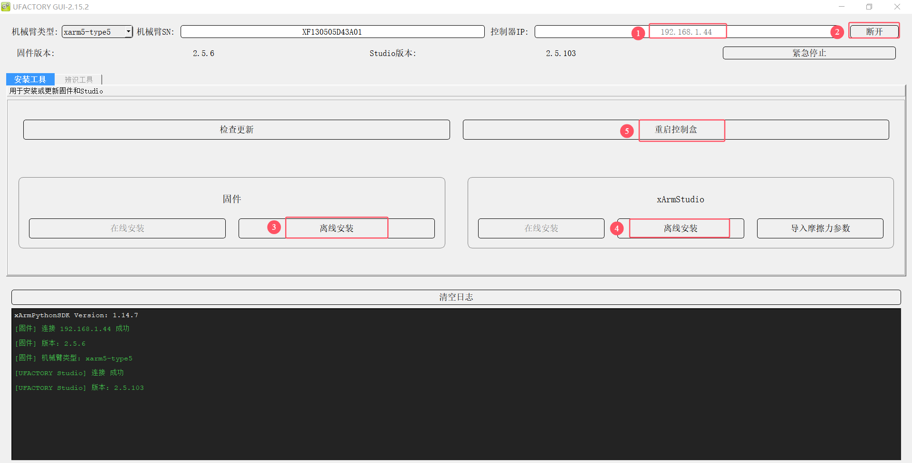</br>

**注意：**
当在线升级不成功时，可以尝试离线升级。离线升级仍然不成功时，请联系技术支持（[support@ufactory.cc](mailto:support@ufactory.cc)）。 软件/固件**降级**请参考xarm-tool-tui的升级方法，选择对应低版本的离线包即可。
