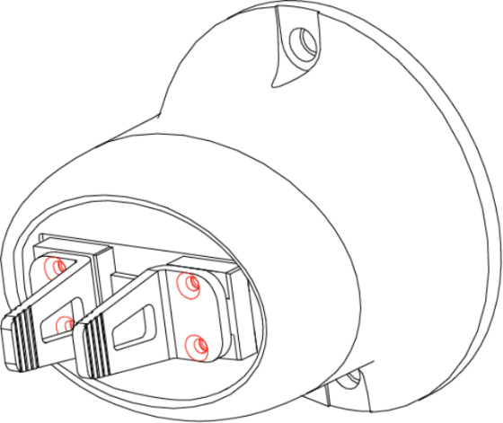
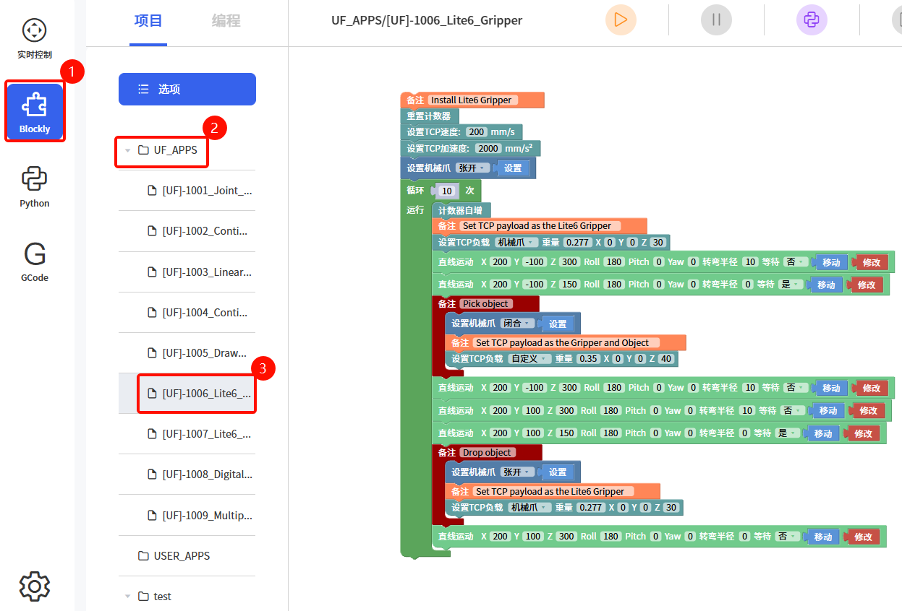
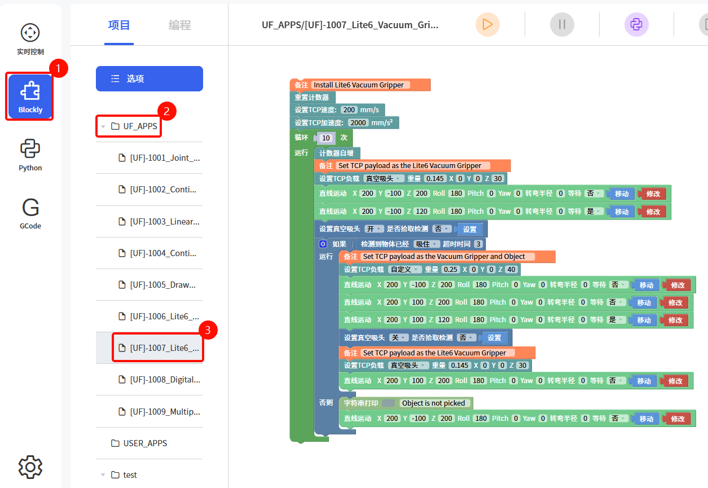

# 5. 末端执行器

## 5.1 Lite6 机械爪

Lite6 机械爪是机械臂的末端执行器，能够动态抓取物体。Lite 6的机械爪有两种安装方式：正装，机械爪的行程范围是0-16mm，反装，机械爪的行程范围是20-38mm。无论哪一种安装方式，机械爪的行程只有16mm。机械爪有效载荷≤600g。

机械爪的状态只有两个：张开，闭合。

- **注意：** 
  - Lite6 机械爪有两种安装方式，使用工具拧下图中红色的4颗螺丝，图1可以变换为图2。
  - 默认安装方式为：图1，行程为：20-38mm

|  |  |
| :-----------------------------------------: | :-----------------------------------------: |
|                     图1                     |                     图2                     |

### 5.1.1 Lite6 机械爪的安装

安装流程：

1. 将机械臂运动到安全位置（避免碰到机械臂安装表面或者其他设备）
2. 机械臂断电（按下急停按钮）
3. 用 2 颗 M6 螺栓把机械爪固定在机械臂末端
4. 用机械爪连接线连接机械臂和机械爪

**注意：**

1. 接通机械爪连接线时一定要使机械臂断电，急停开关处于按下状态，机械臂电源指示灯熄灭，避免热插拔引起机械臂故障。
2. 因机械爪连接线长度限制，机械爪接口与末端接口需在相同的方向。
3. 机械爪连接线接通机械爪跟机械臂时注意务必对齐两端接口的定位孔，连接线的公针较为纤细，避免在拆装时使公针弯曲。

### 5.1.2 注意事项

| 标识                          |                                                              |
| ----------------------------- | ------------------------------------------------------------ |
|  | 1. 在安装有机械爪的机械臂做轨迹规划时，位置指令间必须进行安全评估，避免碰撞到附近设备。 2. 在安装有机械爪的机械臂做轨迹规划时，回零点操作必须进行安全评估。 |

### 5.1.3 控制方式

#### 5.1.3.1 实时控制界面控制

进入实时控制界面，选择机械爪，可点击张开和闭合进行控制。

#### 5.1.3.2 Blockly 控制

在Blockly模块中找到示例文件：**[UF]-1006_Lite6_Gripper**

该示例程序的作用是：控制机械臂移动到指定位置，控制机械爪在指定位置抓取目标物，然后将目标物放到特定的位置。

#### 5.1.3.3 Python 控制

- 接口如下：
  - `arm.open_lite6_gripper()`：张开机械爪
  - `arm.close_lite6_gripper()`：闭合机械爪
  - `arm.stop_lite6_gripper()`：停止机械爪

Python-SDK地址：https://github.com/xArm-Developer/xArm-Python-SDK

## 5.2 Lite6 真空吸头

Lite6 真空吸头可动态吸放光滑的平面物体，有效载荷≤600g。Lite6 真空吸头只有1个吸盘。

**注意：**如果是非光滑的平面，真空吸头漏气会导致不能将物体稳固地吸起。

### 5.2.1 Lite6 真空吸头的安装

安装流程：

1. 将机械臂运动到安全位置（避免碰到机械臂安装表面或者其他设备）
2. 机械臂断电（按下急停按钮）
3. 用 2 颗 M6 螺栓把真空吸头固定在机械臂末端
4. 用真空吸头连接线连接机械臂和真空吸头

**注意：**

1. 接通真空吸头连接线时一定要使机械臂断电，急停开关处于按下状态，机械臂电源指示灯熄灭，避免热插拔引起机械臂故障。
2. 因真空吸头连接线长度限制，真空吸头接口与末端接口需在相同的方向。
3. 真空吸头连接线接通真空吸头跟机械臂时注意务必对齐两端接口的定位孔，连接线的公针较为纤细，避免在拆装时使公针弯曲。

### 5.2.2 控制方式

#### 5.2.2.1 实时控制界面控制

进入实时控制界面，选择真空吸头，可点击打开和关闭进行控制。

#### 5.2.2.2 Blockly 控制

在Blockly模块中找到示例文件：**[UF]-1007_Lite6_Vacuum_Gripper**

该示例程序的作用是：控制真空吸头在指定位置吸取目标物，然后将目标物放到特定的位置。

**注意：** 当真空吸头安装到机械臂上时，在Blockly程序中应当设置TCP负载，当真空吸头吸取物体后，其重量发生变化，则需要设置新的TCP负载。

#### 5.2.2.3 Python 控制

- 接口如下：
  - `arm.set_vacuum_gripper(True, wait=False)`：开启真空吸头
  - `arm.set_vacuum_gripper(False, wait=False)`：关闭真空吸头

Python-SDK地址：https://github.com/xArm-Developer/xArm-Python-SDK