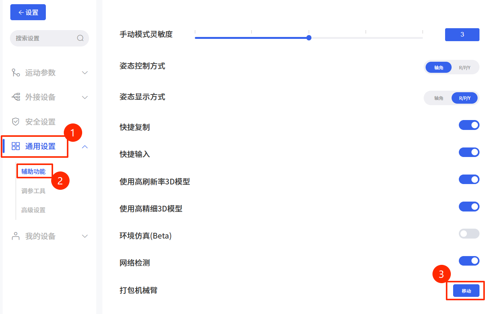

# 8. 产品信息

## 8.1 产品标签
* 机械臂标签

## 8.2 使用环境
* 低湿度（25%-85% 无冷凝）
* 海拔高度：<2000m
* 环境温度：0°C ~ 50°C
* 避免阳光直射（室内使用）
* 无腐蚀性气体或液体。
* 无易燃材料。
* 无油雾。
* 无盐雾。
* 无灰尘或金属粉末。
* 无机械冲击、振动。
* 无电磁噪声。
* 无放射性物质。

## 8.3 运输、存储和搬运
* 通过UFactory studio将机器人移动到打包姿态，然后将Lite6机器人和控制器放入原包装中。
  * 

* 使用原包装运输机器人。
* 将机械臂从包装移至安装地点时，同时提起机械臂两侧的连杆，将机器人固定到位，直到所有安装螺栓都牢固地拧紧在机器人底座上。
* 控制器箱应通过手柄提起。
* 将包装材料保存在干燥的地方，以后可能需要打包和运输机器人。

## 8.4 电源连接
本产品电源切断方式为插头/插座连接方式，所以在使用本产品的时候，建议配备适当的具有足够分断能力的开关电器。  
（如空气开关  绝缘电压：400V AC  额定电流：10A ）

## 8.5 特殊耗材
保险丝规格：15A 250V 5×20mm Time-Lag 玻璃体筒式保险丝

## 8.6 停机类别
**停止类别1** 和**停止类别2** 会在驱动器电源打开的情况下使机器人减速，这使机器人能够在不偏离当前路径的情况下停止。

| 安全输入            | 描述   |
| --------------- | ---- |
| 控制器上的紧急停止按钮     | 1类停机 |
| 控制器上的防护停止输入（SI） | 2类停机 |

## 8.7 证书
[LCSA051123040S-CE-LVD.pdf](http://www.ufactory.cc/wp-content/uploads/2025/04/LCSA051123040S-CE-LVD证书.pdf)  
[LCSA051123041E001-CE-EMC.pdf](http://www.ufactory.cc/wp-content/uploads/2025/04/LCSA051123041E001-CE-EMC-证书.pdf)  
[LCSA051123043R-RoHS.pdf](http://www.ufactory.cc/wp-content/uploads/2025/04/LCSA051123043R-RoHS证书.pdf)

## 8.8 运动学参数
[Lite6运动学参数](https://docs.supportarticle.ufactory.cc/zhHans/support_articles/developer/kinematic-and-dynamic-parameters/lite6.html)