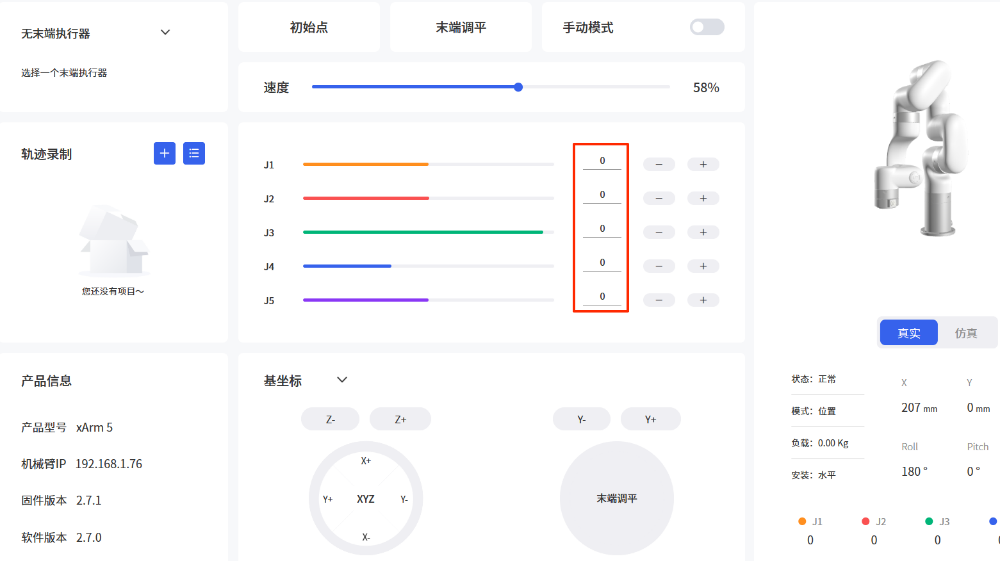
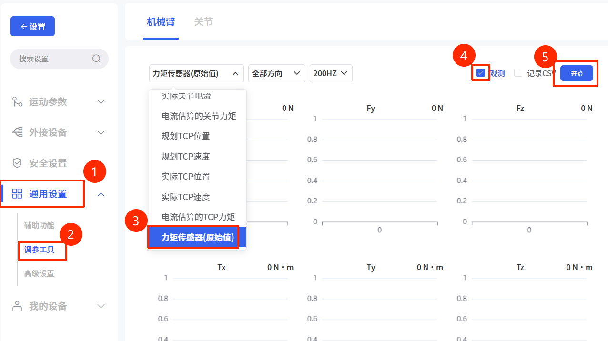
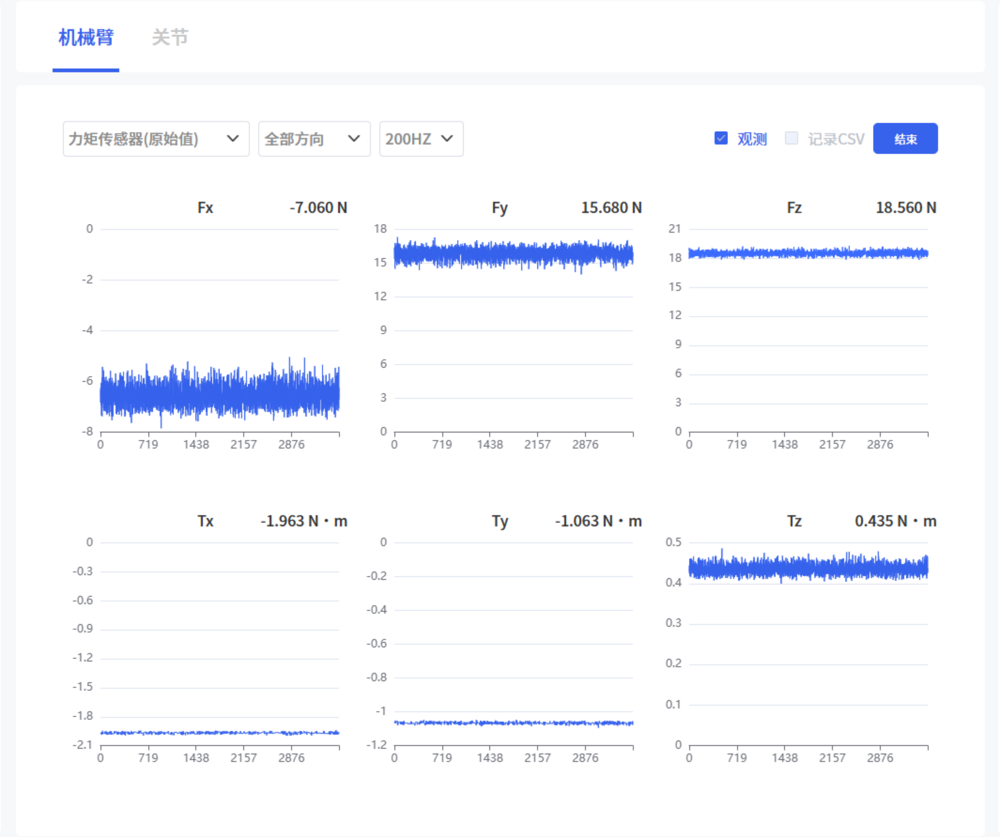

# 如何判断六维力矩传感器是否损坏

## 一、排查步骤

1. 按下急停按钮

2. 机械臂末端只保留六维力矩传感器，移除其他末端执行器及线缆

3. 松开急停按钮并使能机械臂，控制机械臂回到“零点姿态”（即所有关节角度均为0°）

4. 在 UFACTORY Studio 的 “调参工具” 中，观测**力矩传感器（原始值）**

5. 将观测到的原始值与**静态原始值范围**进行对比，若原始值超出范围，则表示力矩传感器已损坏。
   - **静态原始值范围**：

| Fx(N)     | Fy(N)     | Fz(N)     | Tx(N·m) | Ty(N·m) | Tz(N·m) |
| --------- | --------- | --------- | ------- | ------- | ------- |
| [-60, 60] | [-60, 60] | [-60, 60] | [-2, 2] | [-2, 2] | [-2, 2] |

## 二、解决方案

若经过上述排查确认传感器原始值超出范围，则表示力矩传感器已损坏。请联系 **UFACTORY 技术支持**进行售后处理，在反馈时提供以下相关信息：

1. 观测到的原始值截图
2. 力矩传感器SN
3. 力矩传感器外观照片/视频
4. 力矩传感器是否经历过碰撞等
