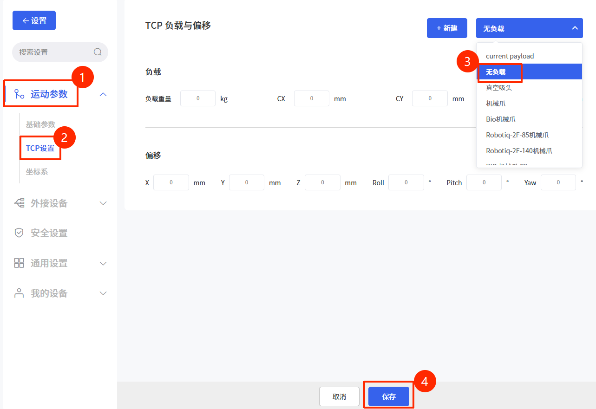
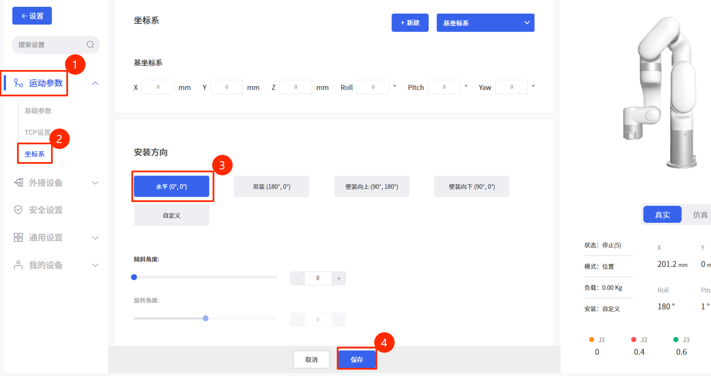
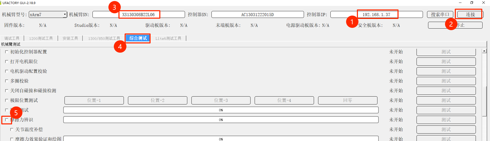
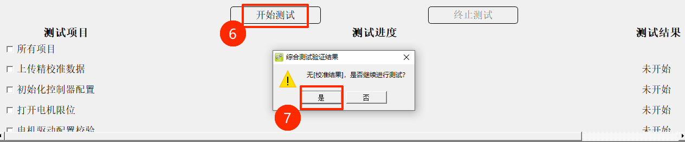

# 如何做摩擦力辨识

> [!Note]
>
> 做摩擦力辨识前，请联系技术支持确认

## 1. 安全提示

1. **清空臂展空间**：辨识过程中，机械臂会以不同速度进行大范围运动。请确保机械臂全臂展范围内没有任何障碍物、人员或线缆干扰。

2. **移除末端负载**：进行摩擦力辨识时，请移除所有末端执行器及线缆，确保机械臂末端处于空载状态。

## 2. 准备工作

1. **负载设置为0**：在 UFACTORY Studio 的“TCP设置”中，将负载重量和偏移设为 0。

2. **完全空载**：卸下末端工具，并取下末端外部接线 。

3. **安装方向设置为水平**：在 UFACTORY Studio 的“坐标系”设置中，将安装方向设置为**水平（0°,0°）**。**机械臂需水平安装**（如下图所示）。

4. **使能手臂**：确保机械臂处于 Enable （使能）状态，无报错代码。

5. **空间确认**：确保机械臂臂展范围空间空旷。

6. **软件准备**：下载并解压 [xarm-tool-gui](https://update.ufactory.cc/xarm-tool-gui-2.18.9-.zip)

## 3. 操作步骤

1. 运行 xarm-tool-gui
2. 输入控制器ip，点击【**连接**】
3. 检查**机械臂SN输入框**与**机械臂底座贴纸SN**是否一致，若不一致，则**手动输入底座贴纸SN**到**机械臂SN输入框**中
4. 切换到【**综合测试**】，取消勾选【**所有项目**】，仅勾选【**摩擦力辨识**】
5. 点击【**开始测试**】，会弹出确认框，再次确认周围环境安全后点击【**是**】

6. 开始辨识后手臂持续5分钟左右的运动
7. 辨识完成后，日志区域会显示摩擦力辨识成功、摩擦力保存成功

8. 按下急停按钮 → 等待 5 秒 → 旋起急停 → 重新使能手臂即完成

