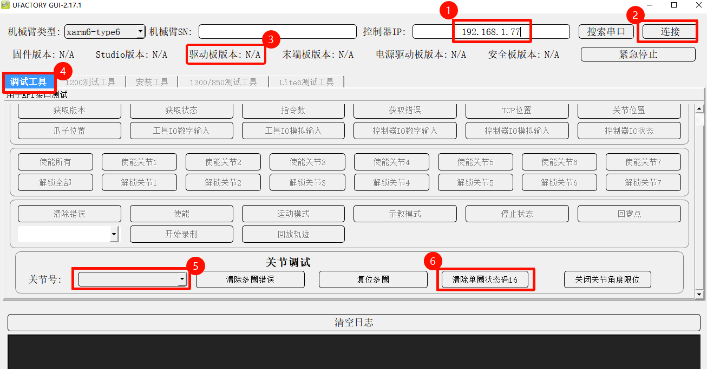

# 如何解决S17错误

S17：单圈编码器错误

适用产品：xArm 系列, UF 850, Lite6

适用固件版本: V2.4.0+

适用studio版本：V2.4.0+

## 状态码=16

### 手臂型号：1303或以下版本

错误码：S17，关节ID：*（1~7），状态码：16

1. 按下急停，然后松开

2. 不要使能，进入设置-通用设置-调参工具-关节，发送 `H101 D0104 V1 I*`，解锁关节\*，手动移动关节\*，轻微转动一点就可以（Lite6的关节4/5/6建议移动45°以上），然后发送`H101D0813V2I*`，按下急停。(这一步将会重置零点位置，所以在移动关节到零点之前，请记住零点位置)

3. 松开急停，移动关节到零点位置，发送`D13 I*`，按下急停

4. 松开急停，尝试再次使能机械臂

### 手臂型号：UF850，Lite6或1304及以上版本

错误码：S17，关节ID：*（1~7），状态码：16，**关节固件版本 ≥ 4.0.18**

1. 按照文档查看关节固件版本是否 ≥ 4.0.18
   - 若关节固件版本＜4.0.14，请联系UFACTORY 技术支持，进行升级；
   - 若4.0.18 ≥ 关节固件版本≥ 4.0.14，则按照文档更新关节固件 [如何查看/更新关节固件？ | UFactory Docs](https://docs.supportarticle.ufactory.cc/zhHans/support_articles/hardware/how-to-update-the-joint-firmware.html)

2. 下载并运行[xarm-tool-gui](https://update.ufactory.cc/xarm-tool-gui-win-amd64-2.17.1.zip)，输入控制器IP，点击连接

3. 切换到调试工具，选择报错的关节ID，点击清除单圈状态码16

4. 按下急停，等5秒松开急停，尝试再次使能机械臂

